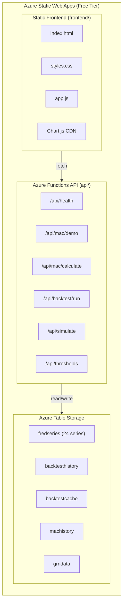

# GRRI-MAC Framework - Azure Deployment Guide

Deploy the GRRI-MAC Framework to Azure Static Web Apps (SWA) with Azure Functions on the **free tier**.

## Architecture



## Prerequisites

1. **Azure Account** - [Create free account](https://azure.microsoft.com/free/)
2. **GitHub Account** - Repository already set up
3. **Azure CLI** (optional) - For command-line deployment
4. **Azure Storage Account** - For historical data persistence

## Deployment Steps

### Option 1: Deploy via Azure Portal (Recommended)

1. **Go to Azure Portal**
   - Navigate to [portal.azure.com](https://portal.azure.com)

2. **Create Static Web App**
   - Search for "Static Web Apps"
   - Click "Create"
   - Fill in:
     - **Subscription**: Your subscription
     - **Resource Group**: Create new or use existing
     - **Name**: `grri-mac-framework`
     - **Plan type**: `Free`
     - **Region**: Choose nearest
     - **Source**: `GitHub`
     - **Organization**: `dev-fgf`
     - **Repository**: `grri-mac-framework`
     - **Branch**: `main`
   - Build Details:
     - **Build Preset**: `Custom`
     - **App location**: `/frontend`
     - **API location**: `/api`
     - **Output location**: (leave empty)

3. **Configure Secrets**
   - After deployment, go to your Static Web App
   - Settings → Configuration → Application settings
   - Add:
     - `FRED_API_KEY`: Your FRED API key
     - `SEC_USER_AGENT`: Your SEC user agent string
     - `AZURE_STORAGE_CONNECTION_STRING`: Azure Storage connection string

## Azure Table Storage Setup

The framework uses Azure Table Storage for persistent historical data. This eliminates the need to re-fetch data from FRED APIs during API calls.

### Tables Created

| Table Name | Contents | Records |
|------------|----------|---------|
| `fredseries` | Raw FRED time series data | 24 series (1970-2025) |
| `backtesthistory` | Weekly MAC scores with pillar breakdown | 2,814 records |
| `backtestcache` | Pre-computed full backtest response | Chunked JSON |
| `machistory` | Live MAC calculation history | Rolling |
| `grridata` | GRRI country risk data | By country/quarter |
| `macindicators` | Cached market indicators | Current values |

### Seeding Historical Data

After creating your Azure Storage Account, seed the historical data:

```bash
# Set connection string in .env or environment
export AZURE_STORAGE_CONNECTION_STRING="DefaultEndpointsProtocol=https;AccountName=..."

# Run the seeding script (takes ~2-3 minutes)
python seed_azure_tables.py

# Or do a dry run first
python seed_azure_tables.py --dry-run

# Verify the data
python seed_azure_tables.py --verify
```

The seeding script uploads:
- **24 FRED series** with 100,000+ total observations (1970-2025)
- **2,814 weekly backtest results** (1971-2025)
- **Pre-computed API response** for instant backtest retrieval

### Creating Azure Storage Account

```bash
# Create storage account
az storage account create \
  --name grrimacdata \
  --resource-group grri-mac-rg \
  --location eastus2 \
  --sku Standard_LRS

# Get connection string
az storage account show-connection-string \
  --name grrimacdata \
  --resource-group grri-mac-rg \
  --query connectionString \
  --output tsv
```

### Option 2: Deploy via Azure CLI

```bash
# Login to Azure
az login

# Create resource group
az group create --name grri-mac-rg --location eastus2

# Create Static Web App
az staticwebapp create \
  --name grri-mac-framework \
  --resource-group grri-mac-rg \
  --source https://github.com/dev-fgf/grri-mac-framework \
  --location eastus2 \
  --branch main \
  --app-location "/frontend" \
  --api-location "/api" \
  --sku Free

# Get deployment token
az staticwebapp secrets list --name grri-mac-framework --resource-group grri-mac-rg
```

### Option 3: Use SWA CLI for Local Development

```bash
# Install SWA CLI
npm install -g @azure/static-web-apps-cli

# Start local development server
swa start frontend --api-location api

# Deploy manually
swa deploy --deployment-token <your-token>
```

## GitHub Secrets Configuration

Add these secrets to your GitHub repository (Settings → Secrets → Actions):

| Secret Name | Description |
|-------------|-------------|
| `AZURE_STATIC_WEB_APPS_API_TOKEN` | Deployment token from Azure SWA |
| `FRED_API_KEY` | Your FRED API key |
| `SEC_USER_AGENT` | Your SEC user agent |

To get the deployment token:
1. Go to Azure Portal → Your Static Web App
2. Click "Manage deployment token"
3. Copy the token
4. Add to GitHub Secrets

## Free Tier Limits

Azure Static Web Apps Free tier includes:

| Feature | Limit |
|---------|-------|
| Bandwidth | 100 GB/month |
| Storage | 250 MB |
| Custom domains | 2 |
| API (Functions) | Included |
| SSL | Included |
| Auth providers | Included |
| Global distribution | Included |

## API Endpoints

| Endpoint | Method | Description |
|----------|--------|-------------|
| `/api/health` | GET | Health check |
| `/api/mac/demo` | GET | Demo MAC calculation |
| `/api/mac/history` | GET | Get historical MAC data |
| `/api/mac/seed` | POST | Seed MAC history data |
| `/api/backtest/run` | GET/POST | Run full backtest |
| `/api/backtest/update` | POST | Update backtest with new data |
| `/api/backtest/seed` | POST | Seed backtest data |
| `/api/thresholds` | GET | Get calibrated thresholds |
| `/api/simulate` | POST | Simulate shock impact |
| `/api/grri` | GET/POST | GRRI calculations |
| `/api/grri/seed` | POST | Seed GRRI data |
| `/api/refresh` | POST | Refresh data from sources |

## Local Development

```bash
# Install Python dependencies
cd api
pip install -r requirements.txt

# Set environment variables
cp ../.env.example ../.env
# Edit .env with your API keys

# Run Azure Functions locally
func start

# In another terminal, serve frontend
cd ../frontend
python -m http.server 8080
```

## Troubleshooting

### API returns 500 errors
- Check Application Settings in Azure Portal
- Verify FRED_API_KEY and SEC_USER_AGENT are set

### Functions not deploying
- Verify `api/requirements.txt` exists
- Check GitHub Actions logs for errors
- Ensure Python version matches (3.11)

### CORS errors
- CORS is configured in `staticwebapp.config.json`
- For local dev, SWA CLI handles CORS automatically

## Monitoring

- Azure Portal → Static Web App → Logs
- Application Insights (if enabled)
- GitHub Actions workflow logs

## Updates

Push to `main` branch triggers automatic deployment:

```bash
git add .
git commit -m "Update dashboard"
git push origin main
```

## Support

- [Azure SWA Documentation](https://docs.microsoft.com/azure/static-web-apps/)
- [GitHub Issues](https://github.com/dev-fgf/grri-mac-framework/issues)
