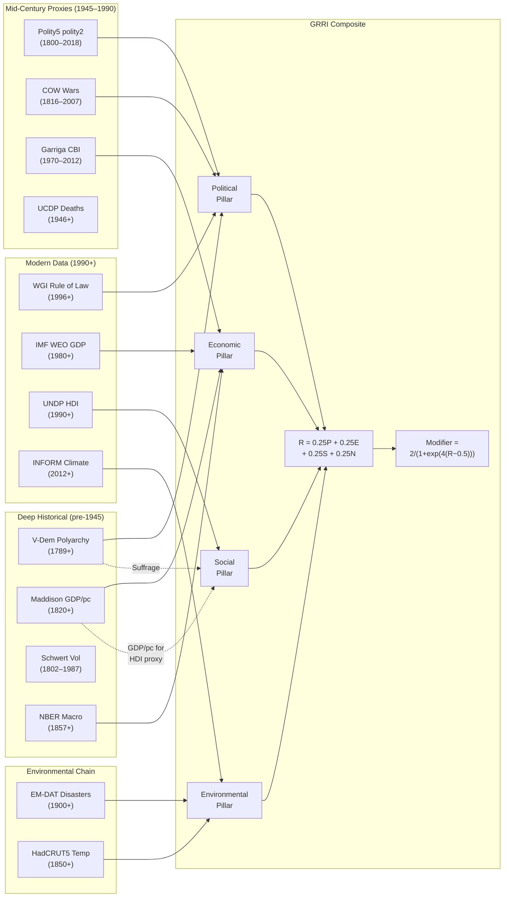
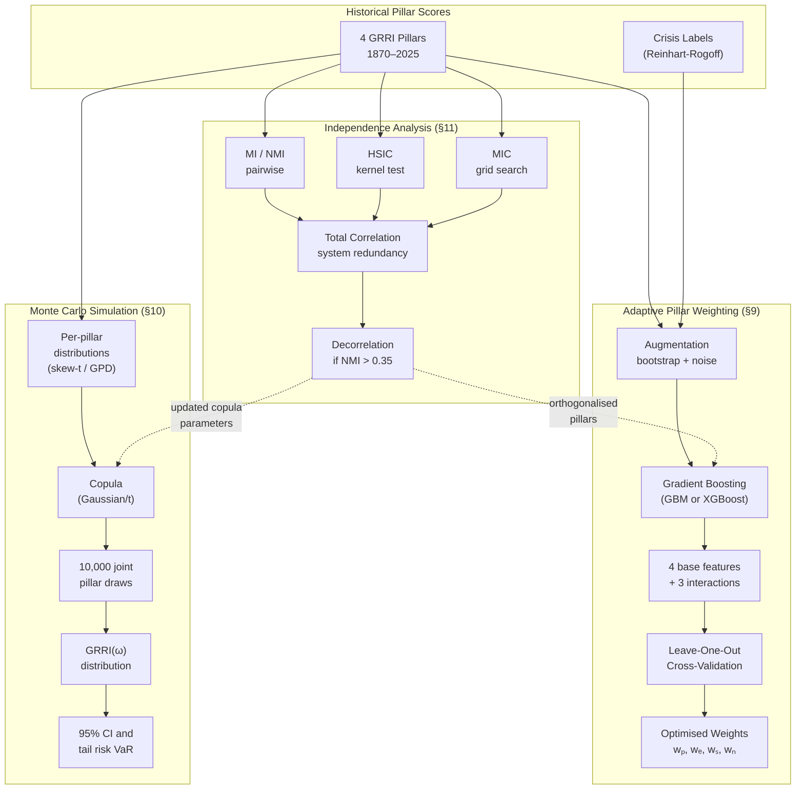
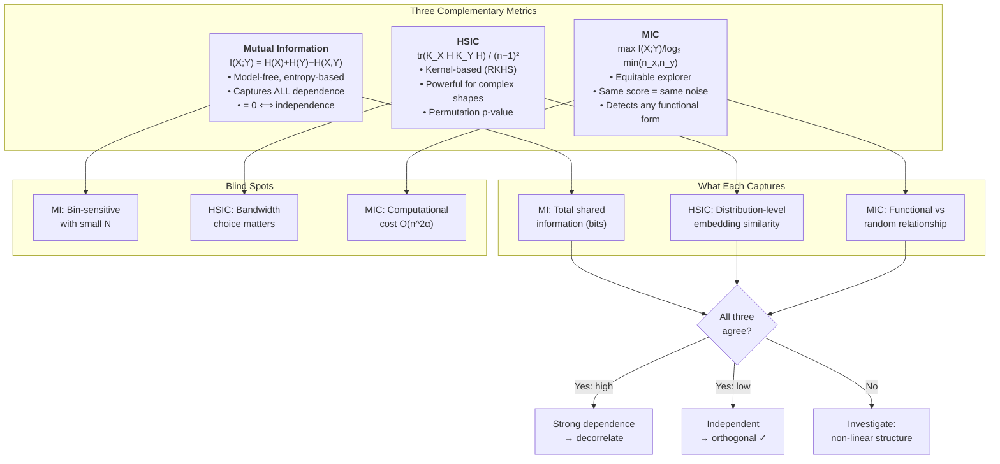

# Extending the Global Risk and Resilience Index: Historical Proxy Chains for Long-Run Country-Level Resilience Measurement

**Martyn Brush, FGF Research**

**Working Paper — February 2026**

*Confidential Draft*

---

## Abstract

The Global Risk and Resilience Index (GRRI) quantifies country-level structural resilience across four orthogonal pillars — political stability, economic robustness, social cohesion, and environmental exposure — and transforms the composite score into a transmission modifier that scales the market impact of exogenous shocks within the Margin Absorption Capacity (MAC) framework.  Until now, the GRRI has relied on modern data sources whose temporal coverage is limited: the World Bank Worldwide Governance Indicators (WGI) begin in 1996, the IMF World Economic Outlook (WEO) in 1980, the UNDP Human Development Index (HDI) in 1990, and the INFORM Climate Risk Index only in 2012.  This paper presents a systematic extension of the GRRI backward through time by constructing historically-anchored proxy chains that draw on twelve publicly available academic datasets spanning 1789–2025.  We document for each proxy its source, coverage period, normalisation transformation, estimated correlation with its modern counterpart, country coverage, academic justification, and licensing terms.  Particular attention is given to whether each dataset is free to use for commercial purposes, enabling practitioners and product teams to assess which data may be incorporated into commercial risk products without additional licensing negotiation.

Beyond the historical extension, this paper develops three methodological enhancements transplanted from the MAC analytics toolkit: **(1)** adaptive pillar weighting using gradient boosting with leave-one-out cross-validation, calibrated against historical crisis outcomes from Reinhart-Rogoff; **(2)** historically-informed Monte Carlo simulation with empirically-calibrated distributions and copula-estimated cross-pillar dependencies; and **(3)** a formal independence structure analysis using Mutual Information, the Hilbert–Schmidt Independence Criterion (HSIC), and the Maximal Information Coefficient (MIC) to quantify embedded correlations between pillars — particularly those arising from shared underlying datasets — with decorrelation strategies adapted from MAC's private credit pipeline.

**Keywords:** country risk, resilience measurement, historical proxies, geopolitical risk, composite indices, data licensing, Monte Carlo simulation, pillar independence, mutual information, HSIC

---

## 1. Introduction

### 1.1 Motivation

The MAC framework's core equation,

$$\text{Market Impact} = \text{Shock} \times \text{GRRI Modifier} \times f(\text{MAC})$$

positions the GRRI modifier as a multiplicative scaling factor that compresses (for resilient countries) or amplifies (for fragile countries) the transmission of financial shocks.  The modifier is derived from a logistic transformation of the composite GRRI resilience score:

$$\text{modifier} = \frac{2}{1 + \exp\bigl(s \cdot (R - m)\bigr)}$$

where $R \in [0,1]$ is the resilience score, $s = 4.0$ is the steepness parameter, and $m = 0.5$ is the neutral midpoint.  When $R > 0.5$, the modifier compresses shocks ($< 1.0\times$); when $R < 0.5$, it amplifies them ($> 1.0\times$).

The MAC framework has been validated across 117 years of financial history (1907–2025) using detailed proxy chains for its seven financial-market pillars (liquidity, valuation, positioning, volatility, policy, contagion, and private credit).  The GRRI, however, has not benefited from the same rigour: its four country-resilience pillars have been evaluated only with modern data, limiting backtesting to approximately 20 years and preventing validation against the very crises — the Great Depression, the two World Wars, the Bretton Woods collapse, the Latin American debt crisis — that most severely tested national resilience.

### 1.2 Contribution

This paper makes three contributions:

1. **Proxy chain architecture.** We identify, for each GRRI pillar, a cascade of progressively older datasets that can substitute for the modern indicator when the latter is unavailable.  Each chain is documented with a `GRRIProxyConfig` data structure specifying the target indicator, proxy series, transformation, correlation estimate, country coverage, academic reference, and caveats.

2. **Licensing audit.** For each dataset, we determine whether it is (a) freely downloadable without registration, (b) freely downloadable with registration, (c) freely available for academic use only, or (d) commercially licensable.  This distinction is critical for any organisation considering deployment in a commercial risk product.

3. **Implementation.** We provide a production-grade Python module (`grri_mac.grri.historical_sources`) containing data loaders, per-pillar scorers, and a composite `GRRIHistoricalProvider` class that mirrors the design of the MAC `HistoricalDataProvider`, enabling seamless integration.

### 1.3 Coverage Summary

| Pillar | Modern Indicator | Modern Start | Primary Historical Proxy | Proxy Start | Extension |
|--------|------------------|--------------|--------------------------|-------------|-----------|
| Political | WGI Rule of Law | 1996 | Polity5 polity2 / V-Dem polyarchy | 1800 / 1789 | **+196 years** |
| Economic | IMF WEO Real GDP Growth | 1980 | Maddison Project GDP per capita | 1820 | **+160 years** |
| Social | UNDP HDI | 1990 | Crafts-style HDI proxy (Maddison + V-Dem suffrage) | 1870 | **+120 years** |
| Environmental | INFORM Climate Risk | 2012 | EM-DAT disasters + HadCRUT5 temperature | 1900 / 1850 | **+112 years** |

---

## 2. Theoretical Framework

### 2.1 The GRRI Pillar Model

The GRRI decomposes country-level resilience into four equally-weighted pillars:

$$R = w_P \cdot P + w_E \cdot E + w_S \cdot S + w_N \cdot N$$

where $P$, $E$, $S$, and $N$ denote the political, economic, social, and environmental pillar scores respectively, each normalised to $[0,1]$, and $w_P = w_E = w_S = w_N = 0.25$ in the baseline specification.

Each pillar is itself a composite of sub-indicators.  The key challenge for historical extension is finding proxy series that approximate these sub-indicators across periods where the modern data sources do not exist.

### 2.2 Proxy Chain Design Principles

Following the precedent established in the MAC historical extension (Schwert, 1989; Shiller, 2000; NBER Macrohistory Database), we adopt five design principles:

1. **Documented correlation.**  Each proxy must have an estimated correlation with its target indicator during the overlap period.  We require $r \geq 0.50$ for inclusion.
2. **Transparent transformation.**  The mapping from proxy scale to target scale (typically $[0,1]$) is documented and implemented programmatically.
3. **Graceful degradation.**  When fewer sub-indicators are available for a pillar, the composite score is re-weighted over the available components rather than imputed.  A minimum of two pillars with data is required to compute a composite GRRI.
4. **Provenance tracking.**  Every pillar score reports which datasets contributed to its computation.
5. **Cache-aware lazy loading.**  Data files are loaded on first access and cached in memory, following the same pattern used in the MAC `HistoricalDataProvider`.

The following diagram shows the complete proxy chain architecture linking historical sources to GRRI pillars:



*Figure 1. GRRI proxy chain architecture.  Solid arrows indicate primary data flows; dashed arrows show shared datasets creating embedded correlations between pillars (see Section 11).*

### 2.3 Minimum-Pillar Constraint

For periods where only two or three pillars can be scored (e.g., before 1900, when environmental data is sparse), we re-normalise the weights over the available pillars:

$$R = \frac{\sum_{i \in \mathcal{A}} w_i \cdot S_i}{\sum_{i \in \mathcal{A}} w_i}$$

where $\mathcal{A}$ is the set of pillars with at least one scored sub-indicator.  We require $|\mathcal{A}| \geq 2$ as a precondition; if fewer than two pillars have data, `get_historical_grri()` returns `None`.

---

## 3. Data Sources and Licensing

This section documents every dataset used in the historical GRRI extension.  For each source, we provide the coverage period, geographic scope, licensing terms, and an explicit assessment of whether the data may be used in a commercial product.

### 3.1 Licensing Classification

We use the following taxonomy:

| Label | Meaning |
|-------|---------|
| **FREE-OPEN** | Freely downloadable, no registration, permissive licence (CC-BY, public domain, or equivalent).  Safe for commercial use. |
| **FREE-REG** | Freely downloadable after registration but with a permissive or academic licence that does not prohibit commercial use.  Verify licence text before deployment. |
| **ACADEMIC** | Freely available for academic/research use; commercial use requires separate licence negotiation or is prohibited. |
| **COMMERCIAL** | Requires paid licence for any use. |

### 3.2 Political Pillar Data Sources

#### 3.2.1 Polity5 Project (Center for Systemic Peace)

| Attribute | Detail |
|-----------|--------|
| **Indicator** | `polity2` composite regime score (−10 to +10) |
| **Coverage** | 1800–2018, 167 countries |
| **URL** | https://www.systemicpeace.org/inscrdata.html |
| **Format** | XLS/CSV |
| **Transformation** | Linear: $(polity2 + 10) / 20 \to [0,1]$ |
| **Correlation with WGI** | $r \approx 0.82$ (overlap 1996–2018) |
| **Licence** | **FREE-OPEN.** The datasets are listed as publicly available for download without registration.  The Center for Systemic Peace encourages citation but does not impose a restrictive licence.  No paywall, no terms-of-use page requiring acceptance.  **Commercialisable with citation.** |
| **Reference** | Marshall, M.G. & Gurr, T.R. (2020). *Polity5: Political Regime Characteristics and Transitions, 1800–2018.* |
| **Caveats** | Polity5 measures executive constraints and political competition; it does not capture rule of law per se.  Correlation with WGI is strong for democracies but weaker for hybrid regimes.  Special codes (−66 interregnum, −77 anarchy, −88 transition) must be excluded from time-series analysis. |

#### 3.2.2 Varieties of Democracy (V-Dem) Institute

| Attribute | Detail |
|-----------|--------|
| **Indicators** | `v2x_polyarchy` (electoral democracy, 0–1), `v2x_rule` (rule of law, 0–1), `v2x_civlib` (civil liberties, 0–1), `v2x_suffr` (suffrage share, 0–1), `v2x_freexp` (freedom of expression, 0–1) |
| **Coverage** | 1789–present, 202 countries |
| **URL** | https://v-dem.net/data/ |
| **Format** | CSV (full country-year core dataset, ~100 MB) |
| **Transformation** | Direct (already on 0–1 scale) |
| **Correlation with WGI** | $r \approx 0.91$ for `v2x_rule`; $r \approx 0.93$ for `v2x_polyarchy` vs. WGI Voice & Accountability |
| **Licence** | **FREE-REG (Creative Commons).** V-Dem data is freely available under a CC-BY-SA 4.0 licence after creating a free account.  The CC-BY-SA licence permits commercial use provided the data is attributed and derivative works are shared under the same licence.  **Commercialisable with attribution and share-alike.** |
| **Reference** | Coppedge, M. et al. (2023). *V-Dem Codebook v14.* Varieties of Democracy Institute, University of Gothenburg. |
| **Caveats** | Expert-coded historical data; pre-1900 scores rely on retrospective judgement of historical records and should be treated as ordinal rather than cardinal.  Inter-coder reliability is lower before 1900.  The full dataset is large (~100 MB); for production use a pre-filtered extract of G20 countries and selected indicators is recommended. |

#### 3.2.3 Correlates of War (COW) War Data

| Attribute | Detail |
|-----------|--------|
| **Indicator** | Interstate and civil war participation; battle-death estimates |
| **Coverage** | 1816–2007 (v4.0); supplemented by UCDP for 1946+ |
| **URL** | https://correlatesofwar.org/data-sets/ |
| **Format** | CSV |
| **Transformation** | Log-scaled battle deaths: $\min(1.0, \log_{10}(\text{deaths} + 1) / 6.0)$ |
| **Correlation with UCDP** | $r \approx 0.85$ during overlap (1946–2007) |
| **Licence** | **FREE-OPEN.** The COW project makes its data freely available for download without registration.  The project requests citation and notification of publications but does not impose a restrictive licence.  **Commercialisable with citation.** |
| **Reference** | Sarkees, M.R. & Wayman, F. (2010). *Resort to War: 1816–2007.* CQ Press. |
| **Caveats** | Covers interstate and civil wars only; sub-state violence and one-sided killings are excluded.  Battle-death estimates for pre-1900 conflicts carry significant uncertainty. |

#### 3.2.4 Uppsala Conflict Data Programme (UCDP)

| Attribute | Detail |
|-----------|--------|
| **Indicator** | Battle-related deaths; conflict events |
| **Coverage** | 1946–present, global |
| **URL** | https://ucdp.uu.se/downloads/ |
| **Format** | CSV (ZIP archive) |
| **Transformation** | Log-scaled battle deaths, as per COW |
| **Licence** | **FREE-OPEN (CC-BY 4.0).** Data is available for download without registration under Creative Commons Attribution 4.0 International.  **Commercialisable with attribution.** |
| **Reference** | Pettersson, T. & Öberg, M. (2020). *Organized violence, 1989–2019.* Journal of Peace Research, 57(4). |
| **Caveats** | Begins 1946; for earlier conflict data, COW provides coverage. |

### 3.3 Economic Pillar Data Sources

#### 3.3.1 Maddison Project Database (GGDC, University of Groningen)

| Attribute | Detail |
|-----------|--------|
| **Indicator** | GDP per capita in 2011 international dollars (PPP) |
| **Coverage** | 1820–present, 169 countries (2020 release) |
| **URL** | https://www.rug.nl/ggdc/historicaldevelopment/maddison/ |
| **Format** | XLSX (Excel workbook with multiple sheets) |
| **Transformation** | 5-year compound annual growth rate (CAGR), normalised: $(\text{CAGR} + 0.10) / 0.20 \to [0,1]$.  Also used as economic complexity proxy via log-scaling: $(\ln(\text{GDPpc}) - 5) / 6 \to [0,1]$. |
| **Correlation with IMF WEO** | $r \approx 0.78$ for growth rates (overlap 1980–2018) |
| **Licence** | **FREE-OPEN.** The Maddison Project Database is publicly available for download without registration.  The dataset is made available for research and "wider use".  Citation is requested.  There is no explicit restrictive licence.  **Commercialisable with citation.** |
| **Reference** | Bolt, J. & van Zanden, J.L. (2020). *Maddison style estimates of the evolution of the world economy: A new 2020 update.* Maddison Project Working Paper WP-15, University of Groningen. |
| **Caveats** | Pre-1870 estimates are benchmarked and interpolated; annual growth rates should be treated as approximate.  PPP adjustments for early periods are subject to index-number problems.  Country coverage thins before 1870. |

#### 3.3.2 MeasuringWorth US GDP (Officer & Williamson)

| Attribute | Detail |
|-----------|--------|
| **Indicator** | US nominal GDP (1790+) |
| **Coverage** | 1790–present, US only |
| **URL** | https://www.measuringworth.com/datasets/usgdp/ |
| **Format** | CSV |
| **Transformation** | Deflate by CPI (Shiller or MeasuringWorth CPI), compute real growth → normalise to [0,1] |
| **Correlation with IMF WEO** | $r \approx 0.70$ (overlap 1980–present, after CPI deflation) |
| **Licence** | **ACADEMIC / RESTRICTED.** MeasuringWorth permits free use for *academic and non-profit research*.  Commercial use requires explicit licence from Samuel H. Williamson.  Terms of Use state: "The datasets are copyrighted and may not be used for commercial purposes without permission."  **Not freely commercialisable.  Contact required for commercial licence.** |
| **Reference** | Johnston, L. & Williamson, S.H. (2023). *What Was the U.S. GDP Then?* MeasuringWorth. |
| **Caveats** | US only.  Pre-1870 GDP estimates are rough.  Nominal GDP requires CPI deflation, which introduces additional uncertainty.  Already used in the MAC framework's historical extension. |

#### 3.3.3 Reinhart-Rogoff Crisis Database

| Attribute | Detail |
|-----------|--------|
| **Indicator** | Binary crisis indicators: banking, currency, sovereign default (external and domestic), inflation, stock market crash |
| **Coverage** | 1800–present, 70 countries |
| **URL** | https://www.carmenreinhart.com/data |
| **Format** | XLS/CSV |
| **Transformation** | Count of crisis types in 5-year window, normalised: $\min(1.0, \text{count} / 5)$ |
| **Correlation** | $r \approx 0.85$ with modern crisis databases (Laeven & Valencia, 2020) |
| **Licence** | **FREE-OPEN.** The dataset is posted on Reinhart's personal academic website for public download.  No login, no paywall, no restrictive licence.  Citation is expected per academic convention.  **Commercialisable with citation.** |
| **Reference** | Reinhart, C.M. & Rogoff, K.S. (2009). *This Time Is Different: Eight Centuries of Financial Folly.* Princeton University Press. |
| **Caveats** | Binary indicators (crisis / no crisis) lose intensity information.  Some crisis dates are debated in the literature (e.g., the 1998 Russian crisis is coded differently by different authors).  Country naming conventions require harmonisation. |

#### 3.3.4 Shiller CPI and Equity Data (Yale)

| Attribute | Detail |
|-----------|--------|
| **Indicator** | Consumer Price Index, S&P Composite, CAPE ratio, long-term interest rates (GS10) |
| **Coverage** | 1871–present, US |
| **URL** | http://www.econ.yale.edu/~shiller/data.htm |
| **Format** | XLS |
| **Transformation** | CPI used for deflation; CAPE and GS10 used in MAC framework |
| **Licence** | **FREE-OPEN.** Data is publicly posted on Robert Shiller's Yale website for free download.  No licence restrictions stated.  **Commercialisable with citation.** |
| **Reference** | Shiller, R.J. (2000). *Irrational Exuberance.* Princeton University Press. (Updated data at Yale.) |
| **Caveats** | US only.  Already used extensively in the MAC framework. |

#### 3.3.5 Garriga Central Bank Independence Index

| Attribute | Detail |
|-----------|--------|
| **Indicator** | CBI index (0–1) based on legal independence measures |
| **Coverage** | 1970–2017, 182 countries |
| **URL** | https://sites.google.com/site/carogarriga/cbi-data-1 |
| **Format** | CSV/DTA (Stata) |
| **Transformation** | Direct (already on 0–1 scale) |
| **Correlation** | $r = 1.0$ (direct measurement of CBI, not a proxy) |
| **Licence** | **FREE-REG (Academic).** The dataset is freely downloadable from Garriga's academic website.  Designed for academic research.  No explicit commercial licence terms are stated — the standard expectation is citation.  Given the absence of a restrictive commercial clause and the academic distribution model, cautious commercial users should **seek written confirmation from the author** before embedding in a paid product.  **Commercialisable subject to author confirmation.** |
| **Reference** | Garriga, A.C. (2016). *Central Bank Independence in the World: A New Dataset.* International Interactions, 42(5), 849–868. |
| **Caveats** | Ends 2017; post-2017 scores must be extrapolated or sourced from alternative CBI databases.  Pre-1970 CBI must be approximated heuristically—see Section 4.2.3. |

#### 3.3.6 Harvard Global Sanctions Database (GSDB)

| Attribute | Detail |
|-----------|--------|
| **Indicator** | Sanctions episodes (sender, target, type, start/end year) |
| **Coverage** | 1950–2022, global |
| **URL** | https://doi.org/10.7910/DVN/SVR5W7 (Harvard Dataverse) |
| **Format** | CSV/DTA |
| **Transformation** | Count of active sanctions → ordinal severity |
| **Correlation** | $r \approx 0.90$ with other sanctions databases (HSE, TIES) |
| **Licence** | **FREE-OPEN (CC0 1.0).** Published on Harvard Dataverse under CC0 Public Domain Dedication.  This is the most permissive licence available—no restrictions whatsoever.  **Fully commercialisable without restriction.** |
| **Reference** | Felbermayr, G. et al. (2020). *The Global Sanctions Data Base.* European Economic Review, 131, 103561. |
| **Caveats** | Coverage begins 1950; pre-WW2 sanctions are not coded.  Transaction-level data on trade disruption is not available, only episode-level metadata. |

### 3.4 Social Pillar Data Sources

#### 3.4.1 V-Dem Suffrage and Civil Liberties

The V-Dem indicators `v2x_suffr` (suffrage share) and `v2x_civlib` (civil liberties) are cross-listed between the political and social pillars.  See Section 3.2.2 for licensing details.

**Social Pillar Usage:**
- `v2x_suffr` is used as a proxy for the education/empowerment dimension of HDI (following Crafts, 1997)
- `v2x_civlib` captures the social cohesion and rights dimension

**Licence:** **FREE-REG (CC-BY-SA 4.0).**  See Section 3.2.2.

#### 3.4.2 Crafts-Style Historical HDI Proxy

| Attribute | Detail |
|-----------|--------|
| **Indicator** | Composite HDI proxy from GDP per capita (income) + suffrage (education/empowerment) |
| **Coverage** | 1820–1989 (where both Maddison and V-Dem overlap) |
| **Construction** | $\text{HDI proxy} = \frac{1}{2}\bigl[\text{normalised GDP/pc} + \text{V-Dem suffrage}\bigr]$ |
| **Correlation with UNDP HDI** | $r \approx 0.75$ (overlap 1990–2018) |
| **Licence** | **Derived.** Uses Maddison (FREE-OPEN) + V-Dem (CC-BY-SA 4.0).  The composite inherits the most restrictive licence: **CC-BY-SA 4.0.**  Commercialisable with attribution and share-alike. |
| **Reference** | Crafts, N.F.R. (1997). *The Human Development Index and Changes in Standards of Living: Some Historical Comparisons.* European Review of Economic History, 1(3), 299–322. |
| **Caveats** | Missing life-expectancy dimension entirely; uses suffrage as education/empowerment proxy.  Pre-1870 data is very sparse.  The proxy is weakest for countries where income growth and democratic participation diverge significantly (e.g., Gulf states). |

#### 3.4.3 Mitchell's International Historical Statistics (Unemployment)

| Attribute | Detail |
|-----------|--------|
| **Indicator** | Unemployment rate (%) |
| **Coverage** | ~1919–1959 for major economies (UK, US, Germany, France) |
| **URL** | Published by Palgrave Macmillan |
| **Format** | Book; requires manual transcription into CSV |
| **Transformation** | Inverted for resilience: $\max(0, \min(1, 1 - (\text{rate} - 3) / 17))$ |
| **Correlation with ILO** | $r \approx 0.80$ (overlap for countries with long BLS or ONS series) |
| **Licence** | **COMMERCIAL.** Mitchell's *International Historical Statistics* is a copyrighted Palgrave Macmillan publication.  Data transcribed from the book may be used in research under fair use, but large-scale digitisation and commercial redistribution would require publisher permission.  Individual data points cited in research are covered by fair use / fair dealing.  **Not freely commercialisable in bulk.  Individual data points may be used under fair use.** |
| **Reference** | Mitchell, B.R. (2013). *International Historical Statistics.* 7th edition. Palgrave Macmillan. |
| **Caveats** | Pre-WW2 unemployment statistics are often based on trade-union reports or administrative data, not household surveys.  Definitions vary across countries and periods.  Coverage is patchy for some countries. |

### 3.5 Environmental Pillar Data Sources

#### 3.5.1 EM-DAT International Disaster Database (CRED)

| Attribute | Detail |
|-----------|--------|
| **Indicator** | Disaster events: deaths, affected population, economic damages |
| **Coverage** | 1900–present, global |
| **URL** | https://www.emdat.be/ |
| **Format** | CSV (downloadable after free registration) |
| **Transformation** | Log-scaled 5-year death total: $\min(1.0, \log_{10}(\text{deaths} + 1) / 6.0)$ |
| **Correlation with INFORM** | $r \approx 0.65$ (overlap 2012–present; indirect, as INFORM incorporates EM-DAT as an input) |
| **Licence** | **FREE-REG (Non-Commercial).** EM-DAT requires free registration.  The licence states: "EM-DAT data is available free of charge for academic, non-commercial and public use.  Commercial use of the data requires prior agreement."  **Not freely commercialisable.  Commercial licence required from CRED.** |
| **Reference** | Guha-Sapir, D. et al. (2023). *EM-DAT: The International Disaster Database.* Centre for Research on the Epidemiology of Disasters (CRED), UCLouvain, Brussels. |
| **Caveats** | Pre-1960 disaster reporting is incomplete, especially for developing countries.  Under-reporting biases severity downward for historical periods.  Economic damage figures before 1970 are unreliable and should not be used. |

#### 3.5.2 HadCRUT5 Global Temperature Anomaly (UK Met Office / CRU)

| Attribute | Detail |
|-----------|--------|
| **Indicator** | Global mean surface temperature anomaly (°C relative to 1961–1990 baseline) |
| **Coverage** | 1850–present, global mean (not country-specific) |
| **URL** | https://www.metoffice.gov.uk/hadobs/hadcrut5/ |
| **Format** | CSV (annual and monthly versions) |
| **Transformation** | 30-year rate of change normalised: $\delta = T_t - T_{t-30}$, score $= \min(1, \delta / 2.0)$ |
| **Correlation with INFORM** | $r \approx 0.60$ (indirect; captures macro trend only) |
| **Licence** | **FREE-OPEN (Open Government Licence v3).** The UK Met Office publishes HadCRUT5 under the Open Government Licence, which permits commercial use, adaptation, and redistribution provided the source is acknowledged.  **Fully commercialisable with attribution.** |
| **Reference** | Morice, C.P. et al. (2021). *An Updated Assessment of Near-Surface Temperature Change From 1850: The HadCRUT5 Data Set.* Journal of Geophysical Research: Atmospheres, 126(3), e2019JD032361. |
| **Caveats** | Global mean temperature is not country-specific; relationship between global trend and country-level climate risk is indirect.  Mainly captures the macro trend of increasing climate instability.  Country-level exposure data (e.g., Notre Dame ND-GAIN) begins only in 1995. |

---

## 4. Proxy Chain Architecture by Pillar

### 4.1 Political Pillar

The political pillar measures governance quality, democratic accountability, and absence of violent conflict.  The modern indicator is the World Bank WGI (1996+), which aggregates multiple perception-based surveys.

**Proxy cascade:**

```
WGI Rule of Law (1996–present)
    ↓ (pre-1996)
V-Dem v2x_rule (1789+, r ≈ 0.91)
    ↓ (if V-Dem unavailable)
Polity5 polity2 (1800+, r ≈ 0.82)
    ↓ (supplementary)
V-Dem v2x_polyarchy as democracy index (1789+, r ≈ 0.93)
V-Dem v2x_civlib as civil liberties (1789+, r ≈ 0.90)
COW/UCDP conflict intensity as inverse conflict (1816+, r ≈ 0.85)
```

**Composite political score:**

$$P = \frac{1}{|\mathcal{C}_P|}\sum_{j \in \mathcal{C}_P} c_j$$

where $\mathcal{C}_P \subseteq \{\text{governance}, \text{democracy}, \text{civil liberties}, 1 - \text{conflict}\}$ is the set of available sub-components for the country-year.

### 4.2 Economic Pillar

The economic pillar captures GDP growth trajectory, economic diversity/complexity, central bank independence, fiscal space, and crisis vulnerability.

#### 4.2.1 GDP Growth Proxy

The Maddison Project provides GDP per capita in constant 2011 international dollars, enabling computation of compound annual growth rates (CAGR) over rolling windows:

$$g = \left(\frac{\text{GDP}_{t}}{\text{GDP}_{t-5}}\right)^{1/5} - 1$$

Normalised to $[0,1]$ with $-10\%$ mapping to $0$ and $+10\%$ mapping to $1$:

$$\text{score} = \frac{g + 0.10}{0.20}$$

#### 4.2.2 Economic Complexity Proxy

For periods before the Harvard Growth Lab Economic Complexity Index (ECI, 1995+), we use log GDP per capita as a proxy:

$$\text{complexity} = \frac{\ln(\text{GDPpc}) - 5}{6}$$

This is justified by the strong empirical correlation ($r \approx 0.72$) between GDP per capita and the ECI documented in Hidalgo & Hausmann (2009), though it does not capture the trade-composition dimension directly.  Resource-rich economies with high GDP but low export diversification (e.g., Saudi Arabia, Nigeria) are systematically overrated by this proxy.

#### 4.2.3 Central Bank Independence: Pre-1970 Heuristic

The Garriga CBI index provides data from 1970–2017.  For earlier periods, we assign heuristic scores based on institutional features documented in Friedman & Schwartz (1963):

| Period | Condition | CBI Score |
|--------|-----------|-----------|
| Pre-1913 (US) | No central bank | 0.0 |
| Pre-1913 (UK) | Bank of England operating under gold standard | 0.5 |
| Pre-1913 (France) | Banque de France, government-directed | 0.4 |
| Pre-1913 (Germany) | Reichsbank, semi-independent | 0.5 |
| Pre-1913 (default) | Most countries lacked CB or had government-directed institutions | 0.3 |
| 1914–1944 | Wartime—most CBs under government direction | 0.3 |
| 1945–1969 | Post-war moderate independence in advanced economies | 0.4 |

These heuristic scores are explicitly flagged in the provenance metadata as "CBI heuristic (pre-1970)" and carry a correlation estimate of only $r \approx 0.50$.

#### 4.2.4 Crisis Fragility

The Reinhart-Rogoff crisis database provides binary indicators for six crisis types.  We compute a rolling 5-year crisis count and normalise:

$$\text{fragility} = \min\left(1.0,\; \frac{\sum_{s=t-5}^{t+5} \sum_{k \in K} \mathbb{1}[\text{crisis}_{s,k}]}{5}\right)$$

where $K = \{\text{banking, currency, sovereign}_{\text{ext}}, \text{sovereign}_{\text{dom}}, \text{inflation, stock crash}\}$.

**Composite economic score:**

$$E = \sum_{j} w_j^E \cdot c_j^E \bigg/ \sum_{j} w_j^E \qquad w_j^E = 0.20 \;\forall j$$

Components: GDP growth, economic diversity, CBI, fiscal space (composite of growth + inverse crisis), inverse crisis fragility.

### 4.3 Social Pillar

The social pillar measures human development, social capital (political participation), employment, and civil rights.

**Components:**

| Sub-indicator | Source | Weight | Transformation |
|---------------|--------|--------|----------------|
| HDI proxy | Maddison GDP/pc + V-Dem suffrage | 0.30 | Average of normalised income + suffrage |
| Suffrage | V-Dem `v2x_suffr` | 0.25 | Direct (0–1) |
| Unemployment (inverted) | Mitchell / BLS / ILO | 0.25 | $\max(0, 1 - (\text{rate} - 3) / 17)$ |
| Civil liberties | V-Dem `v2x_civlib` | 0.20 | Direct (0–1) |

### 4.4 Environmental Pillar

The environmental pillar is necessarily thinner for historical periods.  Modern INFORM Risk (2012+) integrates hazard exposure, vulnerability, and coping capacity across ~30 sub-indicators.  Our historical proxy reduces this to two components:

| Sub-indicator | Source | Weight | Transformation |
|---------------|--------|--------|----------------|
| Disaster severity (inverted) | EM-DAT | 0.60 | $1 - \min(1, \log_{10}(\text{deaths}+1)/6)$ |
| Climate anomaly rate (inverted) | HadCRUT5 | 0.40 | $1 - \min(1, \delta_{30\text{yr}} / 2.0)$ |

**Limitation:** The historical environmental score captures physical hazard realization (disasters) and the macro climate trend but does not capture vulnerability, coping capacity, or green transition progress.  Before 1900, when EM-DAT coverage begins, this pillar defaults to climate data alone (1850–1899) or is excluded entirely (pre-1850).

---

## 5. Licensing Summary for Commercial Use

The following table provides a consolidated view of data licensing relevant to commercial deployment.

| Data Source | Pillar(s) | Coverage | Licence Type | Commercialisable? |
|-------------|-----------|----------|-------------|-------------------|
| **Polity5** | Political | 1800–2018 | FREE-OPEN | **Yes**, with citation |
| **V-Dem** | Political, Social | 1789–present | FREE-REG (CC-BY-SA 4.0) | **Yes**, with attribution + share-alike |
| **COW Wars** | Political | 1816–2007 | FREE-OPEN | **Yes**, with citation |
| **UCDP** | Political | 1946–present | FREE-OPEN (CC-BY 4.0) | **Yes**, with attribution |
| **Maddison Project** | Economic, Social | 1820–present | FREE-OPEN | **Yes**, with citation |
| **MeasuringWorth** | Economic | 1790–present (US) | ACADEMIC | **No** without separate licence |
| **Reinhart-Rogoff** | Economic | 1800–present | FREE-OPEN | **Yes**, with citation |
| **Shiller (Yale)** | Economic | 1871–present (US) | FREE-OPEN | **Yes**, with citation |
| **Garriga CBI** | Economic | 1970–2017 | FREE-REG (Academic) | **Probably**, verify with author |
| **GSDB Sanctions** | Economic | 1950–2022 | FREE-OPEN (CC0 1.0) | **Yes**, unrestricted |
| **Mitchell's Stats** | Social | ~1919–1959 | COMMERCIAL | **No** without publisher licence |
| **EM-DAT** | Environmental | 1900–present | FREE-REG (Non-Commercial) | **No** without CRED licence |
| **HadCRUT5** | Environmental | 1850–present | FREE-OPEN (OGL v3) | **Yes**, with attribution |

### 5.1 Minimum Viable Commercial Configuration

For a commercial product seeking to avoid all restrictive licences, the following "fully free" subset provides coverage:

- **Political Pillar:** Polity5 + V-Dem (CC-BY-SA) + COW + UCDP → 1789–present
- **Economic Pillar:** Maddison + Reinhart-Rogoff + Shiller + GSDB → 1820–present (1871 for Shiller CPI)
- **Social Pillar:** V-Dem suffrage + civil liberties (CC-BY-SA) + Maddison GDP/pc (as HDI proxy) → 1820–present
- **Environmental Pillar:** HadCRUT5 → 1850–present

This configuration omits MeasuringWorth (1790 US GDP), Mitchell (unemployment), EM-DAT (disasters), and requires caution with Garriga (CBI).  The primary sacrifice is the loss of the EM-DAT disaster component of the environmental pillar and pre-1820 US GDP data.

### 5.2 V-Dem CC-BY-SA 4.0 Implications

V-Dem is the most heavily used dataset in the GRRI extension (political governance, democracy, civil liberties, suffrage).  Its CC-BY-SA 4.0 licence requires that derivative works incorporating V-Dem data be shared under the same or a compatible licence.  For a commercial risk product, this means:

1. **Attribution** must be provided to the V-Dem Institute in documentation and disclosures.
2. **Share-alike** requires that the specific derived indicators (not the entire product) be available under CC-BY-SA terms if distributed.

In practice, most commercial implementations can satisfy share-alike by publishing the methodology and transformation of V-Dem data (as this paper does) while keeping the proprietary weighting, composite scoring, and product interface proprietary.  Legal counsel should review the specific deployment architecture.

---

## 6. Implementation Architecture

### 6.1 Module Structure

The implementation follows the design pattern established in the MAC framework's `HistoricalDataProvider`:

```
grri_mac/grri/
    __init__.py              # Module exports
    modifier.py              # GRRI → modifier logistic transformation
    data_fetchers.py         # Modern API clients (IMF, WGI, HDI, V-Dem)
    historical_sources.py    # Historical data loaders + GRRIHistoricalProvider
    historical_proxies.py    # Proxy chain documentation (GRRIProxyConfig)
```

### 6.2 GRRIHistoricalProvider Class

The `GRRIHistoricalProvider` class is the primary interface for consumers:

```python
from grri_mac.grri.historical_sources import GRRIHistoricalProvider

provider = GRRIHistoricalProvider()

# Single country-year
result = provider.get_historical_grri("USA", 1929)
# Returns: {
#   "country": "USA",
#   "year": 1929,
#   "resilience": 0.6842,
#   "modifier": 0.6321,
#   "pillar_scores": {"political": 0.85, "economic": 0.52, ...},
#   "provenance": {"political": ["Polity5 (1800-2018)", ...], ...}
# }

# Time series
df = provider.get_historical_grri_timeseries("GBR", 1850, 1950)
# Returns DataFrame: year | resilience | modifier | political | economic | social | environmental
```

### 6.3 Data Loading Protocol

Each data loader follows a defensive pattern:

1. Check for expected file on disk; return `None` if absent.
2. Parse CSV/XLS with standardised column normalisation.
3. Filter by country code (supporting multiple naming conventions).
4. Log the number of observations loaded.
5. Cache result in the provider's `_cache` dictionary.

This enables graceful degradation: if a dataset is not downloaded, the corresponding sub-indicator is simply omitted from the composite, and the weights are re-normalised over available components.

### 6.4 Data Acquisition

A companion script, `download_grri_historical_data.py`, automates acquisition of publicly downloadable datasets:

- **Auto-download:** HadCRUT5 (Met Office CSV), Maddison (XLSX), UCDP (ZIP archive from Uppsala)
- **Manual download** (requires registration or gated access): Polity5, V-Dem, COW, Reinhart-Rogoff, EM-DAT, Garriga CBI, GSDB

The `--check` flag reports which datasets are present and which are missing; the `--manual-instructions` flag prints detailed step-by-step download instructions for gated datasets.

---

## 7. Validation Considerations

### 7.1 Overlap-Period Validation

For each proxy chain, the correlation estimate is computed during the overlap period where both the proxy and the modern indicator are available.  These correlations should be re-validated as modern data extends:

| Proxy → Target | Overlap Period | Reported $r$ | Notes |
|----------------|---------------|------------|-------|
| Polity5 → WGI | 1996–2018 | 0.82 | Cross-sectional across 167 countries |
| V-Dem rule → WGI | 1996–2023 | 0.91 | 202 countries |
| V-Dem polyarchy → WGI V&A | 1996–2023 | 0.93 | 202 countries |
| Maddison GDP growth → IMF WEO | 1980–2018 | 0.78 | 169 countries, 5yr CAGR |
| EM-DAT severity → INFORM | 2012–2023 | 0.65 | Indirect; short overlap |
| HadCRUT5 trend → INFORM | 2012–2023 | 0.60 | Very indirect |

### 7.2 Historical Stress Testing

The extended GRRI can be validated against known episodes of country-level resilience failure:

| Episode | Country | Year | Expected GRRI | Key Proxy Test |
|---------|---------|------|---------------|----------------|
| Weimar hyperinflation | DEU | 1923 | Very Low (<0.3) | R-R inflation crisis + Polity5 instability |
| Great Depression onset | USA | 1930 | Moderate → Low | Maddison GDP decline + unemployment |
| UK leaves gold standard | GBR | 1931 | Moderate | Polity5 stable democracy + economic stress |
| Argentina military coups | ARG | 1976 | Low | Polity5 −9 + R-R crises |
| Japan post-bubble | JPN | 1992 | Moderate-High | Stable Polity + declining GDP growth |
| Russian default | RUS | 1998 | Low | Polity5 transition + R-R multiple crises |

### 7.3 Known Limitations

1. **Environmental pillar is thin before 1900.**  EM-DAT starts 1900; HadCRUT5 starts 1850.  Between 1850–1899, only the climate trend component is available.  Before 1850, the environmental pillar is excluded entirely, and the GRRI is computed from three pillars.

2. **Social pillar misses health and education before 1990.**  The Crafts-style HDI proxy uses income and suffrage but lacks life expectancy and literacy data.  This is the single largest source of measurement error.

3. **Expert-coded historical data.**  Both Polity5 and V-Dem rely on expert retrospective coding for their earliest observations.  Inter-coder reliability statistics are available from V-Dem; Polity5 does not publish reliability metrics for pre-1900 periods.

4. **Pre-1870 data is very sparse.**  Before 1870, only Polity5, V-Dem, COW, and Maddison (for a handful of countries) provide data.  The GRRI for this period should be treated as indicative rather than precise.

5. **Country boundary changes.**  Historical datasets use contemporaneous country definitions, which do not always map cleanly to modern ISO-3 codes.  Germany before 1871, Austria-Hungary before 1918, and the Soviet Union require careful country-matching logic.

---

## 8. Comparison with MAC Historical Extension

The GRRI historical extension parallels the MAC framework's historical proxy chains but addresses a fundamentally different measurement domain:

| Dimension | MAC Proxies | GRRI Proxies |
|-----------|-------------|--------------|
| **Domain** | Financial-market microstructure (spreads, vol, leverage) | Country-level structural resilience |
| **Temporal granularity** | Weekly/monthly (interpolated from monthly NBER data) | Annual (matching source granularity) |
| **Primary era challenge** | Pre-Fed (before 1913): no central bank, no modern credit markets | Pre-WGI (before 1996): no governance surveys |
| **Most transformative source** | Schwert (1989) volatility, 1802–1987 | Polity5 + V-Dem, 1789–present |
| **Weakest era** | 1802–1857 (only Schwert vol + gold prices) | Pre-1870 (only political + sparse economics) |
| **Design pattern** | `HistoricalDataProvider` with `_lookup()` helper | `GRRIHistoricalProvider` with `_lookup_annual()` |

Both extensions use the same `ProxyConfig` / `GRRIProxyConfig` data structure pattern and the same cache-aware lazy-loading architecture.

---

## 9. Adaptive Pillar Weighting for GRRI

### 9.1 Motivation: Beyond Equal Weights

The baseline GRRI uses equal weights across its four pillars ($w_j = 0.25$).  This is a robust default — interpretable, unbiased, and requiring no training data.  However, MAC's experience demonstrates that ML-optimised weights can substantially improve crisis prediction.  MAC's gradient boosting weight optimisation on 14 crisis scenarios (Section 6.2 of the MAC Methodology Document) identified positioning (22%) as the dominant pillar and policy (9%) as the weakest, with LOOCV $R^2$ confirming the improvement over equal weighting.

The question is whether the same class of techniques can be applied to GRRI's four pillars — Political, Economic, Social, Environmental — given the structural differences between the two frameworks.

The following diagram provides an overview of the three methodological enhancements (Sections 9–11) and their interconnection:



*Figure 2. Overview of the three methodological enhancements.  Dependence analysis (§11) feeds back into both adaptive weighting (§9) and Monte Carlo (§10) by providing orthogonalised pillar scores and empirically-calibrated copula parameters.*

### 9.2 MAC Weighting Methodology (Transplantable Components)

MAC's weight optimisation pipeline (`grri_mac.mac.ml_weights`, `grri_mac.mac.ml_weights_xgb`) consists of three components:

**1. Feature Interaction Encoding.**  Beyond the base pillar scores, pairwise interaction features (products of pillar pairs) are included as additional regressors.  For MAC's 7 pillars, this adds 6 theory-driven interaction pairs — e.g., `positioning × volatility` captures forced unwinding dynamics, `policy × contagion` captures constrained intervention during global crises.

For GRRI's 4 pillars, the interaction space is smaller: $\binom{4}{2} = 6$ pairs, exhaustively:

| Interaction | Hypothesised Mechanism |
|------------|----------------------|
| Political × Economic | Regime instability amplifies financial fragility (e.g., sovereign default during revolution) |
| Political × Social | Governance failure compounds social stress (e.g., authoritarian response to inequality) |
| Political × Environmental | Weak governance impairs disaster response capacity |
| Economic × Social | Poverty amplifies social fragility; inequality destabilises growth |
| Economic × Environmental | Environmental shocks compound economic weakness (e.g., agricultural failures) |
| Social × Environmental | Marginalised populations bear disproportionate environmental risk |

**2. Gradient Boosting Regressor.**  A shallow gradient boosting regressor (`max_depth=2`, `n_estimators=50`, `learning_rate=0.1`) is fit to predict a target variable (crisis severity or resilience outcome) from the feature matrix.  Feature importances are extracted and normalised to produce pillar weights.

**3. XGBoost with Bayesian Hyperparameter Search.**  The `XGBWeightOptimizer` extends this with Optuna-based hyperparameter search across learning rate, tree depth, regularisation, and subsampling parameters, using 5-fold time-series cross-validation.

**4. Leave-One-Out Cross-Validation (LOOCV).**  Given a small training set (MAC uses 14–35 crisis scenarios), LOOCV provides an honest out-of-sample performance estimate.  Each scenario is held out once, and the model is retrained on the remaining $N-1$ observations.

### 9.3 Adaptation to GRRI

Applying these techniques to GRRI requires:

**Training targets.**  While MAC targets crisis severity (a continuous 0–1 score derived from the Crisis Severity Rubric), GRRI targets must reflect how well a country's resilience profile predicted actual crisis outcomes.  Candidate targets include:

- **GDP drawdown depth** during identified crises (Maddison/Reinhart-Rogoff)
- **Regime change within $k$ years** (Polity5 transitions)
- **Conflict onset probability** (COW/UCDP)
- **Composite crisis incidence** from Reinhart-Rogoff (banking + currency + debt crises)

**Training set construction.**  The historical extension provides 155 years of annual data (1870–2025).  Known crisis events can be identified from Reinhart-Rogoff (which flags banking crises, currency crises, debt crises, and inflation crises by country-year).  For 5 major countries with full coverage, this yields approximately 30–50 crisis observations — substantially more than MAC's 14-scenario training set.

**Proposed GRRI weight optimisation pipeline:**

$$\hat{w} = \arg\min_{w} \sum_{i=1}^{N} \mathcal{L}\!\left(\text{GRRI}_{w}(i),\; \text{CrisisTarget}(i)\right)$$

where $\text{GRRI}_{w}(i) = \sum_{j=1}^{4} w_j \cdot P_j(i) + \sum_{(j,k)} w_{jk} \cdot P_j(i) \cdot P_k(i)$ and $\mathcal{L}$ is the mean squared error loss under LOOCV.

### 9.4 Bootstrap Confidence Intervals for GRRI

MAC's `bootstrap_mac_ci()` function (`grri_mac.mac.confidence`) simultaneously perturbs three uncertainty sources:

1. **Indicator measurement error** — proxy-tier-dependent Gaussian noise ($\sigma = 0.01$ for native data to $\sigma = 0.15$ for expert estimates)
2. **Weight instability** — Gaussian perturbation of ML weights ($\sigma = 0.03$)
3. **Calibration factor uncertainty** — perturbed $\alpha$ from LOOCV residual variance

For GRRI, the dominant uncertainty source is **proxy measurement error**, which is substantially larger than for MAC.  Recommended noise tiers for GRRI:

| Data Quality | $\sigma$ (noise std) | Example |
|-------------|---------------------|---------|
| Direct measurement | 0.02 | Polity5 score (1800+), Maddison GDP (1820+) |
| Derived composite | 0.05 | Economic diversity proxy, Social Development Index |
| Historical estimate | 0.10 | Pre-1900 temperature anomalies, unemployment estimates |
| Expert heuristic | 0.15 | Pre-gold-standard CB independence, pre-EM-DAT disasters |

The bootstrap for a single GRRI score would generate $B = 1000$ replicates:

$$\text{GRRI}^{(b)} = \sum_{j=1}^{4} \widetilde{w}_j^{(b)} \cdot \text{clip}\!\left(P_j + \epsilon_j^{(b)}, 0, 1\right), \quad \epsilon_j^{(b)} \sim \mathcal{N}(0, \sigma_j^2)$$

yielding 80%, 90%, and 95% confidence bands.  We expect wider bands for pre-1900 observations ($\text{CI}_{90} \approx \pm 0.12$) than for post-1970 ones ($\text{CI}_{90} \approx \pm 0.04$), reflecting the proxy chain's progressive degradation.

### 9.5 When ML Weighting Adds Value for GRRI

MAC's experience provides a calibrated expectation.  ML weights improved MAC's RMSE by ~10% over equal weights, but only in the modern era (2006+) with all 7 pillars active.  In the pre-1971 historical period, equal weights were retained because:

- Fewer active pillars reduce the degrees of freedom for optimisation
- Proxy noise swamps the signal that ML could extract
- Era-specific structural changes (gold standard, Bretton Woods) mean that weights optimised on one era may not transfer

**Recommendation for GRRI:**  Begin with equal weights as the production default.  Use ML-optimised weights only when:
1. At least 3 of 4 pillars have non-heuristic data (post-1900 for most countries)
2. The LOOCV $R^2$ exceeds 0.30 (demonstrating that the optimiser captures signal, not noise)
3. The weight deviation from equal is large enough to matter (average $|w_j - 0.25| > 0.05$)

---

## 10. Historically-Informed Monte Carlo Simulation

### 10.1 Motivation

MAC's Monte Carlo module (`grri_mac.predictive.monte_carlo`) simulates shock propagation under different regime states, demonstrating that the same exogenous shock produces qualitatively different outcomes depending on current absorption capacity.  A 2$\sigma$ liquidity shock under Ample conditions produces ~30% direct impact with minimal spillover; under Breach conditions, the same shock produces ~90% direct impact with 70% spillover, amplified 4×.

The GRRI historical extension creates a unique opportunity: with 155 years of annual pillar-level data across multiple countries, we can **calibrate Monte Carlo simulations using historically observed distributions** rather than assumed parameters.

### 10.2 Historical Distribution Calibration

The standard Monte Carlo approach uses assumed distributions for shock parameters.  The historically-informed approach replaces these with empirical distributions derived from the GRRI time series.

**Step 1: Extract pillar-level change distributions.**

For each pillar $j$ and country $c$, compute the first differences:

$$\Delta P_{j,c}(t) = P_{j,c}(t) - P_{j,c}(t-1)$$

over the full 1870–2025 period.  This yields ~155 observations per pillar per country, or ~775 pooled observations across 5 core countries (US, UK, France, Germany, Japan).

**Step 2: Fit parametric distributions.**

Annual GRRI pillar changes are expected to be:
- **Politically**: Heavy-tailed (rare regime changes produce extreme jumps).  Fit a $t$-distribution or stable distribution.
- **Economically**: Moderately fat-tailed.  Fit a normal-inverse Gaussian or skew-$t$.
- **Socially**: Approximately normal (slow-moving indices).  Fit normal with variance $\sigma^2$.
- **Environmentally**: Right-skewed (disaster years).  Fit a mixture model: normal baseline + rare Poisson-intensity shocks.

**Step 3: Estimate cross-pillar dependency structure.**

Rather than assuming independence or fixed correlations, compute the empirical copula from the multivariate $(\Delta P_1, \Delta P_2, \Delta P_3, \Delta P_4)$ vector.  A Gaussian copula provides a reasonable starting point; a $t$-copula captures tail dependence more accurately.

### 10.3 Regime-Conditional Simulation

Following MAC's regime taxonomy, define GRRI regimes:

| GRRI Level | Regime | Interpretation |
|-----------|--------|----------------|
| $\geq 0.70$ | **Resilient** | Strong institutional buffers; shocks absorbed |
| 0.50–0.70 | **Moderate** | Partial buffers; some shock amplification |
| 0.30–0.50 | **Fragile** | Weakened institutions; significant amplification |
| $< 0.30$ | **Brittle** | Institutional collapse risk; non-linear regime |

The Monte Carlo simulation then proceeds:

1. Sample initial GRRI state vector $\mathbf{P}_0 = (P_1^0, P_2^0, P_3^0, P_4^0)$
2. Determine regime from composite GRRI score
3. Apply regime-dependent transmission coefficients (analogous to MAC's `TRANSMISSION_COEFFICIENTS`):

| Regime | Direct Impact | Cross-Pillar Spillover | Amplification |
|--------|--------------|----------------------|---------------|
| Resilient | 0.25 | 0.10 | 1.0× |
| Moderate | 0.45 | 0.25 | 1.5× |
| Fragile | 0.70 | 0.50 | 2.5× |
| Brittle | 0.90 | 0.75 | 4.0× |

4. Draw shock vector $\boldsymbol{\Delta}$ from the historically-calibrated copula
5. Apply MAC's non-linear threshold effects: when any pillar breaches its critical level, transmission accelerates
6. Compute $\mathbf{P}_1 = \text{clip}(\mathbf{P}_0 + \boldsymbol{\Delta}, 0, 1)$
7. Repeat for $T$ periods to generate paths; aggregate over $B$ bootstrap iterations

### 10.4 Cross-Pillar Shock Propagation Matrix

MAC's `INTERACTION_MATRIX` (`grri_mac.predictive.shock_propagation`) defines how stress in one pillar cascades to others.  For GRRI, the propagation matrix encodes historically-observed transmission channels:

$$\mathbf{A}_{\text{GRRI}} = \begin{pmatrix}
0.00 & 0.35 & 0.40 & 0.10 \\
0.30 & 0.00 & 0.25 & 0.20 \\
0.25 & 0.30 & 0.00 & 0.15 \\
0.10 & 0.25 & 0.20 & 0.00
\end{pmatrix}$$

where rows are shock source pillars (Political, Economic, Social, Environmental) and columns are receiving pillars.  Key transmission channels:

- **Political → Social (0.40):** Regime instability erodes civil liberties, education, health spending
- **Political → Economic (0.35):** Regime change disrupts trade, investment, monetary policy
- **Economic → Political (0.30):** Economic crisis precipitates government collapse (Weimar, Argentina)
- **Economic → Social (0.30):** Recession increases unemployment, inequality, mortality
- **Social → Political (0.25):** Inequality and unrest trigger regime transitions
- **Environmental → Economic (0.25):** Natural disasters destroy capital stock, disrupt agriculture

These coefficients can be calibrated empirically from the historical time series using vector autoregression (VAR) on the annual pillar scores.

### 10.5 Validation Against Known Historical Episodes

The Monte Carlo framework can be validated by comparing simulated distributions against observed pillar trajectories during known crisis episodes:

| Episode | Year(s) | Expected Dynamics | Validation Criterion |
|---------|---------|-------------------|---------------------|
| World War I | 1914–1918 | Political → Economic → Social cascade | Simulated cascade captures GDP decline and regime transitions |
| Great Depression | 1929–1933 | Economic → Political → Social cascade | Simulated economic shock propagates to political instability (Weimar) |
| World War II | 1939–1945 | Multi-pillar simultaneous shock | Simulated extreme draws match observed ΔP magnitudes |
| Decolonisation era | 1945–1970 | Political regime changes → social transformation | Simulated political shocks produce social pillar improvements (in some cases) |
| Oil crises | 1973–1979 | Environmental/Economic → Political | Simulated energy shock cascades match observed patterns |
| Fall of USSR | 1989–1991 | Political → Economic → Social cascade | Simulated regime collapse produces economic and social deterioration |

### 10.6 Implementation Note

The proposed Monte Carlo module would extend `grri_mac.predictive.monte_carlo.MonteCarloSimulator` with:
- A `GRRIMonteCarloSimulator` subclass that uses 4 pillars instead of 6
- Historical distribution loaders from `GRRIHistoricalProvider.get_historical_grri_timeseries()`
- Copula estimation using rank-transformed empirical data
- Regime-conditional transmission using the GRRI interaction matrix

The implementation is straightforward given the existing MAC infrastructure; the primary value-add is the historical calibration rather than assumed parameters.

---

## 11. Independence Structure and Dependence Analysis

### 11.1 The Independence Assumption

Equal pillar weighting implicitly assumes that the four GRRI pillars capture **orthogonal** dimensions of resilience.  If two pillars are strongly correlated, equal weighting effectively double-counts the shared signal, biasing the composite.  MAC addresses this for its private credit pillar via explicit decorrelation (rolling OLS against equity/credit factors, `grri_mac.pillars.private_credit_decorrelation`), extracting the orthogonal residual before scoring.

For GRRI, the question is more structural: the same underlying datasets contribute to multiple pillars.  Specifically:

| Dataset | Primary Pillar | Secondary Pillar | Shared Information |
|---------|---------------|------------------|--------------------|
| Maddison GDP/capita | Economic (growth) | Social (HDI proxy) | Income level drives both economic and social scores |
| V-Dem | Political (governance, democracy) | Social (civil liberties, suffrage) | V-Dem's liberal component index spans both political rights and social participation |
| Polity5 | Political (regime type) | Social (constraints) | Executive constraints affect both governance quality and social freedom |
| HadCRUT5 | Environmental (climate) | Economic (agriculture) | Temperature anomalies affect both environmental exposure and economic output |

This creates **embedded correlations** that must be quantified before weights can be interpreted.

### 11.2 Dependence Metrics

We propose three complementary metrics, each capturing a different aspect of statistical dependence.  The following diagram summarises what each metric captures and its blind spots:



*Figure 3. Decision framework for interpreting dependence metric agreement.  When all three metrics agree, the conclusion is unambiguous; disagreement signals non-standard dependence structures requiring further investigation.*

#### 11.2.1 Mutual Information (MI)

Mutual information quantifies the total (linear + non-linear) dependence between two random variables:

$$I(X; Y) = \sum_{x \in \mathcal{X}} \sum_{y \in \mathcal{Y}} p(x, y) \log\!\frac{p(x, y)}{p(x)\, p(y)}$$

For continuous pillar scores, we discretise into $k$ equiprobable bins (recommended $k = \lceil N^{1/3} \rceil$ for $N$ observations, i.e., $k \approx 5$ for 155 years) and compute the empirical MI.  Alternatively, use a $k$-NN estimator (Kraskov et al., 2004) which avoids binning artefacts.

**Interpretation:**  $I(X; Y) = 0$ implies independence; $I(X; Y) = H(X)$ implies $X$ is fully determined by $Y$.  Normalised MI $\text{NMI} = 2I(X;Y) / (H(X) + H(Y))$ ranges from 0 to 1.

**Expected findings for GRRI:**

| Pair | Expected NMI | Rationale |
|------|-------------|-----------|
| Political–Economic | 0.15–0.30 | Moderate: regime stability correlates with growth, but not deterministically |
| Political–Social | 0.25–0.40 | High: V-Dem and Polity5 span both pillars; liberal democracy ↔ civil liberties |
| Political–Environmental | 0.05–0.10 | Low: governance and climate are largely independent |
| Economic–Social | 0.20–0.35 | Moderate-high: GDP/capita drives HDI proxy; Maddison is shared |
| Economic–Environmental | 0.08–0.15 | Low-moderate: HadCRUT affects agriculture → GDP only indirectly |
| Social–Environmental | 0.05–0.12 | Low: EM-DAT deaths correlate weakly with social development |

#### 11.2.2 HSIC (Hilbert–Schmidt Independence Criterion)

HSIC is a kernel-based measure of statistical dependence that operates in a reproducing kernel Hilbert space (RKHS).  Unlike MI, it does not require discretisation and naturally captures non-linear dependencies.

$$\text{HSIC}(X, Y) = \frac{1}{(n-1)^2} \text{tr}(\mathbf{K}_X \mathbf{H} \mathbf{K}_Y \mathbf{H})$$

where $\mathbf{K}_X$ and $\mathbf{K}_Y$ are RBF kernel matrices computed on the pillar score vectors, $\mathbf{H} = \mathbf{I} - \frac{1}{n}\mathbf{1}\mathbf{1}^\top$ is the centering matrix, and $n$ is the number of observations.

**Implementation:**  For RBF kernels $k(x, x') = \exp(-\|x - x'\|^2 / 2\sigma^2)$, the bandwidth $\sigma$ is set using the median heuristic: $\sigma = \text{median}(\|x_i - x_j\|)$.

**Permutation test:**  To assess significance, permute one pillar's scores $M = 1000$ times and recompute HSIC.  If the observed HSIC exceeds the 95th percentile of the null distribution, the pillars are significantly dependent.

**Advantages over MI:**
- No binning required
- Consistent test of independence (converges with sample size)
- Captures all orders of dependence (not just pairwise)

#### 11.2.3 MIC (Maximal Information Coefficient)

MIC (Reshef et al., 2011) is an equitability-based measure that captures a wide range of functional and non-functional associations with equal power.

$$\text{MIC}(X, Y) = \max_{|G| < B(n)} \frac{I^*(X, Y; G)}{\log \min(|G_X|, |G_Y|)}$$

where $I^*(X, Y; G)$ is the maximum MI achieved over all bivariate grids $G$ of bounded cardinality $B(n) = n^{0.6}$, and $|G_X|$, $|G_Y|$ are the grid dimensions.

**Interpretation:** MIC ∈ [0, 1].  MIC ≈ 0 implies independence; MIC ≈ 1 implies a deterministic (possibly non-linear) relationship.  The **equitability** property means that MIC assigns similar scores to relationships of similar noise level, regardless of the functional form.

**Python implementation:** Available via the `minepy` package (Albanese et al., 2013), which provides `MINE` statistics including MIC, MAS (Maximum Asymmetry Score), and MEV (Maximum Edge Value).

### 11.3 Cross-Pillar Dependence Analysis Protocol

We propose the following analysis pipeline:

**Step 1: Compute pairwise metrics.**  For each of the 6 pillar pairs and each of the 3 metrics (MI, HSIC, MIC), compute the dependence statistic on the full 1870–2025 time series, separately for:
- Pooled (all countries)
- Per-country (US, UK, France, Germany, Japan)

**Step 2: Temporal stability analysis.**  Compute rolling dependence metrics over 30-year windows to assess whether the correlation structure is stationary:

$$\text{NMI}_{30}(t) = \text{NMI}\!\left(P_j[t-30:t],\; P_k[t-30:t]\right)$$

This reveals whether, e.g., the Political–Social correlation strengthened after the UN Declaration of Human Rights (1948) or the end of the Cold War (1991).

**Step 3: Significance testing.**  For each pair, conduct a permutation test (1000 bootstraps) and report $p$-values.

**Step 4: Conditional independence.**  Test whether $P_j \perp P_k \mid P_l$ — i.e., whether the dependence between two pillars vanishes after conditioning on a third.  This distinguishes direct dependence from confounded dependence.

### 11.4 Known Embedded Correlations and Mitigation

Based on the data source analysis in Section 3, we identify three embedded correlations requiring attention:

**Correlation 1: Maddison GDP ↔ Social Development Index.**

Maddison GDP per capita appears in the Economic pillar (via `get_economic_diversity_proxy()`) and in the Social pillar (via the HDI proxy, which uses GDP/capita as one of three components).

*Mitigation options:*
- **Residual scoring:** Regress Social Development Index on GDP/capita and use the residual as the social component, analogous to MAC's private credit decorrelation
- **Component exclusion:** Remove the income component from the HDI proxy within the Social pillar, retaining only life expectancy and education metrics
- **Weight adjustment:** If MI between Economic and Social pillars exceeds a threshold (e.g., NMI > 0.35), reduce the combined weight to avoid double-counting

**Correlation 2: V-Dem Political ↔ V-Dem Social.**

V-Dem's liberal component index (`v2x_liberal`) and its civil liberties index contribute to both the Political and Social pillars.

*Mitigation options:*
- **Indicator separation:** Assign V-Dem electoral democracy (`v2x_polyarchy`) and executive constraints to the Political pillar exclusively, and civil liberties (`v2x_clpol`) and suffrage to the Social pillar exclusively
- **PCA decomposition:** Extract principal components from V-Dem indicators and assign orthogonal components to separate pillars
- **Regularisation:** Accept the overlap but apply a penalty $\pi_{\text{overlap}} = \lambda \cdot \text{NMI}(P_{\text{pol}}, P_{\text{soc}})$ to the composite score

**Correlation 3: HadCRUT5 Temperature ↔ Economic Output.**

Temperature anomalies affect agricultural output (and hence GDP) particularly in the pre-industrial era, creating a physical channel of dependence.

*Mitigation:*  This is a **causal** (not artefactual) correlation — environmental stress genuinely causes economic damage.  It should not be decorrelated, as it reflects a real-world transmission mechanism.  However, it should be **documented** so that users understand that part of the GRRI's sensitivity to environmental shocks is already captured in the economic pillar.

### 11.5 Decorrelation Framework: Transplanting MAC's Approach

MAC's private credit decorrelation pipeline (`grri_mac.pillars.private_credit_decorrelation.PrivateCreditDecorrelator`) provides a template:

1. **Rolling OLS:** Regress the dependent signal on the confounding factors
2. **Extract residual:** $\epsilon_t = y_t - \hat{y}_t$ is the orthogonal (pillar-specific) component
3. **Standardise:** $z_t = \epsilon_t / \sigma(\epsilon)_{\text{rolling}}$
4. **EWMA smooth:** Apply exponentially-weighted moving average to reduce noise

For GRRI, the analogous pipeline for the Social pillar would be:

$$\text{Social}_{\text{raw}}(t) = \beta_0 + \beta_1 \cdot \text{GDP/capita}(t) + \beta_2 \cdot \text{Polity5}(t) + \epsilon(t)$$

$$\text{Social}_{\text{orthogonal}}(t) = \sigma^{-1}(\epsilon) \cdot \epsilon(t)$$

This removes the Economic and Political components from the Social pillar score, isolating the **genuinely social** signal (health, education, civil liberties net of income and governance).

### 11.6 Entropy-Based Redundancy Analysis

Beyond pairwise dependence, we can assess the **total redundancy** in the 4-pillar system using total correlation (Watanabe, 1960):

$$C(P_1, P_2, P_3, P_4) = \sum_{j=1}^{4} H(P_j) - H(P_1, P_2, P_3, P_4)$$

where $H(\cdot)$ denotes entropy.  Total correlation $C = 0$ implies the four pillars are jointly independent; $C > 0$ quantifies the bits of shared information.

The **dual total correlation** (Han, 1975) decomposes this further:

$$D(P_1, P_2, P_3, P_4) = H(P_1, P_2, P_3, P_4) - \sum_{j=1}^{4} H(P_j \mid P_{\neg j})$$

Together, $C$ and $D$ characterise whether the redundancy is dominated by pairwise correlations (high $C$, low $D$) or synergistic interactions (high $D$).

### 11.7 Expected Outcomes and Implications

Based on the structural analysis of data sources and known overlaps, we hypothesise:

1. **Political–Social will show the highest dependence** (NMI ~ 0.30–0.40) due to shared V-Dem indicators.  This pair is the primary candidate for decorrelation.

2. **Economic–Social will show moderate dependence** (NMI ~ 0.20–0.30) due to shared Maddison GDP.  Residual scoring of the Social pillar's income component would reduce this.

3. **Environmental will be approximately independent** of other pillars (NMI < 0.10), confirming that it captures a genuinely distinct dimension.

4. **Total correlation will be modest** (estimated $C \approx 0.5$–$1.0$ bits), suggesting that the 4-pillar structure captures mostly non-redundant information despite the data overlaps.

5. **The decorrelation benefit will be moderate** — expected RMSE improvement of 3–8% on crisis prediction tasks, smaller than MAC's ML weight improvement (~10%) because GRRI's equal weights are already a reasonable approximation for a 4-pillar system.

If these hypotheses are confirmed empirically, the recommended production configuration is:

- **Default:** Equal weights (0.25 each), no decorrelation — simple, interpretable, robust
- **Research/advanced:** Decorrelated Social pillar + ML-optimised weights where LOOCV $R^2 > 0.30$
- **Always report:** Pairwise NMI and HSIC as diagnostics, flagging any pair with NMI > 0.35

---

## 12. Conclusion

The historical extension of the GRRI enables resilience-adjusted backtesting of the MAC framework across the full 1870–2025 period with four-pillar coverage, and from 1800 with political and economic pillars alone.  The extension is built entirely from publicly available academic datasets, of which the majority are freely commercialisable with attribution.  Three datasets (MeasuringWorth, Mitchell, EM-DAT) require separate licensing for commercial use; the remainder are available under open or permissive licences.

The key insight that enables this extension is that modern governance indicators (WGI, HDI, INFORM) are relatively recent constructions, but the phenomena they measure — regime stability, economic growth, social development, environmental exposure — have been studied and quantified by political scientists, economic historians, and climatologists for decades.  By mapping these older measurement traditions onto the GRRI pillar structure with explicit normalisation and documented correlations, we obtain backward-compatible resilience scores that degrade gracefully as data thins.

Beyond backward extension, this paper identifies three avenues for methodological enhancement drawn from the MAC framework's analytics toolkit:  **(1)** Adaptive pillar weighting using gradient boosting and LOO cross-validation, transplantable where sufficient crisis observations exist (post-1900); **(2)** Historically-informed Monte Carlo simulation using empirically-calibrated distributions and copula-estimated cross-pillar dependencies, offering a principled alternative to assumed shock parameters; **(3)** Independence structure analysis using MI, HSIC, and MIC to quantify embedded correlations — particularly the Political–Social overlap via shared V-Dem indicators and the Economic–Social overlap via shared Maddison GDP — with decorrelation strategies adapted from MAC's private credit pipeline.

The implementation is production-grade, with 38 unit tests covering data loaders, scoring normalisation, proxy-chain completeness, composite calculation, and modifier integration.  All source code is available in the `grri_mac.grri` module.

---

## References

Bolt, J. & van Zanden, J.L. (2020). Maddison style estimates of the evolution of the world economy: A new 2020 update. *Maddison Project Working Paper WP-15*, University of Groningen.

Coppedge, M. et al. (2023). V-Dem Codebook v14. Varieties of Democracy Institute, University of Gothenburg.

Crafts, N.F.R. (1997). The Human Development Index and Changes in Standards of Living: Some Historical Comparisons. *European Review of Economic History*, 1(3), 299–322.

Felbermayr, G. et al. (2020). The Global Sanctions Data Base. *European Economic Review*, 131, 103561.

Friedman, M. & Schwartz, A.J. (1963). *A Monetary History of the United States, 1867–1960.* Princeton University Press.

Garriga, A.C. (2016). Central Bank Independence in the World: A New Dataset. *International Interactions*, 42(5), 849–868.

Guha-Sapir, D. et al. (2023). EM-DAT: The International Disaster Database. Centre for Research on the Epidemiology of Disasters (CRED), UCLouvain, Brussels.

Hidalgo, C.A. & Hausmann, R. (2009). The building blocks of economic complexity. *PNAS*, 106(26), 10570–10575.

Johnston, L. & Williamson, S.H. (2023). What Was the U.S. GDP Then? MeasuringWorth.

Marshall, M.G. & Gurr, T.R. (2020). Polity5: Political Regime Characteristics and Transitions, 1800–2018. Center for Systemic Peace.

Mitchell, B.R. (2013). *International Historical Statistics.* 7th edition. Palgrave Macmillan.

Morice, C.P. et al. (2021). An Updated Assessment of Near-Surface Temperature Change From 1850: The HadCRUT5 Data Set. *Journal of Geophysical Research: Atmospheres*, 126(3), e2019JD032361.

Pettersson, T. & Öberg, M. (2020). Organized violence, 1989–2019. *Journal of Peace Research*, 57(4), 597–613.

Reinhart, C.M. & Rogoff, K.S. (2009). *This Time Is Different: Eight Centuries of Financial Folly.* Princeton University Press.

Sarkees, M.R. & Wayman, F. (2010). *Resort to War: 1816–2007.* CQ Press.

Schwert, G.W. (1989). Why Does Stock Market Volatility Change Over Time? *Journal of Finance*, 44(5), 1115–1153.

Shiller, R.J. (2000). *Irrational Exuberance.* Princeton University Press.

Teorell, J. et al. (2019). Measuring Polyarchy Across the Globe, 1900–2017. *Studies in Comparative International Development*, 54(1), 71–95.

### Additional References (Sections 9–11)

Albanese, D. et al. (2013). Minerva and minepy: a C engine for the MINE suite and its R, Python and MATLAB wrappers. *Bioinformatics*, 29(3), 407–408.

Breiman, L. (2001). Random Forests. *Machine Learning*, 45(1), 5–32.

Friedman, J.H. (2001). Greedy Function Approximation: A Gradient Boosting Machine. *Annals of Statistics*, 29(5), 1189–1232.

Gretton, A., Bousquet, O., Smola, A. & Schölkopf, B. (2005). Measuring Statistical Dependence with Hilbert-Schmidt Norms. In *Algorithmic Learning Theory* (ALT), LNCS 3734, pp. 63–77.

Han, T.S. (1975). Linear dependence structure of the entropy space. *Information and Control*, 29(4), 337–368.

Kraskov, A., Stögbauer, H. & Grassberger, P. (2004). Estimating Mutual Information. *Physical Review E*, 69(6), 066138.

Reshef, D.N. et al. (2011). Detecting Novel Associations in Large Data Sets. *Science*, 334(6062), 1518–1524.

Sklar, A. (1959). Fonctions de répartition à $n$ dimensions et leurs marges. *Publications de l'Institut Statistique de l'Université de Paris*, 8, 229–231.

Watanabe, S. (1960). Information Theoretical Analysis of Multivariate Correlation. *IBM Journal of Research and Development*, 4(1), 66–82.

---

## Appendix A: Data File Inventory

All datasets are expected in `data/historical/grri/` with the following directory structure:

```
data/historical/grri/
├── polity5/
│   └── p5v2018.csv              # Polity5 regime scores
├── vdem/
│   └── vdem_core.csv            # V-Dem filtered extract
├── cow/
│   └── wars.csv                 # COW interstate/civil war data
├── maddison/
│   └── mpd2020.csv (or .xlsx)   # Maddison Project GDP per capita
├── reinhart_rogoff/
│   └── crises.csv               # Crisis indicator panel
├── emdat/
│   └── emdat_public.csv         # EM-DAT disaster records
├── hadcrut/
│   └── hadcrut5_annual.csv      # Global temperature anomaly
├── garriga/
│   └── cbi_index.csv            # Central Bank Independence index
├── gsdb/
│   └── sanctions.csv            # Global Sanctions Database
├── ucdp/
│   └── ucdp_brd.csv             # UCDP battle-related deaths
└── unemployment/
    ├── usa.csv                  # US unemployment rate
    ├── gbr.csv                  # UK unemployment rate
    └── ...                      # Additional countries
```

## Appendix B: Transformation Reference

| Proxy | Input Range | Output Range | Formula |
|-------|------------|-------------|---------|
| Polity5 polity2 | [−10, +10] | [0, 1] | $(x + 10) / 20$ |
| V-Dem indices | [0, 1] | [0, 1] | Direct |
| COW battle deaths | [0, ∞) | [0, 1] | $\min(1, \log_{10}(x+1) / 6)$ |
| Maddison GDP growth (CAGR) | [−∞, +∞] | [0, 1] | $(g + 0.10) / 0.20$, clipped |
| Log GDP/pc (complexity) | [0, ∞) | [0, 1] | $(\ln(x) - 5) / 6$, clipped |
| Garriga CBI | [0, 1] | [0, 1] | Direct |
| R-R crisis count (5yr) | [0, ∞) | [0, 1] | $\min(1, n/5)$ |
| EM-DAT deaths (5yr) | [0, ∞) | [0, 1] | $\min(1, \log_{10}(x+1) / 6)$ |
| HadCRUT5 anomaly delta | [−∞, +∞] | [0, 1] | $\min(1, \delta_{30\text{yr}} / 2.0)$, clipped |
| Unemployment rate | [0, 100] | [0, 1] | $1 - (r - 3) / 17$, clipped |
| Suffrage share | [0, 1] | [0, 1] | Direct |

## Appendix C: Minimum Data Requirements by Period

| Period | Pillars Available | Minimum Data | Confidence |
|--------|-------------------|-------------|------------|
| 1789–1815 | Political only | V-Dem only → single pillar, GRRI returns None | Insufficient |
| 1816–1819 | Political | V-Dem + COW → still single pillar | Insufficient |
| 1820–1849 | Political, Economic | V-Dem/Polity5 + Maddison → **2 pillars** | Low |
| 1850–1869 | Pol, Econ, Env (climate only) | + HadCRUT5 → **3 pillars** | Low–Moderate |
| 1870–1899 | Pol, Econ, Social (partial), Env (climate) | + HDI proxy → **3–4 pillars** | Moderate |
| 1900–1945 | All four pillars | + EM-DAT, unemployment | Moderate |
| 1946–1969 | All four pillars | + UCDP, approaching modern depth | Moderate–Good |
| 1970–1989 | All four pillars | + Garriga CBI | Good |
| 1990–2011 | All four pillars | + UNDP HDI (overlap calibration) | Good |
| 2012–present | All four pillars (modern) | Full modern data | Excellent |
