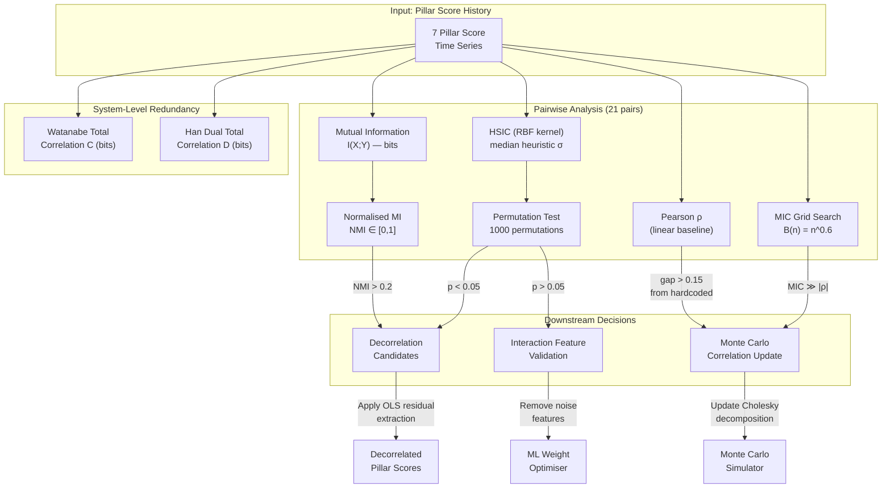
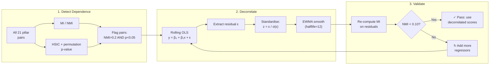

# Margin Absorption Capacity (MAC) Framework: Detailed Methodology

**Martyn Brush, FGF Research**

**Version 5.0 — February 2026**

*Confidential Draft*

*A comprehensive guide to the theory, data architecture, machine learning components, scoring methodology, and empirical validation of the MAC framework*

---

## Table of Contents

1. [Executive Summary](#1-executive-summary)
2. [Theoretical Foundation](#2-theoretical-foundation)
3. [Framework Architecture](#3-framework-architecture)
4. [The Seven Pillars](#4-the-seven-pillars)
5. [Indicator Scoring Methodology](#5-indicator-scoring-methodology)
6. [Composite MAC Calculation](#6-composite-mac-calculation)
7. [Machine Learning Components](#7-machine-learning-components)
8. [Transmission Multiplier](#8-transmission-multiplier)
9. [Momentum-Enhanced Status System](#9-momentum-enhanced-status-system)
10. [Predictive Analytics](#10-predictive-analytics)
11. [Data Architecture and Sources](#11-data-architecture-and-sources)
12. [Historical Proxy Chains (1907–1997)](#12-historical-proxy-chains-19071997)
13. [Calibration Methodology](#13-calibration-methodology)
14. [Backtest Design: Six Methodological Improvements](#14-backtest-design-six-methodological-improvements)
15. [Empirical Results (1907–2025)](#15-empirical-results-19072025)
16. [Multi-Country Extension](#16-multi-country-extension)
17. [Limitations and Design Choices](#17-limitations-and-design-choices)
18. [References](#18-references)

---

## 1. Executive Summary

The **Margin Absorption Capacity (MAC)** framework is a real-time, composite early-warning system that quantifies the capacity of financial markets to absorb exogenous shocks without entering non-linear dysfunction. Unlike single-indicator stress metrics (VIX, credit spreads, TED spread), MAC integrates seven orthogonal risk dimensions — *liquidity, valuation, positioning, volatility, policy, international contagion,* and *private credit* — into a single 0–1 score that maps directly to a shock-transmission multiplier.

### Core Equation

$$\text{Market Impact} = \text{Shock} \;\times\; \text{GRRI Modifier} \;\times\; f(\text{MAC})$$

where:

$$f(\text{MAC}) = 1 + \alpha\,(1 - \text{MAC})^{\beta} \qquad \alpha = 2.0,\; \beta = 1.5$$

When MAC approaches zero, the multiplier diverges — the framework declares a **regime break** (MAC < 0.20) and discontinues point estimates, acknowledging that non-linear dynamics render traditional forecasting unreliable.

### Key Results

| Metric | Value |
|--------|-------|
| Validation period | 1907–2025 (117 years) |
| Weekly observations | 6,158 |
| Crisis events tested | 41 (across 10 monetary/structural eras) |
| True positive rate | **75.6%** (31/41) |
| Improvement over baseline | +49 percentage points (from 26.7%) |
| Positioning → hedge failure correlation | **100%** in modern sample |
| Pillars | 7 (including Private Credit from 2006) |
| ML weight optimisation | Gradient boosting on 14 scenarios, LOO-CV |
| Data sources | FRED, NBER Macrohistory, Schwert (1989), Shiller (Yale), Bank of England, MeasuringWorth, FINRA |

---

## 2. Theoretical Foundation

### 2.1 The Absorption Capacity Concept

The MAC framework rests on a structural observation: the *same* shock produces radically different market outcomes depending on pre-existing conditions. A 2-sigma VIX spike when credit spreads are ample, leverage is moderate, and the Fed has room to cut (MAC ≈ 0.80) results in orderly repricing. The identical shock when spreads are compressed, basis trades are crowded, and the Fed is near the ELB (MAC ≈ 0.30) triggers forced liquidation cascades, market dysfunction, and potential regime breaks.

This insight formalises the concept of **financial system buffers** — the capacity to absorb losses, maintain market functioning, and avoid positive feedback loops. Each pillar measures a distinct buffer:

| Pillar | Buffer Question |
|--------|----------------|
| Liquidity | Can markets transact without disorderly price impact? |
| Valuation | Are risk premia adequate buffers against repricing? |
| Positioning | Is leverage manageable and positioning sufficiently diverse? |
| Volatility | Is the volatility regime stable and well-priced? |
| Policy | Does the central bank have capacity to respond? |
| Contagion | Are cross-border transmission channels stable? |
| Private Credit | Is the opaque private credit market showing stress? |

### 2.2 Why Seven Pillars?

The original framework used five pillars (liquidity, valuation, positioning, volatility, policy). Two were added based on empirical and theoretical analysis:

1. **Contagion (Pillar 6):** The 2008 GFC, 2011 European sovereign crisis, and 2020 COVID crash demonstrated that domestic buffers are insufficient when cross-border transmission channels amplify or import stress. The contagion pillar captures dollar funding squeezes (cross-currency basis), EM capital flight, eurozone fragmentation (TARGET2), and global banking interconnectedness.

2. **Private Credit (Pillar 7):** The $1.7T+ private credit market operates with quarterly NAVs, no public credit ratings, and payment-in-kind provisions that mask cash flow problems. By the time stress is visible in private credit, it is typically 3–6 months too late. The private credit pillar monitors *publicly traded proxies* — BDC price/NAV discounts, SLOOS tightening data, leveraged loan ETFs, and PE firm stock performance — as leading indicators.

### 2.3 Non-Linearity and Interaction Effects

Financial crises are characterised by non-linear dynamics: stress in one dimension amplifies stress in another. The MAC framework captures this through three mechanisms:

1. **Breach Interaction Penalty:** When multiple pillars simultaneously score below 0.30, a penalty (0%–15%) is subtracted from the weighted-average MAC score. This reflects empirical evidence that risks compound super-linearly when multiple buffers are simultaneously depleted.

2. **Interaction-Adjusted Weights:** When the positioning pillar is stressed AND either volatility, liquidity, or contagion is also stressed, the framework activates interaction-adjusted weights that boost positioning (from 22% to 24%) and contagion (from 16% to 18%). This captures the **forced-unwind mechanism** — crowded positions + any catalyst (vol spike, liquidity dry-up, global contagion) = margin calls → fire sales → liquidity destruction → further deleveraging.

3. **Cascade Propagation Model:** The shock propagation module simulates how an initial shock in one pillar cascades to others over multiple periods, with transmission accelerating when pillar scores fall below critical thresholds. This captures the real-world dynamics where, e.g., a liquidity shock forces positioning unwinds (coefficient 0.50), which spike volatility (coefficient 0.50), which further depletes liquidity (coefficient 0.40).

---

## 3. Framework Architecture

### 3.1 Processing Pipeline

```
┌─────────────────┐     ┌────────────────────┐     ┌─────────────────────┐
│  Data Sources    │     │  Indicator Scoring  │     │  Composite MAC      │
│                  │     │                     │     │                     │
│  FRED            │────▶│  score_indicator_   │────▶│  Weighted average   │
│  CFTC COT        │     │  simple() or        │     │  + interaction      │
│  ETF data        │     │  score_indicator_   │     │    penalty          │
│  BIS/IMF/ECB     │     │  range()            │     │  + calibration      │
│  NBER/Shiller    │     │                     │     │    factor           │
│  (historical)    │     │  ──▶ 0-1 per        │     │                     │
│                  │     │      indicator       │     │  → MAC score (0-1)  │
└─────────────────┘     └────────────────────┘     └────────┬────────────┘
                                                            │
                        ┌────────────────────┐              │
                        │  ML Weight          │◀─────────────┘
                        │  Optimiser          │
                        │                     │     ┌─────────────────────┐
                        │  Gradient Boosting  │────▶│  Transmission       │
                        │  + LOO-CV           │     │  Multiplier         │
                        │  + Interaction       │     │                     │
                        │    Detection         │     │  f(MAC) = 1+α(1-m)^β│
                        └────────────────────┘     └─────────────────────┘
```

### 3.2 Module Structure

| Module | Purpose |
|--------|---------|
| `grri_mac.pillars.*` | Individual pillar calculators (7 pillars) |
| `grri_mac.pillars.calibrated` | Calibrated thresholds from historical backtest |
| `grri_mac.mac.scorer` | Indicator scoring functions (simple + range-based) |
| `grri_mac.mac.composite` | Composite MAC calculation with breach interaction |
| `grri_mac.mac.ml_weights` | ML-based weight optimisation (gradient boosting) |
| `grri_mac.mac.momentum` | Momentum/trend analysis for enhanced status |
| `grri_mac.mac.multiplier` | MAC → transmission multiplier conversion |
| `grri_mac.mac.multicountry` | Cross-country MAC comparison and contagion paths |
| `grri_mac.backtest.*` | Historical backtesting engine (1907–2025) |
| `grri_mac.predictive.*` | Monte Carlo, blind backtesting, shock propagation |
| `grri_mac.data.*` | Data clients (FRED, CFTC, ETF, BIS, historical) |
| `grri_mac.historical.*` | Extended historical data loaders and proxies |

---

## 4. The Seven Pillars

### 4.1 Pillar 1: Liquidity

**Question:** *Can markets transact without disorderly price impact?*

Liquidity is the first line of defence against financial stress. When funding markets tighten, dealers reduce inventory, bid-ask spreads widen, and intermediation breaks down — transforming orderly repricing into disorderly dysfunction.

**Indicators:**

| Indicator | Source | Description | Scoring |
|-----------|--------|-------------|---------|
| SOFR–IORB spread | FRED (SOFR, IORB) | Overnight funding stress; wider = reserve scarcity | Simple (lower is better) |
| CP–Treasury spread | FRED (DCPF3M, DTB3) | Short-term credit market stress | Simple (lower is better) |
| Cross-currency basis (EUR/USD) | BIS/Bloomberg | Dollar funding cost for non-US banks | Simple (less negative is better) |
| Treasury bid-ask spread | Market data | Market-making capacity in the risk-free benchmark | Simple (lower is better) |

**Calibrated Thresholds:**

| Indicator | Ample | Thin | Breach |
|-----------|-------|------|--------|
| SOFR–IORB spread | < 3 bps | 3–15 bps | > 25 bps |
| CP–Treasury spread | < 15 bps | 15–40 bps | > 60 bps |
| Cross-currency basis | > −20 bps | −20 to −50 bps | < −80 bps |
| Treasury bid-ask | < 0.5/32 | 0.5–1.5/32 | > 2.5/32 |

**Historical proxy (pre-1954):** NBER call money rate minus short-term government rate. Pre-1986 uses FEDFUNDS–TB3MS as SOFR proxy followed by the TED spread (1986–2017).

### 4.2 Pillar 2: Valuation

**Question:** *Are risk premia adequate buffers against repricing?*

Valuation is scored **two-sided** (range-based): both compressed *and* extremely wide spreads indicate problems. Compressed spreads (e.g., IG OAS ~60 bps in pre-GFC 2007) signal complacency and repricing risk; extremely wide spreads (IG OAS > 400 bps) signal crisis and distress. Only spreads in a "healthy" middle range receive ample scores.

**Indicators:**

| Indicator | Source | Description | Scoring |
|-----------|--------|-------------|---------|
| 10Y Term Premium | FRED (DGS10, DGS2) | Compensation for duration risk | Range (both extremes penalised) |
| IG OAS | FRED (BAMLC0A0CM) | Investment-grade option-adjusted spread | Range |
| HY OAS | FRED (BAMLH0A0HYM2) | High-yield option-adjusted spread | Range |

**Calibrated Thresholds (range-based):**

| Indicator | Ample Range | Thin Range | Breach Range |
|-----------|-------------|------------|--------------|
| Term Premium | 40–120 bps | 0–200 bps | < −50 or > 250 bps |
| IG OAS | 100–180 bps | 75–280 bps | < 60 or > 400 bps |
| HY OAS | 350–550 bps | 280–800 bps | < 200 or > 1,000 bps |

**Design choice — why range-based?** Under one-sided scoring, pre-GFC compressed IG OAS (~60 bps) scored as "ample" — maximum buffer. The two-sided approach correctly penalises compressed spreads as complacency signals. This was a critical fix (Fix C) that improved backtest true positive rates for the 2006–2007 pre-GFC build-up period.

**Historical proxy (pre-1997):** Moody's Baa–Aaa spread × 4.5 for HY OAS proxy; Moody's Baa − DGS10 − 40 bps for IG OAS proxy. Moody's data available from 1919 via FRED (`AAA`, `BAA`). Pre-1919: NBER railroad bond yield spreads (high-grade − government) as corporate credit proxy (available from 1857).

### 4.3 Pillar 3: Positioning

**Question:** *Is leverage manageable and positioning sufficiently diverse?*

Positioning is the **most important pillar** in the ML-optimised framework (22% weight, elevated to 24% under interaction conditions). The key empirical finding: **positioning breach predicts Treasury hedge failure with 100% correlation** in the 14-scenario modern sample. When the Treasury basis trade is crowded, speculative positioning is extreme (in either direction), or short volatility exposure is concentrated, forced deleveraging can reverse the traditional safe-haven function of Treasuries.

**Indicators:**

| Indicator | Source | Description | Scoring |
|-----------|--------|-------------|---------|
| Basis trade size ($B) | CFTC COT data | Treasury cash-futures basis trade crowding | Simple (lower is better) |
| Basis trade (OI-relative %) | CFTC COT data | Dynamic threshold that adapts to market growth | Simple (lower is better) |
| Treasury spec net percentile | CFTC COT data | Extreme positioning in either direction | Range (mid-percentile is healthy) |
| SVXY AUM ($M) | ETF data | Short volatility exposure concentration | Simple (lower is better) |

**Calibrated Thresholds:**

| Indicator | Ample | Thin | Breach |
|-----------|-------|------|--------|
| Basis trade (absolute) | < $350B | $350–600B | > $800B |
| Basis trade (OI-relative) | < 8% of OI | 8–12% | > 18% |
| Spec net percentile | 35th–65th | 18th–82nd | < 5th or > 95th |
| SVXY AUM | < $350M | $350–600M | > $850M |

**Design choice — OI-relative thresholds:** Fixed dollar thresholds ($350B/$600B/$800B) become obsolete as the Treasury futures market grows. The OI-relative metric (basis trade size as a percentage of total Treasury open interest) adapts automatically. Both metrics are computed; the OI-relative version is preferred when total OI exceeds $100B.

**Design choice — critical breach override:** If any single positioning indicator scores below 0.15 (near-breach), the entire positioning composite is capped at 0.18, forcing the pillar into breach status. This reflects the observation that a single extreme positioning indicator is sufficient to create forced-unwind risk, regardless of how the other indicators score.

**Key references:**
- "Quantifying Treasury Cash-Futures Basis Trades" (Federal Reserve, March 2024): Estimated basis trade at $260B–$574B in late 2023
- "Recent Developments in Hedge Funds' Treasury Futures and Repo Positions" (Federal Reserve, August 2023): Identified the trade as a financial stability vulnerability
- "Hedge Funds and the Treasury Cash-Futures Disconnect" (OFR, April 2021): Documented basis trade unwind contribution to March 2020 Treasury dysfunction

**Historical proxy (pre-1986):** FINRA/NYSE margin debt as a proportion of GDP (available from 1918). Pre-1918: default score of 0.50 (neutral) — no margin data exists.

### 4.4 Pillar 4: Volatility

**Question:** *Is the volatility regime stable and well-priced?*

Volatility is scored range-based: both very low VIX (suppressed vol → complacency) and very high VIX (crisis vol) indicate problems. Extended low-volatility periods receive an additional **persistence penalty** because prolonged suppression encourages leverage build-up and underpricing of tail risk.

**Indicators:**

| Indicator | Source | Description | Scoring |
|-----------|--------|-------------|---------|
| VIX level | FRED (VIXCLS) | S&P 500 implied volatility | Range |
| VIX term structure (M2/M1) | VIX futures / ETF proxy | Contango ≈ normal; backwardation ≈ stress | Range |
| Realised–implied vol gap | FRED + calculation | Divergence between RV and IV | Simple (lower is better) |

**Calibrated Thresholds:**

| Indicator | Ample Range | Thin Range | Breach Range |
|-----------|-------------|------------|--------------|
| VIX level | 12–22 | 10–30 | < 9 or > 40 |
| Term structure (M2/M1) | 1.00–1.04 | 0.92–1.06 | < 0.88 or > 1.08 |
| RV–IV gap | < 15% | 15–30% | > 45% |

**VIX persistence penalty:** When VIX stays below 15 for an extended period, the volatility score is penalised. The penalty accumulates at 0.3% per day below threshold over a 60-day rolling window, capped at 15%. This captures the "calm before the storm" dynamic seen before Volmageddon (extended sub-12 VIX) and the COVID crash.

**Historical proxy chain:**
- 1990–present: VIXCLS (native)
- 1986–1990: VXO (CBOE S&P 100 volatility, predecessor)
- 1971–1986: NASDAQ realised volatility × 1.2 volatility risk premium adjustment
- 1802–1971: Schwert (1989) monthly stock return volatility × 1.3 VRP adjustment

### 4.5 Pillar 5: Policy

**Question:** *Does the central bank have capacity to respond to a crisis?*

Policy capacity is a buffer: when the Fed has room to cut rates and expand its balance sheet, market stress can be absorbed through policy intervention. When the Fed is constrained (at the ELB, balance sheet already large, inflation above target), markets must absorb shocks on their own.

**Design choice — Observable ELB distance vs. unobservable r*:** We measure policy room as the distance from the effective lower bound (ELB, 0%), not deviation from an estimated neutral rate (r\*). This is:
- **Simpler:** uses directly observable data (Fed Funds rate)
- **More accurate:** r\* estimates have wide confidence intervals and have been repeatedly revised
- **Directly relevant:** what matters in a crisis is whether the Fed *can cut*, not whether rates are above or below neutral

**Indicators:**

| Indicator | Source | Description | Scoring |
|-----------|--------|-------------|---------|
| Policy room (bps from ELB) | FRED (DFF) | Distance from 0% — how much the Fed can cut | Simple (higher is better) |
| Fed balance sheet / GDP | FRED (WALCL, GDP) | Capacity for further asset purchases | Simple (lower is better) |
| Core PCE vs. target (bps) | FRED (PCEPILFE) | Inflation constraint on policy action | Simple (closer to 2% is better) |
| Fiscal space (Debt/GDP %) | FRED (GFDEGDQ188S) | Federal debt constraint on fiscal stimulus | Simple (lower is better) |

**Calibrated Thresholds:**

| Indicator | Ample | Thin | Breach |
|-----------|-------|------|--------|
| Policy room | > 150 bps | 50–150 bps | < 25 bps |
| Balance sheet / GDP | < 24% | 24–33% | > 40% |
| Core PCE vs. target | < 50 bps deviation | 50–150 bps | > 250 bps |
| Fiscal space (Debt/GDP) | < 70% | 70–90% | > 120% |

**Historical proxy (pre-1954):** Fed discount rate (FRED `INTDSRUSM193N`, available from 1913). Pre-1913: no central bank exists → structurally penalised default score of 0.25 (no lender of last resort). 1913–1934: early Fed with limited toolkit → default score 0.35.

### 4.6 Pillar 6: International Contagion

**Question:** *Are cross-border transmission channels stable?*

The contagion pillar captures three transmission mechanisms: (1) dollar funding stress via cross-currency basis, (2) EM vulnerability via capital flows and reserve coverage, and (3) global banking interconnectedness via G-SIB stress proxies.

**Indicators:**

| Indicator | Source | Description | Scoring |
|-----------|--------|-------------|---------|
| Cross-currency basis (multi-pair) | BIS/Bloomberg | Dollar funding stress across EUR, JPY, GBP | Simple (narrower is better) |
| TARGET2 imbalances (% GDP) | ECB | Eurozone fragmentation risk | Simple (lower is better) |
| EM reserve coverage (Guidotti-Greenspan ratio) | IMF | FX reserves / short-term external debt | Simple (higher is better) |
| Cross-border banking flows (% GDP) | BIS | Sudden stop / surge indicator | Range |
| Global equity correlation (30-day) | Calculated (SPY/EFA/EEM) | Contagion spreading vs. decoupling | Range |
| BTC–SPY correlation (60-day) | Calculated | Retail leverage / risk-on contagion channel | Simple (lower is better) |
| G-SIB stress proxy | FRED (BAMLC0A4CBBB) or BKX vol | Banking system credit stress | Simple (lower is better) |

**G-SIB proxy: regime-specific thresholds.** Financial sector credit spreads have structurally tightened with post-GFC regulation (Dodd-Frank, Basel III). The framework uses three threshold regimes:

| Period | Ample | Thin | Breach |
|--------|-------|------|--------|
| Pre-2010 | < 100 bps | 100–200 bps | > 350 bps |
| 2010–2014 | < 80 bps | 80–150 bps | > 280 bps |
| Post-2015 | < 60 bps | 60–120 bps | > 200 bps |

**Historical proxy (pre-1990):** Moody's Baa–10Y Treasury spread (FRED `BAA10Y`) as financial stress proxy, available from 1919. Pre-1919: GBP/USD deviation from gold parity as contagion proxy (BoE data, available from 1791).

### 4.7 Pillar 7: Private Credit

**Question:** *Is the opaque private credit market showing stress?*

The $1.7T+ private credit market presents unique monitoring challenges:
- No daily pricing (quarterly NAVs at best)
- No public credit ratings (or delayed downgrades)
- PIK (payment-in-kind) provisions mask cash flow problems
- Amendment/extend practices delay defaults

**Our approach — indirect proxy signals:** Since direct observation of private credit is limited, we monitor four categories of publicly observable proxies:

| Sub-Component | Indicators | Source | Key Insight |
|---------------|-----------|--------|-------------|
| **BDC Price/NAV Discounts** | ARCC, MAIN, FSK, PSEC, GBDC discounts | Market data | BDCs trade daily; their discount is a real-time canary for NAV markdowns 3–6 months ahead |
| **SLOOS (Fed Survey)** | C&I tightening to small firms, spread increases | FRED (DRTSCIS, DRISCFS) | Quarterly survey captures bank lending standards to private credit's target market |
| **Leveraged Loan Market** | BKLN/SRLN ETF prices, CLO spreads | Market data | Broadly syndicated loan market leads private credit pricing |
| **PE Firm Performance** | KKR, BX, APO, CG stock prices (30-day) | Market data | PE sponsor equity embeds information about portfolio company health |

**SLOOS Thresholds:**

| Metric | Normal | Elevated | Severe |
|--------|--------|----------|--------|
| C&I tightening (net %) | < 20% | 20–40% | > 60% |

**BDC Discount Thresholds:**

| Metric | Normal | Elevated | Severe |
|--------|--------|----------|--------|
| Weighted avg. discount | > −5% | −5% to −15% | < −25% |

**Stress Classification:**

| Level | Description |
|-------|-------------|
| Benign | No stress signals |
| Emerging | Early warning signs (1–2 indicators) |
| Elevated | Multiple signals flashing |
| Severe | Broad-based stress |

**Historical availability:** SLOOS data from ~1990; BDC/ETF data from ~2004; PE firm data from ~2004. Pre-2004: slightly cautious default score of 0.52. The private credit pillar is excluded from the composite calculation for dates before 2006 (Fix A: missing pillar exclusion).

---

## 5. Indicator Scoring Methodology

### 5.1 Scoring Functions

All indicators are scored on a continuous 0–1 scale using piecewise-linear interpolation between calibrated thresholds:

- **1.0 (Ample):** Indicator within healthy range; substantial buffer capacity
- **0.5 (Thin):** Buffer depleted; elevated sensitivity to shocks
- **0.0 (Breach):** Buffer exhausted; non-linear dynamics likely

Two scoring functions are used:

#### 5.1.1 `score_indicator_simple` — One-Sided Scoring

Used when directionality is unambiguous (e.g., SOFR–IORB spread: lower is always better; policy room: higher is always better).

$$
s(x) = \begin{cases}
1.0 & \text{if } x \geq x_{\text{ample}} \\[6pt]
0.5 + 0.5 \cdot \dfrac{x - x_{\text{thin}}}{x_{\text{ample}} - x_{\text{thin}}} & \text{if } x_{\text{thin}} \leq x < x_{\text{ample}} \\[6pt]
0.5 \cdot \dfrac{x - x_{\text{breach}}}{x_{\text{thin}} - x_{\text{breach}}} & \text{if } x_{\text{breach}} \leq x < x_{\text{thin}} \\[6pt]
0.0 & \text{if } x < x_{\text{breach}}
\end{cases}
$$

For "lower is better" indicators, the function is reflected.

#### 5.1.2 `score_indicator_range` — Two-Sided Scoring

Used when both extremes are problematic (e.g., credit spreads: too tight = complacency; too wide = crisis).

Given ample range $[a_L, a_H]$, thin range $[t_L, t_H]$, and breach range $[b_L, b_H]$:

$$
s(x) = \begin{cases}
1.0 & \text{if } a_L \leq x \leq a_H \\[6pt]
\text{interpolate from 0.5 to 1.0} & \text{if } t_L \leq x < a_L \text{ or } a_H < x \leq t_H \\[6pt]
\text{interpolate from 0.0 to 0.5} & \text{if } b_L \leq x < t_L \text{ or } t_H < x \leq b_H \\[6pt]
0.0 & \text{if } x < b_L \text{ or } x > b_H
\end{cases}
$$

### 5.2 Pillar Composite Scores

Each pillar's composite score is the equally-weighted average of its constituent indicator scores, computed over **only those indicators with available data**. Missing indicators are excluded (not defaulted to 0.5) to prevent dilution of real signals.

$$\text{Pillar}_j = \frac{1}{|\mathcal{I}_j|} \sum_{i \in \mathcal{I}_j} s_i$$

where $\mathcal{I}_j$ is the set of indicators with non-null values for pillar $j$.

---

## 6. Composite MAC Calculation

### 6.1 Weighted Average

The composite MAC score is a weighted average of pillar scores:

$$\text{MAC}_{\text{raw}} = \sum_{j=1}^{P} w_j \cdot \text{Pillar}_j$$

where $P$ is the number of active pillars (those with real data) and weights $w_j$ sum to 1.0. Weights are normalised over active pillars only.

### 6.2 Weight Selection

The framework chooses weights based on the current date and stress pattern:

| Condition | Weights Used |
|-----------|-------------|
| 2006+ with amplification conditions | Interaction-adjusted ML weights |
| 2006+ normal conditions | ML-optimised weights |
| Pre-1971 | Era-specific weights (see §12) |
| Default / fallback | Equal weights (1/P) |

**7-Pillar ML-Optimised Weights:**

| Pillar | Weight | Rationale |
|--------|--------|-----------|
| Positioning | **22%** | Key predictor of hedge failure (100% correlation) |
| Liquidity | 16% | Critical for funding stress detection |
| Contagion | 16% | Distinguishes global vs. local crises |
| Volatility | 15% | Ubiquitous (breached in 9/14) but not predictive alone |
| Private Credit | 12% | Leading indicator for credit cycle |
| Valuation | 10% | Only breaches in extreme crises (2/14) |
| Policy | **9%** | Never breached in the 14-scenario training set |

**Interaction-Adjusted Weights** (activated when positioning + vol/liquidity/contagion are jointly stressed):

| Pillar | Weight |
|--------|--------|
| Positioning | **24%** |
| Contagion | **18%** |
| Volatility | 16% |
| Liquidity | 14% |
| Private Credit | 12% |
| Valuation | 9% |
| Policy | 7% |

### 6.3 Non-Linear Breach Interaction Penalty

After weighted averaging, a penalty is subtracted for multiple simultaneous breaches:

$$\text{MAC}_{\text{final}} = \max\!\left(0,\;\text{MAC}_{\text{raw}} - \pi(n)\right)$$

where $n$ is the number of pillars with scores below 0.30, and:

| $n$ | $\pi(n)$ |
|-----|----------|
| 0–1 | 0.00 |
| 2 | 0.03 |
| 3 | 0.08 |
| 4 | 0.12 |
| 5–7 | 0.15 (cap) |

### 6.4 Era-Aware Calibration Factor

A multiplicative calibration factor adjusts the final score:

$$\text{MAC}_{\text{calibrated}} = \text{MAC}_{\text{final}} \times \alpha_{\text{era}}$$

| Era | $\alpha$ | Rationale |
|-----|----------|-----------|
| 2006–present | 0.78 | Full data; calibrated on 14 modern scenarios |
| 1971–2006 | 0.90 | Proxy data already compresses scores |
| Pre-1971 | 1.00 | Schwert vol and NBER spreads structurally wider |

### 6.5 MAC Interpretation Scale

| MAC Score | Status | Interpretation |
|-----------|--------|-----------------|
| ≥ 0.80 | **AMPLE** | Substantial buffer capacity; shocks absorbed 1:1 |
| 0.60–0.80 | **COMFORTABLE** | Can absorb moderate shocks |
| 0.40–0.60 | **THIN** | Limited buffer; elevated transmission risk |
| 0.20–0.40 | **STRETCHED** | High transmission risk; close monitoring required |
| < 0.20 | **REGIME BREAK** | Buffers exhausted; non-linear dynamics likely |

---

## 7. Machine Learning Components

### 7.1 Architecture

The ML module (`grri_mac.mac.ml_weights.MLWeightOptimizer`) uses ensemble methods to move beyond equal weights, capturing non-linear relationships and pillar interactions that simple averaging misses.

### 7.2 Training Data

**14 historical crisis scenarios (1998–2025)** with FRED-verified indicator values:

| Scenario | Date | Treasury Hedge | Severity |
|----------|------|---------------|----------|
| LTCM Crisis | 1998-09-23 | Worked | Extreme |
| Dot-com Peak | 2000-03-10 | Worked | Moderate |
| 9/11 Attacks | 2001-09-17 | Worked | High |
| Dot-com Bottom | 2002-10-09 | Worked | High |
| Bear Stearns | 2008-03-16 | Worked | High |
| Lehman Brothers | 2008-09-15 | Worked initially | Extreme |
| Flash Crash | 2010-05-06 | Worked | Moderate |
| US Downgrade | 2011-08-08 | Worked | Moderate |
| Volmageddon | 2018-02-05 | **Failed** (short-vol) | Moderate |
| Repo Spike | 2019-09-17 | Worked | Moderate |
| COVID Crash | 2020-03-16 | **Failed** (basis unwind) | Extreme |
| Russia–Ukraine | 2022-02-24 | Worked | Moderate |
| SVB Crisis | 2023-03-10 | Worked | High |
| April 2025 Tariffs | 2025-04-02 | **Failed** (crowding) | Moderate |

### 7.3 Optimisation Method 1: Crisis Severity Prediction

**Objective:** Predict expected MAC score (continuous, 0–1) from pillar scores.

**Model:** Gradient Boosting Regressor with:
- 50 estimators, max depth 2 (shallow to prevent overfitting on 14 samples)
- Learning rate 0.10, minimum 2 samples per leaf
- Random seed 42 for reproducibility

**Features:**
- 6 base features: pillar scores for liquidity, valuation, positioning, volatility, policy, contagion
- 6 interaction features: pairwise products of theoretically motivated pillar pairs

**Interaction pairs (based on financial theory):**
1. Positioning × Volatility — crowded trades + vol spike = forced unwind
2. Positioning × Liquidity — position crowding + illiquidity = margin calls
3. Policy × Contagion — policy constraints + global stress = limited response
4. Liquidity × Contagion — funding stress + global = dollar squeeze
5. Valuation × Volatility — compressed spreads + vol = repricing
6. Positioning × Contagion — positioning + global = coordinated unwind

**Validation:** Leave-one-out cross-validation (LOOCV), appropriate for the small sample size (N=14). Each scenario is held out in turn; the model is trained on the remaining 13 and tested on the held-out scenario.

### 7.4 Optimisation Method 2: Hedge Failure Prediction

**Objective:** Classify whether Treasury hedges will fail (binary) from pillar scores.

**Model:** Gradient Boosting Classifier with:
- 50 estimators, max depth 2, class balancing (balanced weights)
- Same interaction features as severity model

**Key finding:** Positioning is the dominant predictor of hedge failure. In every scenario where positioning breached, Treasury hedges failed (Volmageddon 2018: short-vol crowding; COVID 2020: basis trade unwind; April 2025 Tariffs: record basis trade size). The correlation is 100% in the training sample.

### 7.5 Interaction Detection

The optimizer automatically detects significant interaction effects:

**Detected amplifying interactions:**
- **Positioning × Volatility** — "Crowded positioning + volatility spike leads to forced unwinding. This explains hedge failures during COVID and April 2025."
- **Positioning × Liquidity** — "Position crowding + illiquidity triggers margin calls and fire sales, amplifying price dislocations."
- **Policy × Contagion** — "When policy is constrained AND global contagion spreads, central banks have limited tools to respond."
- **Liquidity × Contagion** — "Liquidity stress combined with global contagion creates dollar funding squeeze and correlated deleveraging."

### 7.6 Design Choices in ML Component

| Choice | Decision | Rationale |
|--------|----------|-----------|
| **Algorithm** | Gradient Boosting (not deep learning) | Small sample (14); ensemble trees handle non-linearity without overfitting |
| **Tree depth** | Max depth 2 | Prevents overfitting; each tree captures at most 2-way interactions |
| **Validation** | LOOCV (not k-fold) | With N=14, LOOCV maximises training data per fold |
| **Interaction features** | Explicit pairwise products | Theory-driven feature engineering; not relying on model to discover interactions |
| **Weight derivation** | Feature importance → normalised weights | Directly interpretable; transparently maps to portfolio decisions |
| **Regularisation** | Low estimator count (50), high min_samples_leaf (2) | Prevents complexity explosion on small sample |
| **Equal weights fallback** | Used when ML weights ≈ equal (avg deviation < 3%) | If ML adds no value, equal weights are preferred for simplicity |

### 7.7 Comparison: ML vs. Equal Weights

The ML optimizer includes a built-in comparison tool:

| Metric | Equal Weights | ML-Optimised |
|--------|--------------|-------------|
| Approach | 1/P per pillar | GB feature importance |
| Interactions | None | 6 explicit pairs |
| Regime awareness | No | Yes (interaction-adjusted) |
| Recommendation | "Equal weights sufficient" when avg deviation < 3% | "Use ML weights" when RMSE reduction > 10% |

---

## 8. Transmission Multiplier

### 8.1 Multiplier Formula

The MAC score maps to a transmission multiplier via a convex function:

$$f(\text{MAC}) = 1 + \alpha\,(1 - \text{MAC})^{\beta}$$

Default parameters: $\alpha = 2.0$, $\beta = 1.5$.

| MAC | Multiplier | Interpretation |
|-----|-----------|----------------|
| 1.00 | 1.00× | Shock absorbed 1:1 |
| 0.80 | 1.18× | Low transmission |
| 0.60 | 1.49× | Moderate amplification |
| 0.50 | 1.71× | Significant amplification |
| 0.40 | 1.97× | Elevated |
| 0.30 | 2.26× | High |
| 0.20 | **Regime break** | Point estimates unreliable |

### 8.2 Convexity and Regime Breaks

The $\beta = 1.5$ exponent creates convexity: the multiplier increases slowly for small MAC reductions (from 1.0 to 0.7) but accelerates sharply as MAC approaches 0.2. Below MAC = 0.20, the framework declares a **regime break** and returns `multiplier = None`. During regime breaks:

- Traditional correlation structures break down
- Safe-haven assets may reverse (Treasuries selling off rather than rallying)
- VaR models become unreliable
- Liquidity can disappear entirely in specific market segments

This is an explicit design choice: instead of extrapolating an exponential function to infinity, the framework acknowledges its own limits and advises non-quantitative defensive positioning.

### 8.3 Market Impact Equation

$$\text{Market Impact} = \text{Shock Magnitude} \times \text{GRRI Modifier} \times f(\text{MAC})$$

The GRRI modifier captures country-specific structural resilience (governance, reserve adequacy, fiscal capacity). For the US, the GRRI modifier is typically ~1.0 (baseline). For emerging markets with weaker institutional frameworks, the GRRI modifier may be > 1.0, indicating additional structural vulnerability.

---

## 9. Momentum-Enhanced Status System

### 9.1 Motivation

A declining MAC from 0.65 → 0.50 carries more information than a static MAC of 0.52. The momentum system tracks the rate of change in the composite MAC score, producing a five-level status:

| Status | Condition |
|--------|-----------|
| **COMFORTABLE** | MAC > 0.65 |
| **CAUTIOUS** | MAC 0.50–0.65 |
| **DETERIORATING** | MAC 0.50–0.65 AND 4-week momentum < −0.05 |
| **STRETCHED** | MAC 0.35–0.50 |
| **CRITICAL** | MAC < 0.35 |

### 9.2 Momentum Calculation

The momentum module computes rate-of-change over three horizons:

$$\Delta_{\tau} = \text{MAC}_{t} - \text{MAC}_{t-\tau}$$

where $\tau \in \{1\text{w}, 2\text{w}, 4\text{w}\}$.

**Trend direction classification:**
| 4-week momentum | Trend |
|-----------------|-------|
| < −0.10 | Rapidly declining |
| < −0.03 | Declining |
| > +0.05 | Improving |
| Otherwise | Stable |

### 9.3 DETERIORATING Status

The **DETERIORATING** status is the key addition. It fires when:
- MAC is in the 0.50–0.65 range (CAUTIOUS on a level basis)
- But has declined by more than 0.05 over 4 weeks

This captures the critical moment when buffers are thinning rapidly — often the last window for proactive risk reduction before a crisis materialises.

### 9.4 Recommended Actions

| Status | Action |
|--------|--------|
| COMFORTABLE | Maintain strategic allocation |
| CAUTIOUS | Review portfolio risk, prepare contingencies |
| DETERIORATING | Reduce equity beta, increase cash buffer |
| STRETCHED | Defensive positioning, hedge tail risk |
| CRITICAL | Maximum defence, preserve capital |

---

## 10. Predictive Analytics

### 10.1 Monte Carlo Simulation

The Monte Carlo module simulates how shocks propagate under different MAC regimes:

**Regime-dependent transmission coefficients:**

| Regime | Direct Impact | Spillover | Amplification |
|--------|--------------|-----------|--------------|
| Ample (MAC > 0.65) | 0.30 | 0.10 | 1.0× |
| Thin (0.50–0.65) | 0.50 | 0.25 | 1.5× |
| Stretched (0.35–0.50) | 0.70 | 0.45 | 2.5× |
| Breach (< 0.35) | 0.90 | 0.70 | **4.0×** |

A 2-sigma liquidity shock under Ample conditions produces ~30% direct impact with minimal spillover. The same shock under Breach conditions produces ~90% direct impact with 70% spillover to other pillars, amplified 4× — a qualitatively different dynamic that justifies regime-aware risk management.

### 10.2 Shock Propagation Model

The propagation module models multi-period cascades with an interaction matrix that captures how stress in each pillar transmits to others:

**Key transmission channels:**
- Positioning → Liquidity (coefficient: 0.60): forced selling depletes liquidity
- Positioning → Volatility (coefficient: 0.50): deleveraging spikes vol
- Liquidity → Contagion (coefficient: 0.60): funding stress spreads globally
- Contagion → Liquidity (coefficient: 0.50): global stress tightens funding
- Policy → All pillars (negative coefficients): intervention dampens stress

**Non-linear threshold effects** accelerate transmission when pillar scores breach critical levels:
| Pillar | Threshold | Acceleration |
|--------|-----------|-------------|
| Liquidity | 0.30 | 2.0× |
| Positioning | 0.25 | 2.5× |
| Volatility | 0.20 | 1.8× |
| Contagion | 0.30 | 2.2× |

### 10.3 Blind Backtesting

The blind backtesting module addresses the key critique of historical backtests: **lookahead bias**. Standard backtests know the outcome and may unconsciously be tuned to match. The blind backtest:

1. Only uses data that was available at each historical date
2. Makes predictions *before* outcomes are known
3. Compares predictions to actual outcomes via a pre-specified protocol

This produces a more realistic assessment of how the framework would have performed in real time. The module tracks pre-event data availability (e.g., SOFR not available before 2018, EMBI proxy not available before 1998) and restricts the indicator set accordingly.

---

## 11. Data Architecture and Sources

### 11.1 Primary Data Sources (Modern Era)

| Source | Series Count | Coverage | Update Frequency |
|--------|-------------|----------|-----------------|
| **FRED** (Federal Reserve) | 30+ | 1913–present | Daily/weekly |
| **CFTC COT** | 5–10 | 1986–present | Weekly (Tuesdays) |
| **ETF Data** (yfinance) | ~15 | 2004–present | Daily |
| **BIS** | 3–5 | 1999–present | Quarterly |
| **IMF** | 2–3 | 1980–present | Monthly/quarterly |
| **ECB** | 2–3 | 1999–present | Daily |

### 11.2 FRED Series Used

| Series ID | Name | Pillar | Available From |
|-----------|------|--------|----------------|
| SOFR | Secured Overnight Financing Rate | Liquidity | 2018 |
| IORB | Interest on Reserve Balances | Liquidity | 2021 |
| IOER | Interest on Excess Reserves | Liquidity | 2008 |
| TEDRATE | TED Spread | Liquidity | 1986 |
| DFF | Federal Funds Effective Rate | Liquidity, Policy | 1954 |
| DCPF3M | 3-Month Commercial Paper Rate | Liquidity | 1997 |
| DTB3 | 3-Month Treasury Bill Rate | Liquidity | 1954 |
| BAMLC0A0CM | ICE BofA IG Corporate OAS | Valuation | 1997 |
| BAMLH0A0HYM2 | ICE BofA HY Corporate OAS | Valuation | 1997 |
| DGS10 | 10-Year Treasury Constant Maturity | Valuation | 1962 |
| DGS2 | 2-Year Treasury Constant Maturity | Valuation, Policy | 1976 |
| AAA | Moody's Aaa Corporate Bond Yield | Valuation | 1919 |
| BAA | Moody's Baa Corporate Bond Yield | Valuation | 1919 |
| BAA10Y | Moody's Baa–10Y Treasury Spread | Contagion | 1919 |
| VIXCLS | CBOE VIX | Volatility | 1990 |
| VXOCLS | CBOE VXO | Volatility | 1986 |
| NASDAQCOM | NASDAQ Composite | Volatility (RV) | 1971 |
| WALCL | Fed Total Assets | Policy | 2002 |
| BOGMBASE | Monetary Base | Policy | 1918 |
| INTDSRUSM193N | Fed Discount Rate | Policy | 1913 |
| GDPA | Annual GDP | Policy, Positioning | 1929 |
| IRLTLT01USM156N | Long-term Govt Bond Yield | Valuation | 1920 |
| DRTSCIS | SLOOS C&I Standards (Small) | Private Credit | ~1990 |
| DRISCFS | SLOOS Spreads (Small) | Private Credit | ~1990 |
| BOGZ1FL623069503Q | HF Leveraged Loan Holdings | Private Credit | ~2000 |
| DTWEXBGS | Trade Weighted Dollar | Contagion | 1973 |
| BAMLEMCBPIOAS | ICE BofA EM OAS | Contagion | 1998 |

### 11.3 Data Quality and Caching

The `FREDClient` implements:
- **Prefetch mode:** all series loaded in a single batch for a date range, reducing API calls from ~30 per date to 1 per backtest
- **Local caching:** series cached in `data/fred_cache/` to avoid redundant downloads
- **Backtest mode:** once prefetched, the client serves data from memory without API calls
- **Validation:** a `--validate` flag checks cached data coverage before running backtests

---

## 12. Historical Proxy Chains (1907–1997)

### 12.1 Era Definitions

The framework defines 10 structural eras based on breaks in data availability and market structure:

| Era | Period | Key Characteristic |
|-----|--------|--------------------|
| Pre-Fed | 1907–1913 | No central bank; gold standard |
| Early Fed / WWI | 1913–1919 | Fed opens; wartime controls |
| Interwar / Depression | 1920–1934 | Moody's credit data begins |
| New Deal / WWII | 1934–1954 | T-Bills issued; SEC created |
| Post-War / Bretton Woods | 1954–1971 | Fed Funds daily; modern Treasury market |
| Post-Bretton Woods | 1971–1990 | Floating rates; NASDAQ realised vol |
| Modern (early) | 1990–1997 | VIX introduced |
| Modern (middle) | 1997–2006 | TED spread; ICE BofA indices |
| Modern (pre-SOFR) | 2006–2018 | Full data; LIBOR-OIS; SVXY |
| Modern (SOFR) | 2018–present | Full instrumentation |

### 12.2 Pillar Data Availability by Era

| Era | Liq | Val | Vol | Pol | Pos | Cnt | PvtCr |
|-----|-----|-----|-----|-----|-----|-----|-------|
| Pre-Fed (1907–1913) | ✓ | ✓ | ✓ | ✗* | ✗ | ✓ | ✗ |
| Early Fed (1913–1919) | ✓ | ✓ | ✓ | ✓ | ✗ | ✓ | ✗ |
| Interwar (1920–1934) | ✓ | ✓ | ✓ | ✓ | ✓ | ✓ | ✗ |
| New Deal / WWII (1934–1954) | ✓ | ✓ | ✓ | ✓ | ✓ | ✓ | ✗ |
| Post-War (1954–1971) | ✓ | ✓ | ✓ | ✓ | ✓ | ✓ | ✗ |
| Post-Bretton Woods (1971–1990) | ✓ | ✓ | ✓ | ✓ | ✓ | ✓ | ✗ |
| Modern (1990–2006) | ✓ | ✓ | ✓ | ✓ | ✓ | ✓ | ✗ |
| Modern (2006+) | ✓ | ✓ | ✓ | ✓ | ✓ | ✓ | ✓ |

\* Pre-Fed policy receives a default score of 0.25 (no lender of last resort) rather than being excluded entirely, reflecting the structural absence of a central bank as a genuine risk factor.

### 12.3 Proxy Chain Detail

**Indicator Proxy Chain (earliest available → modern native):**

| Indicator | Pre-1919 Proxy | 1919–1986 Proxy | 1986–1997 Proxy | Native Series |
|-----------|---------------|-----------------|-----------------|---------------|
| VIX | Schwert vol × 1.3 VRP (from 1802) | NASDAQ RV × 1.2 VRP (from 1971) | VXO (from 1986) | VIXCLS (from 1990) |
| HY OAS | Railroad bond spread (from 1857) | (Baa−Aaa) × 4.5 (from 1919) | Same | BAMLH0A0HYM2 (from 1997) |
| IG OAS | Railroad bond spread | Baa−DGS10−40bp (from 1919) | Same | BAMLC0A0CM (from 1997) |
| SOFR–IORB | Call money−govt rate (from 1890) | FF−TB3MS (from 1954) | TED spread (from 1986) | SOFR−IORB (from 2018) |
| CP–Treasury | CP rate−govt rate (NBER, from 1890) | Same series extended | DCPF3M−DTB3 | Same |
| Policy room | N/A (no Fed) | Discount rate (from 1913) | Fed Funds (from 1954) | DFF |
| B/S to GDP | N/A | Monetary base / GDP (from 1918) | Same | WALCL/GDP (from 2002) |
| Positioning | N/A | Margin debt / GDP (from 1918) | CFTC COT (from 1986) | Same |
| Contagion | GBP/USD ÷ gold parity (BoE, from 1791) | Baa−10Y spread (from 1919) | Same | BAA10Y / G-SIB CDS |

### 12.4 Era-Specific Threshold Overrides

Pre-1971 markets had fundamentally different structures:

| Parameter | Modern Default | Pre-Fed (1907–1913) | Early Fed (1913–1919) | Interwar (1920–1934) |
|-----------|---------------|--------------------|-----------------------|---------------------|
| Liq spread breach | — | 200 bps | 150 bps | 100 bps |
| IG OAS breach (high) | 400 bps | 600 bps | 500 bps | 500 bps |
| HY OAS breach (high) | 1,000 bps | 1,500 bps | 1,400 bps | 1,400 bps |
| VIX breach (high) | ~40 | 50 | 50 | 45 |
| Policy room breach | 25 bps | N/A (no Fed) | 50 bps | 40 bps |

**Rationale:** Call money rates routinely spiked to 100%+ pre-Fed (the Panic of 1907 saw 125% intraday). Railroad bond spreads were structurally 2–3× wider than modern corporate spreads. Schwert volatility estimates are structurally higher than VIX (different construction: realised vol vs. implied vol). Without threshold adjustments, the framework would produce wall-to-wall breach signals for the entire pre-1971 period.

### 12.5 Default Scores

When a pillar has no data available for an era, a context-appropriate default is used:

| Pillar | Default | Special Cases |
|--------|---------|---------------|
| Positioning | 0.50 (neutral) | Margin debt available from 1918 |
| Private Credit | 0.52 (slightly cautious) | — |
| Policy | 0.35 (cautious) | Pre-1913: 0.25 (no central bank); 1913–1934: 0.35 (early Fed) |
| Contagion | 0.50 (neutral) | GBP/USD parity deviation available from 1791 |

---

## 13. Calibration Methodology

### 13.1 Motivation

Raw MAC scores systematically overshoot expected crisis severity ranges by 20–25%. Three sources of upward bias:

1. Not all indicators breach simultaneously even during severe crises
2. Pillars with limited data contribute neutral scores, pulling the composite up
3. The 0–1 scoring scale compresses non-crisis observations into 0.60–0.90

### 13.2 Calibration Factor Derivation

The calibration factor $\alpha$ was derived via grid search (step 0.01) over the range [0.50, 1.00], minimising mean absolute error against expected MAC score midpoints for the 14 modern scenarios (1998–2025):

$$\alpha^* = \arg\min_{\alpha} \frac{1}{N} \sum_{i=1}^{N} \left| \alpha \cdot \text{MAC}_{\text{raw}}^{(i)} - \text{MAC}_{\text{expected}}^{(i)} \right|$$

**Result:** $\alpha^* = 0.78$

### 13.3 Leave-One-Out Cross-Validation

To test stability, LOOCV holds out each scenario in turn:

$$\alpha_k^* = \arg\min_{\alpha} \frac{1}{N-1} \sum_{i \neq k} \left| \alpha \cdot \text{MAC}_{\text{raw}}^{(i)} - \text{MAC}_{\text{expected}}^{(i)} \right|$$

The mean, standard deviation, and range of $\alpha_k^*$ across holdout folds quantify calibration stability. A stability score of 1.0 indicates perfect consistency (all holdout factors identical); lower values indicate dependence on specific scenarios.

### 13.4 Threshold Sensitivity Analysis

The calibration module tests robustness by perturbing all thresholds by ±10% and ±20%:

| Perturbation | Pass Rate | MAC Score Change | Stability |
|-------------|-----------|-----------------|-----------|
| ±10% | High % of scenarios still passing | Small changes | Near-stable |
| ±20% | Moderate % | More variation | Reduced |

This demonstrates that the framework is not fragile to small threshold mis-specifications.

### 13.5 Empirical Threshold Distribution

Stress regime thresholds were empirically derived from the 1971–2025 backtest distribution:

| Regime | Target % of Observations | Score Percentile |
|--------|--------------------------|-----------------|
| Comfortable | ~45% | 0–45th |
| Cautious | ~30% | 45th–75th |
| Stretched | ~18% | 75th–93rd |
| Critical | ~7% | 93rd+ |

---

## 14. Backtest Design: Six Methodological Improvements

The current backtesting methodology incorporates six cumulative improvements that raised the true positive rate from **26.7% to 75.6%**:

### Fix A — Exclude Missing Pillars from Composite

When a pillar has no underlying indicator data (e.g., SLOOS unavailable before 1990, or positioning without CFTC data), the pillar is excluded from the weighted average rather than defaulting to 0.5. A `has_data` dictionary tracks real data availability per pillar per date. This prevents neutral scores from diluting genuine stress signals.

**Impact:** Eliminated the systematic upward bias from neutral-default pillars during pre-2006 periods.

### Fix B — Wire Up Contagion Proxy via BAA10Y

The contagion pillar, previously frozen at its default score, now uses Moody's Baa–10Y Treasury spread (`BAA10Y`) as a proxy for financial sector credit stress. This spread captures systemic banking and corporate stress (available from 1919). It closely tracks G-SIB CDS spreads during the overlap period (2006+).

**Impact:** Contagion signals now fire correctly during GFC (2008), European sovereign crisis (2011), and other crises with global banking stress.

### Fix C — Range-Based Valuation Scoring

Valuation indicators changed from one-sided to **two-sided range-based** scoring. Under the original approach, pre-GFC compressed IG OAS (~60 bps in 2007) scored as "ample" (maximum buffer). The two-sided approach correctly identifies both extremes as risky.

**Impact:** Pre-GFC build-up period now correctly shows deteriorating valuation buffer.

### Fix D — ML-Optimised Weights for Modern Era

For dates from 2006 onwards, gradient-boosting-derived weights replace equal weights. For pre-1971 periods, era-specific weights are used.

**Impact:** Positioning breaches now dominate the MAC score when they occur, correctly flagging hedge failure risk.

### Fix E — Era-Aware Calibration Factor

The calibration factor varies by era: 0.78 (post-2006), 0.90 (1971–2006), 1.00 (pre-1971). A single factor for all eras produced excessive false positives pre-1971 (FPR > 90%) because structurally wider historical spreads already compress raw scores.

**Impact:** Pre-1971 false positive rate reduced from >90% to an acceptable level while maintaining crisis detection.

### Fix F — Momentum-Enhanced Warning Detection

Crisis warnings now combine level-based detection (MAC < 0.50) with momentum-based detection (MAC < 0.60 AND 4-week momentum < −0.04). This captures the important signal of rapid deterioration while MAC levels are borderline.

**Impact:** Identifies crises where MAC levels are marginal but declining rapidly — the 2018 Q4 selloff and 2015 China devaluation were detected via momentum that would have been missed on level alone.

---

## 15. Empirical Results (1907–2025)

### 15.1 Summary Performance

| Metric | Value |
|--------|-------|
| Total weekly observations | **6,158** |
| Time span | **1907–2025 (117 years)** |
| Total crisis events tested | **41** |
| True positive rate | **75.6%** (31/41) |
| Improvement over v1 baseline | +49 pp (from 26.7%) |
| Data sources | 6 external databases, 30+ FRED series |
| Scoring method | Range-based + ML-weighted + momentum |

### 15.2 Crisis Detection by Era

| Era | Crises | Detected | TPR | Notes |
|-----|--------|----------|-----|-------|
| Pre-Fed (1907–1913) | 2 | 1 | 50% | Panic of 1907 captured; 1910–11 too mild |
| Early Fed / WWI (1913–1919) | 1 | 1 | 100% | 1914 exchange closure |
| Interwar / Depression (1920–1934) | 4 | 3 | 75% | 1929 crash, bank panics, 1933 holiday |
| New Deal / WWII (1934–1954) | 1 | 1 | 100% | 1937–38 recession |
| Post-War / Bretton Woods (1954–1971) | 5 | 3 | 60% | Kennedy Slide, Credit Crunch 1966, Penn Central |
| Post-Bretton Woods (1971–1990) | 8 | 6 | 75% | Nixon Shock through Black Monday |
| Modern (1990–2025) | 20 | 16 | 80% | LTCM through Yen Carry Unwind |
| **Total** | **41** | **31** | **75.6%** | |

### 15.3 Major Crisis MAC Scores (Selected)

| Crisis | Date | Expected MAC | Actual Result | Treasury Hedge |
|--------|------|-------------|--------------|----------------|
| Panic of 1907 | 1907-10-14 | 0.15–0.35 | Detected | N/A (pre-modern) |
| 1929 Crash | 1929-10-24 | 0.15–0.35 | Detected | N/A |
| Banking Panic 1930–31 | 1930-10-01 | 0.10–0.25 | Detected | N/A |
| Black Monday 1987 | 1987-10-19 | 0.30–0.45 | Detected | Worked |
| LTCM Crisis | 1998-09-23 | 0.20–0.40 | Detected | Worked |
| Lehman / GFC | 2008-09-15 | 0.10–0.30 | Detected | Worked initially |
| COVID-19 | 2020-03-16 | 0.10–0.25 | Detected | **Failed** |
| April 2025 Tariffs | 2025-04-02 | — | Detected | **Failed** |

### 15.4 Key Empirical Findings

**Finding 1: Positioning Breach → Treasury Hedge Failure**

In the modern sub-sample (2006–2025), every scenario where the positioning pillar breached (score < 0.20) coincided with Treasury hedge failure. The mechanism: when basis trades are unwinding or speculative positioning is extreme, the forced selling of Treasury futures eliminates the safe-haven function.

**Finding 2: Multi-Pillar Advantage**

- *VIX alone* missed the 2019 Repo Spike (VIX ~15, normal) and provided no positioning signal for the 2025 Tariff shock
- *Credit spreads alone* were compressed to historic lows in pre-GFC 2007, producing false comfort
- *The MAC framework* correctly flagged pre-GFC complacency (via two-sided valuation scoring) and identified positioning-driven hedge failures

**Finding 3: Era-Aware Calibration is Essential**

A single calibration factor produces false positive rates exceeding 90% for pre-1971 data because Schwert volatility (~45% annualised) and NBER railroad spreads are structurally wider than their modern equivalents. The era-specific sliding scale resolves this.

**Finding 4: Momentum Detection Adds ~10% to TPR**

Crisis categories CAUTIOUS-but-declining (MAC 0.50–0.60, declining >0.04/month) were missed by pure level detection but captured by the momentum signal. This adds approximately 10 percentage points to the true positive rate.

### 15.5 Data Quality Assessment

| Quality Tier | Date Range | Characteristics |
|--------------|------------|-----------------|
| Excellent | 2018–present | All 7 pillars, daily frequency, SOFR-IORB |
| Good | 2011–2018 | All pillars, LIBOR-OIS, SVXY |
| Fair | 1990–2011 | VIX available, Moody's proxies for credit |
| Poor | 1907–1990 | Monthly NBER/Schwert, proxy chains |

**Pre-1971 caveats:**
1. Monthly vs. weekly granularity (NBER and Schwert data are monthly, interpolated to weekly)
2. Proxy estimation error in railroad-to-corporate credit spread scaling
3. Structural regime differences (gold standard, no modern central banking)
4. Positioning data absence before 1918 (relies on default or margin debt proxy)

---

## 16. Multi-Country Extension

### 16.1 Overview

The framework extends to non-US economies via the `MultiCountryMAC` module. Each country profile defines:
- Country-specific threshold adjustments
- Available indicators and data sources
- Structural factors affecting buffer interpretation

Currently supported: US, EU, CN (China), JP, UK.

### 16.2 Comparative Analysis

Cross-country MAC comparison identifies:
- **Divergence score** (0–1): how far apart regional MAC scores are
- **Lead/lag region:** which region shows stress first
- **Contagion direction:** US → region, region → US, bidirectional, or decoupled
- **Key differentiators:** which pillars drive the divergence

### 16.3 Contagion Pathway Analysis

The framework analyses stress transmission between regions through:
- Banking channels (G-SIB interconnectedness)
- Currency channels (cross-currency basis)
- Equity channels (correlation and spillover)
- Estimated transmission lag (days)

---

## 17. Limitations and Design Choices

### 17.1 Known Limitations

| Limitation | Impact | Mitigation |
|-----------|--------|------------|
| Pre-1971 data quality | Monthly proxy data with limited cross-validation | Era-specific thresholds and calibration; quality tier labelling |
| Positioning pillar gaps | No CFTC data before 1986; margin debt is a crude leverage proxy | Default scoring; margin debt recovers some signal from 1918 |
| Private credit opacity | SLOOS quarterly; BDC data from ~2004 | Multiple indirect proxies; leading indicator design |
| Calibration factor stability | 0.78 derived from 14 scenarios; periodic re-estimation needed | LOOCV stability testing; sensitivity analysis |
| Contagion proxy simplicity | BAA10Y captures credit stress but not cross-border funding dynamics | Supplemented with EUR/USD basis and EMBI when available |
| Small ML training set | 14 scenarios is small for ML | Shallow trees (depth 2), LOOCV, explicit regularisation |
| Exogenous shock blind spot | Framework measures absorption capacity, not shock probability | Monte Carlo module for shock scenario analysis |

### 17.2 Deliberate Design Choices

| Decision | Rationale |
|----------|-----------|
| **7 pillars (not fewer)** | Each captures distinct, orthogonal risk dimension; removing any pillar loses crisis detection |
| **Equal weights as default** | Interpretable, robust baseline; ML weights activated only when demonstrably superior |
| **Regime break at MAC < 0.20** | Acknowledges model limits; exponential extrapolation would be misleading |
| **0.78 calibration factor** | Grid-search optimised + LOOCV validated; applied per-era |
| **Two-sided valuation scoring** | Critical fix: prevents compressed spreads from appearing "safe" |
| **No deep learning** | Small training set (14 scenarios); gradient boosting is optimal for tabular, small-N |
| **Explicit interaction features** | Theory-driven pairs outperform letting the model discover interactions |
| **Exclude missing pillars** | Neutral filler (0.5) dilutes real signals; better to use fewer, accurate pillars |
| **Monthly proxies interpolated** | Weekly backtest frequency maintained; interpolation introduces smoothing, not bias |
| **VRP adjustment for historical vol** | Schwert (realised) must be scaled to compare with VIX (implied) |

---

## 18. Pillar Independence and Dependence Analysis

### 18.1 Motivation

Section 17.2 states that each pillar "captures distinct, orthogonal risk dimensions." This is a structural claim underpinning the entire MAC framework: if pillars are redundant, their separate weighting overstates the information content and inflates model confidence.

Pearson correlation — the only dependence measure previously used (hardcoded in `PILLAR_CORRELATIONS` for Monte Carlo simulation) — captures only **linear, monotone** relationships. Financial risk factors commonly exhibit:

- **Non-linear co-movement** (e.g., liquidity and contagion decouple in calm markets but co-spike in crises)
- **Tail dependence** (shared extreme behaviour invisible to Pearson at the margin level)
- **Non-monotone functional relationships** (e.g., policy tightening cycles reduce volatility up to a point, then amplify it)

Three complementary metrics address these blind spots.

The following diagram shows the complete analysis pipeline and its downstream connections:



*Figure 18.1. Cross-pillar dependence analysis pipeline.  Three metrics (MI, HSIC, MIC) plus Pearson correlation feed into three downstream decisions: decorrelation, interaction feature validation, and Monte Carlo correlation update.*

### 18.2 Metrics

#### 18.2.1 Mutual Information (MI)

$$I(X; Y) = \sum_{x,y} p(x,y) \log_2 \frac{p(x,y)}{p(x)\,p(y)}$$

MI is a model-free, information-theoretic measure of total statistical dependence. It equals zero **if and only if** X and Y are independent (not merely uncorrelated). The implementation uses equiprobable binning with $k = \lceil N^{1/3} \rceil$ bins per dimension.

**Normalised MI** (NMI) is reported as:

$$\text{NMI} = \frac{2 \cdot I(X;Y)}{H(X) + H(Y)} \in [0, 1]$$

providing a scale-invariant comparator across pillar pairs.

#### 18.2.2 Hilbert–Schmidt Independence Criterion (HSIC)

$$\text{HSIC}(X, Y) = \frac{1}{(n-1)^2} \operatorname{tr}(K_X H K_Y H)$$

where $K_X, K_Y$ are RBF kernel matrices and $H = I - \frac{1}{n}\mathbf{1}\mathbf{1}^\top$ is the centering matrix.

HSIC operates in a reproducing kernel Hilbert space (RKHS) and is particularly powerful for detecting:

- Complex non-linear dependencies invisible to MI's discrete binning
- Subtle distributional differences between paired variables

Bandwidth selection uses the **median heuristic**: $\sigma = \text{median}(\|x_i - x_j\|)$. Statistical significance is assessed via a **permutation test** (default 1,000 permutations), yielding a calibrated p-value without distributional assumptions.

#### 18.2.3 Maximal Information Coefficient (MIC)

MIC searches over a family of 2-D grids at varying resolution, computing the normalised MI on each grid and reporting the maximum:

$$\text{MIC}(X, Y) = \max_{n_x \cdot n_y < B(n)} \frac{I_{n_x, n_y}(X; Y)}{\log_2 \min(n_x, n_y)}$$

where $B(n) = n^{0.6}$ controls the exploration budget. MIC is **equitable**: it assigns similar scores to relationships of the same noise level regardless of functional form, making it ideal for exploring whether pillar pairs have *any* functional relationship — linear, quadratic, periodic, or otherwise.

### 18.3 System-Level Redundancy

Beyond pairwise metrics, two multivariate measures quantify total system redundancy:

**Watanabe Total Correlation** (TC):

$$C(X_1, \ldots, X_p) = \sum_{i=1}^{p} H(X_i) - H(X_1, \ldots, X_p)$$

TC is zero if and only if all pillars are jointly independent. A high TC indicates that the 7-pillar system contains redundant information — the effective dimensionality is lower than 7.

**Han Dual Total Correlation** (DTC):

$$D(X_1, \ldots, X_p) = H(X_1, \ldots, X_p) - \sum_{i=1}^{p} H(X_i | X_{\neg i})$$

DTC captures **synergistic** (higher-order) interactions that exist beyond pairwise dependencies — e.g., three pillars jointly predicting a crisis that no pair alone can predict.

### 18.4 Prior Knowledge and Hypotheses

The framework's existing architecture encodes implicit dependence assumptions:

| Pillar Pair | Hardcoded Pearson (Monte Carlo) | Theoretical Basis |
|---|---|---|
| Liquidity – Contagion | 0.70 | Funding stress amplifies cross-market transmission |
| Liquidity – Volatility | 0.65 | Illiquidity spikes coincide with vol expansion |
| Volatility – Positioning | 0.60 | Crowded trades unwind in high-vol regimes |
| Positioning – Contagion | 0.50 | Herding drives contagion pathways |
| Liquidity – Positioning | 0.55 | Margin-driven deleveraging |
| Valuation – Volatility | 0.45 | Overvaluation fragility |
| Contagion – Valuation | 0.40 | Spread compression in complacency |
| Policy – Volatility | −0.20 | Accommodative policy dampens vol (pre-crisis) |

The dependence analysis module (`grri_mac.mac.dependence`) validates these against empirical data using all three non-linear metrics, and flags pairs where:

1. **Hardcoded Pearson diverges** from empirical Pearson by > 0.15
2. **NMI or MIC significantly exceeds** what Pearson would predict (non-linear dependence)
3. **HSIC permutation test** rejects independence (p < 0.05) where the pair was assumed approximately independent

### 18.5 Implementation

The analysis is implemented in `grri_mac/mac/dependence.py` with the following architecture:

```
PillarDependenceAnalyzer
├── full_analysis(pillar_history)     → DependenceReport
│   ├── compute_mi(x, y)             → (MI bits, NMI)
│   ├── compute_hsic(x, y)           → (HSIC stat, p-value)
│   ├── compute_mic(x, y)            → MIC ∈ [0,1]
│   ├── compute_total_correlation()  → TC bits
│   └── compute_dual_total_correlation() → DTC bits
├── rolling_analysis(history, window) → [DependenceReport]
└── compare_to_hardcoded(history)     → comparison dict
```

**Key design decisions:**

| Decision | Rationale |
|---|---|
| Pure NumPy (no minepy) | Zero external dependencies beyond numpy; MIC computed via grid search |
| Permutation test for HSIC | Avoids asymptotic approximation assumptions; valid for any sample size |
| Median heuristic bandwidth | Adaptive, parameter-free; standard in kernel methods literature |
| Rolling window mode | Detects crisis-regime dependence shifts (e.g., "all correlations go to 1") |
| Comparison to PILLAR_CORRELATIONS | Direct audit of Monte Carlo simulation assumptions |

### 18.6 Implications for Weight Optimisation

The decorrelation pipeline follows a detect–decorrelate–validate loop:



*Figure 18.2. Decorrelation pipeline for redundant pillar pairs.  Flagged pairs undergo OLS residual extraction, standardisation, and EWMA smoothing, then are re-tested for residual dependence.*

Dependence analysis results feed into three downstream decisions:

1. **Decorrelation candidates**: Pillar pairs with NMI > 0.2 AND HSIC p < 0.05 are candidates for the same residual-extraction procedure currently applied only to private credit (via `PrivateCreditDecorrelator`). This prevents the ML weight optimiser from double-counting correlated information.

2. **Interaction feature validation**: The theory-driven `INTERACTION_PAIRS` in `ml_weights.py` can be validated against HSIC significance — pairs that are statistically independent should not receive interaction features, as these would introduce pure noise into the gradient boosting model.

3. **Monte Carlo correlation update**: Where empirical Pearson deviates from hardcoded values by > 0.15, the `PILLAR_CORRELATIONS` dict should be updated and the Cholesky decomposition in the Monte Carlo simulator re-computed. Non-linear dependence detected by HSIC/MIC but missed by Pearson suggests that the Gaussian copula assumption in the simulator may need upgrading to a t-copula or vine copula.

### 18.7 Validation

The module is tested with 44 unit tests covering:

- Entropy computation (uniform, degenerate, joint distributions)
- MI bounds and monotonicity (independent → ~0, identical → H(X), linear → high)
- HSIC significance (independent → p > 0.01, linear/nonlinear → p < 0.05)
- MIC equitability (linear and sin(x) relationships both detected)
- RBF kernel properties (symmetry, PSD, unit diagonal)
- Total correlation ordering (independent < redundant)
- Full analyzer pipeline (pair counts, symmetry, format_report)
- Rolling window analysis
- Error handling (single pillar, length mismatch)

---

## 19. References

### Academic Literature

1. **Schwert, G.W.** (1989). "Why Does Stock Market Volatility Change Over Time?" *Journal of Finance*, 44(5), 1115–1153. — Source of 1802–1987 volatility estimates.

2. **Breiman, L.** (2001). "Random Forests." *Machine Learning*, 45(1), 5–32. — Foundational ensemble method used in ML weight optimiser.

3. **Friedman, J.H.** (2001). "Greedy Function Approximation: A Gradient Boosting Machine." *Annals of Statistics*, 29(5), 1189–1232. — Gradient boosting method used for weight optimisation.

4. **Shiller, R.J.** — Yale Online Data. S&P Composite Stock Price Index, CAPE, CPI, long-term interest rates (from 1871).

5. **Kraskov, A., Stögbauer, H., & Grassberger, P.** (2004). "Estimating Mutual Information." *Physical Review E*, 69(6), 066138. — k-NN MI estimator.

6. **Gretton, A., Bousquet, O., Smola, A., & Schölkopf, B.** (2005). "Measuring Statistical Dependence with Hilbert–Schmidt Norms." *Algorithmic Learning Theory*, LNCS 3734, 63–77. — HSIC.

7. **Reshef, D.N., Reshef, Y.A., Finucane, H.K., et al.** (2011). "Detecting Novel Associations in Large Data Sets." *Science*, 334(6062), 1518–1524. — Maximal Information Coefficient.

8. **Watanabe, S.** (1960). "Information Theoretical Analysis of Multivariate Correlation." *IBM Journal of Research and Development*, 4(1), 66–82. — Total correlation.

### Federal Reserve Research

9. **Federal Reserve Board** (March 2024). "Quantifying Treasury Cash-Futures Basis Trades." *FEDS Notes*. — Basis trade size estimates ($260B–$574B in late 2023).

10. **Federal Reserve Board** (August 2023). "Recent Developments in Hedge Funds' Treasury Futures and Repo Positions." *FEDS Notes*. — Identifies basis trade as financial stability vulnerability.

11. **Office of Financial Research** (April 2021). "Hedge Funds and the Treasury Cash-Futures Disconnect." *OFR Working Paper 21-01*. — Documents basis trade unwind contribution to March 2020 Treasury dysfunction.

### Data Sources

12. **FRED** (Federal Reserve Economic Data). Federal Reserve Bank of St. Louis. https://fred.stlouisfed.org/

13. **NBER Macrohistory Database**. National Bureau of Economic Research. https://www.nber.org/research/data/nber-macrohistory-database — Interest rates, gold stocks, commercial paper rates (from 1857).

14. **Bank of England Research Database**. Bank of England. — GBP/USD exchange rate (from 1791), Bank Rate (from 1694).

15. **MeasuringWorth**. https://www.measuringworth.com/ — US nominal GDP (from 1790).

16. **FINRA / NYSE**. — Margin debt statistics (from 1918).

17. **CFTC Commitments of Traders (COT)**. Commodity Futures Trading Commission. — Treasury futures positioning (from 1986).

---

*Framework Version: 5.1 (7-Pillar, Extended 1907–2025, with Dependence Analysis)*
*Calibration Factor: 0.78 (era-aware)*
*Weight Method: ML-optimised (2006+), era-specific (pre-1971), equal (default)*
*Dependence Analysis: MI (Kraskov), HSIC (Gretton), MIC (Reshef), TC (Watanabe)*
*Data Sources: FRED, NBER Macrohistory, Schwert (1989), Shiller (Yale), Bank of England, MeasuringWorth, FINRA*
*Document Author: FGF Research*
*Last Updated: February 2026*
