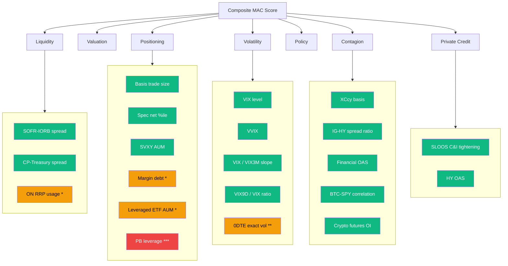

# Post-GFC Margin & Leverage Architecture

## Motivation

Since the 2008 Global Financial Crisis, leverage has migrated from regulated banks into new channels: crypto exchanges, 0DTE options, private credit, CLOs, and prime brokerage. The MAC framework must track these non-traditional leverage channels to avoid blind spots in its systemic risk assessment.

The current positioning pillar tracks **Treasury basis trades**, **CFTC speculator positioning**, and **SVXY AUM**. This document outlines the expanded architecture for monitoring margin across the full post-GFC leverage landscape.

---

## Leverage Channel Taxonomy

### Tier 1 — Currently Tracked (Live)

| Channel | Indicator | Pillar | Data Source | Status |
|---------|-----------|--------|-------------|--------|
| Treasury basis trade | Estimated $B from CFTC futures | Positioning | CFTC COT | Live |
| Speculator concentration | Treasury spec net %ile | Positioning | CFTC COT | Live |
| Short-vol exposure | SVXY AUM | Positioning | ETF providers | Live |
| Crypto-equity contagion | BTC-SPY 60d correlation | Contagion | Yahoo Finance | Live |
| Crypto futures OI | BTC+ETH perp futures OI (est. total mkt) | Contagion | Binance API | **Live** |
| 0DTE gamma proxy | VVIX, VIX9D/VIX, VIX/VIX3M ratios | Volatility | CBOE CDN | **Live** |
| Private credit stress | C&I lending standards (SLOOS) | Private Credit | FRED | Live |
| HY spread (leveraged loan proxy) | HY OAS | Private Credit | FRED | Live |

### Tier 2 — Actionable Next (Free/Public Data)

| Channel | Proposed Indicator | Pillar | Data Source | FRED Series |
|---------|-------------------|--------|-------------|-------------|
| Retail margin debt | FINRA margin debt / market cap | Positioning | FRED | `BOGZ1FL663067003Q` |
| Fed repo facility | ON RRP usage $B | Liquidity | FRED | `RRPONTSYD` |
| Leveraged ETF AUM | Total 2x/3x ETF assets | Positioning | ETF providers | Manual |
| Crypto exchange reserves | BTC held on exchanges | Contagion | Glassnode (free tier) | N/A |

### Tier 3 — Aspirational (Proprietary/Delayed Data)

| Channel | Proposed Indicator | Source | Lag |
|---------|-------------------|--------|-----|
| Prime brokerage leverage | HF gross/net leverage | Fed SHF survey | Quarterly |
| 0DTE exact volume | SPX 0DTE % of total options volume | CBOE DataShop (paid) | Daily |
| CLO issuance rate | BSL CLO new issuance | LCD / PitchBook | Monthly |
| Total return swap (TRS) | Equity TRS notional | OFR | Quarterly |

---

## Architecture: How Each Channel Maps to Pillars

> Green = Tier 1 (live) | Amber = Tier 2 (next) | Red = Tier 3 (proprietary)

---

## Tier 2 Implementation Plan

### 1. FINRA Margin Debt (Positioning Pillar)

**Rationale**: Retail and institutional margin debt relative to equity market capitalisation is a well-studied predictor of market fragility. Sharp margin debt growth preceded the 2000 dot-com bust, 2007-08 GFC, and 2021 meme-stock correction.

**Data**: FRED series `BOGZ1FL663067003Q` — Securities margin accounts at broker-dealers (quarterly, $B). Normalise by Wilshire 5000 total market cap (FRED `WILL5000PR`).

**Thresholds**:
- AMPLE: Margin debt / market cap < 2.0%
- THIN: 2.0%–2.8%
- BREACH: > 2.8% (levels seen in Q1 2000, Q3 2007, Q4 2021)

**Scoring**: `score_indicator_simple(ratio, 2.0, 2.8, 3.5, lower_is_better=True)`

### 2. ON RRP Facility Usage (Liquidity Pillar)

**Rationale**: The Fed's Overnight Reverse Repo (ON RRP) facility acts as a liquidity sink. When ON RRP drains rapidly, reserves are flowing back into the system (easing). When it's very high, it indicates excess reserves parked unproductively. Rapid drawdown may signal funding stress migration.

**Data**: FRED `RRPONTSYD` (daily, $B).

**Thresholds**: Rate-of-change based — rapid 30-day drawdown (> $200B/month) signals liquidity regime shift.

### 3. Leveraged ETF AUM (Positioning Pillar)

**Rationale**: Aggregate 2x/3x leveraged ETF AUM (TQQQ, SOXL, SPXU, etc.) provides a real-time gauge of retail directional leverage. When combined with SVXY (inverse vol), gives a more complete picture of retail risk-seeking behaviour.

**Data**: Scrape from issuer websites or use ETF API providers. Consider tracking top-10 leveraged ETFs by AUM.

---

## BTC-SPY Correlation: Implementation Details

The BTC-SPY 60-day rolling correlation is now computed in the API as a **contagion sub-indicator**. The rationale:

1. **Pre-2020**: BTC correlation to equities was near-zero — crypto was a separate market
2. **2020-2021**: Correlation rose to 0.3-0.5 as institutional adoption grew
3. **2022**: Correlation spiked to 0.6-0.8 during the Terra/LUNA collapse and FTX contagion
4. **Post-2023**: Correlation oscillates 0.3-0.6, sensitive to risk-on/risk-off regimes

**Why contagion, not positioning**: Crypto margin itself is difficult to observe (offshore exchanges, DeFi protocols). But the *correlation* between crypto and equities is directly observable and captures the systemic risk channel — when crypto acts as a correlated risk asset, a large crypto drawdown amplifies equity selling through shared margin calls and portfolio rebalancing.

**Scoring thresholds** (from `contagion.py`):
| Correlation | Score | Interpretation |
|------------|-------|----------------|
| < 0.3 | 1.0 | Decoupled — no contagion risk |
| 0.3–0.5 | 0.75–0.50 | Moderate — some shared factor exposure |
| 0.5–0.7 | 0.50–0.20 | Elevated — crypto acts as risk asset |
| > 0.7 | 0.20 | High — contagion channel active |

---

## Crypto Futures OI: Implementation Details

Aggregate BTC + ETH perpetual futures open interest is fetched from **Binance's public Futures API** (no key required). Binance is the largest crypto derivatives exchange (~35% of global OI), so we scale up by 1/0.35 to estimate total market OI.

**Client**: `api/shared/crypto_oi_client.py`
**Endpoints**:
- `GET https://fapi.binance.com/fapi/v1/openInterest?symbol=BTCUSDT`
- `GET https://fapi.binance.com/fapi/v1/ticker/price?symbol=BTCUSDT`
- (Same for ETHUSDT)

**Scoring thresholds** (contagion pillar):
| Total Market OI | Score | Interpretation |
|----------------|-------|----------------|
| < $20B | 1.0 | Normal — manageable leverage |
| $20–35B | 0.75–0.50 | Elevated — crowding building |
| $35–50B | 0.50–0.20 | Crowded — liquidation cascade risk |
| > $50B | 0.20 | Extreme — systemic contagion risk |

---

## 0DTE / Gamma Proxy: Implementation Details

Since exact 0DTE options volume requires paid CBOE DataShop access, we proxy gamma concentration risk using the **VIX term structure** from CBOE's free CDN:

**Client**: `api/shared/cboe_client.py`
**Sources**:
- `https://cdn.cboe.com/api/global/us_indices/daily_prices/VIX9D_History.csv` (9-day VIX)
- `https://cdn.cboe.com/api/global/us_indices/daily_prices/VIX3M_History.csv` (3-month VIX)
- `https://cdn.cboe.com/api/global/us_indices/daily_prices/VVIX_History.csv` (vol-of-vol)

**Derived metrics**:
| Metric | Formula | Stress Signal |
|--------|---------|---------------|
| Gamma ratio | VIX9D / VIX | > 1.0 → near-term gamma elevated |
| Term slope | VIX / VIX3M | > 1.0 → backwardation (stress) |
| VVIX level | Direct | > 100 → intense dealer hedging |

**Scoring** (volatility pillar, averaged with VIX):
- **VVIX**: <85 calm (1.0), 85–100 elevated (0.75–0.50), >120 extreme (0.20)
- **Term slope**: <0.85 contango (1.0), 0.85–1.0 normal (0.75), >1.15 deep backwardation (0.20)

---

## Quarterly Review Cadence

As new leverage channels emerge or existing ones change structure, this taxonomy should be reviewed quarterly:

1. Check whether Tier 2 data sources have become available
2. Evaluate whether any Tier 3 channels have moved to publicly available data
3. Re-calibrate thresholds against recent crisis episodes
4. Assess whether pillar assignment remains correct (e.g., does crypto OI belong in Positioning or Contagion?)

---

## References

- Baranova, Y. et al. (2023). "Margin Leverage and Vulnerabilities in US Treasury Futures." Bank of England Staff Working Paper.
- Brunnermeier, M. & Pedersen, L. (2009). "Market Liquidity and Funding Liquidity." Review of Financial Studies.
- Federal Reserve (2024). "Quantifying Treasury Cash-Futures Basis Trades." FEDS Notes.
- OFR (2021). "Hedge Funds and the Treasury Cash-Futures Disconnect." Working Paper 21-01.
- FSB (2023). "The Financial Stability Implications of Leverage in Non-Bank Financial Intermediation."
