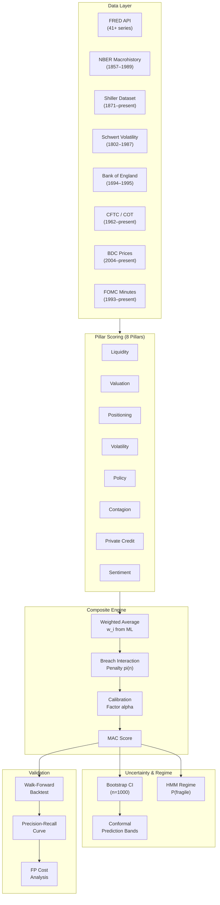
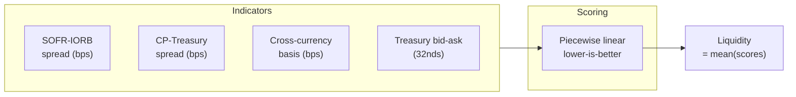
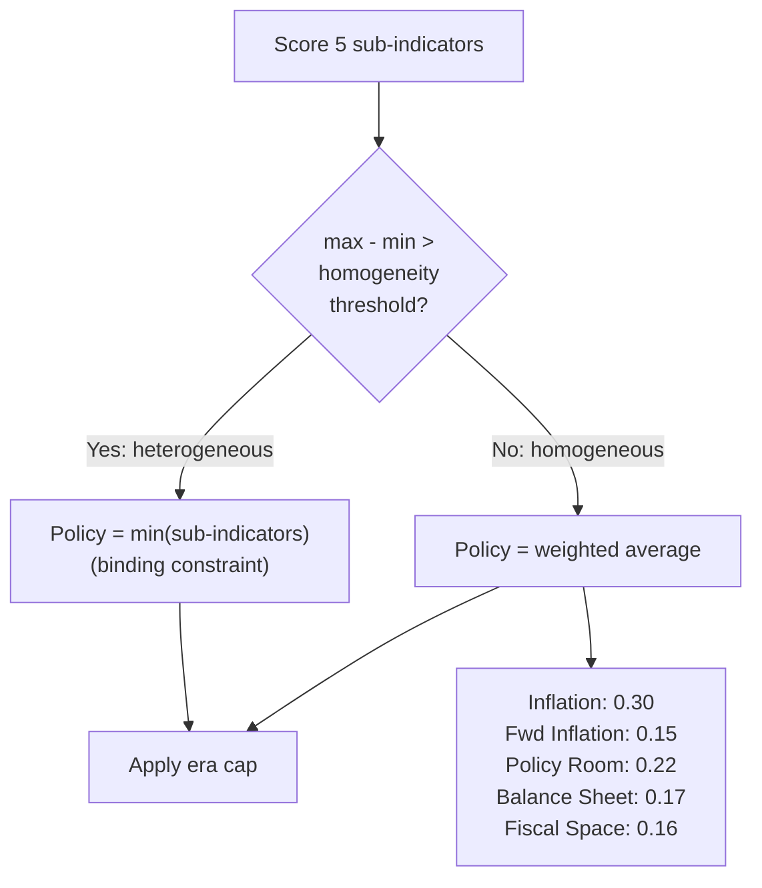
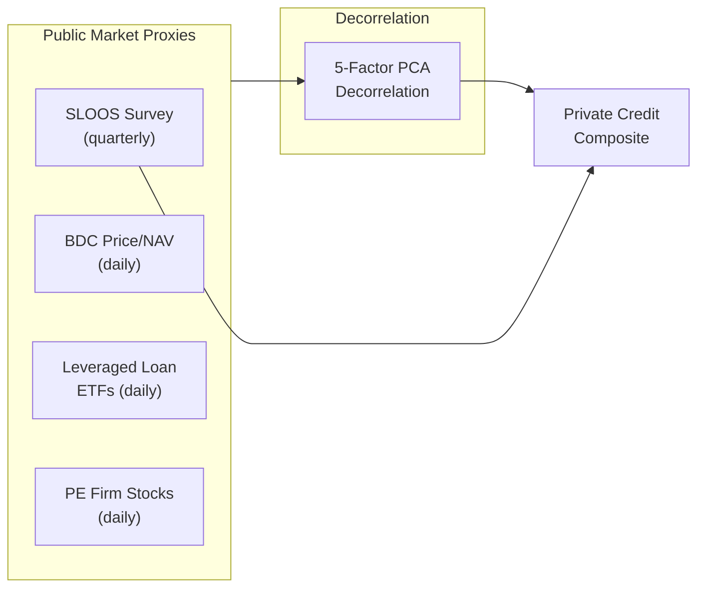
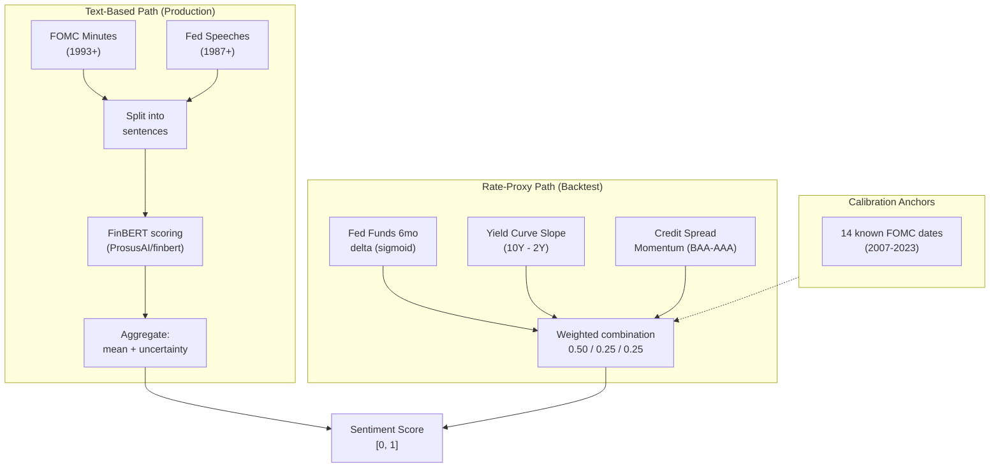
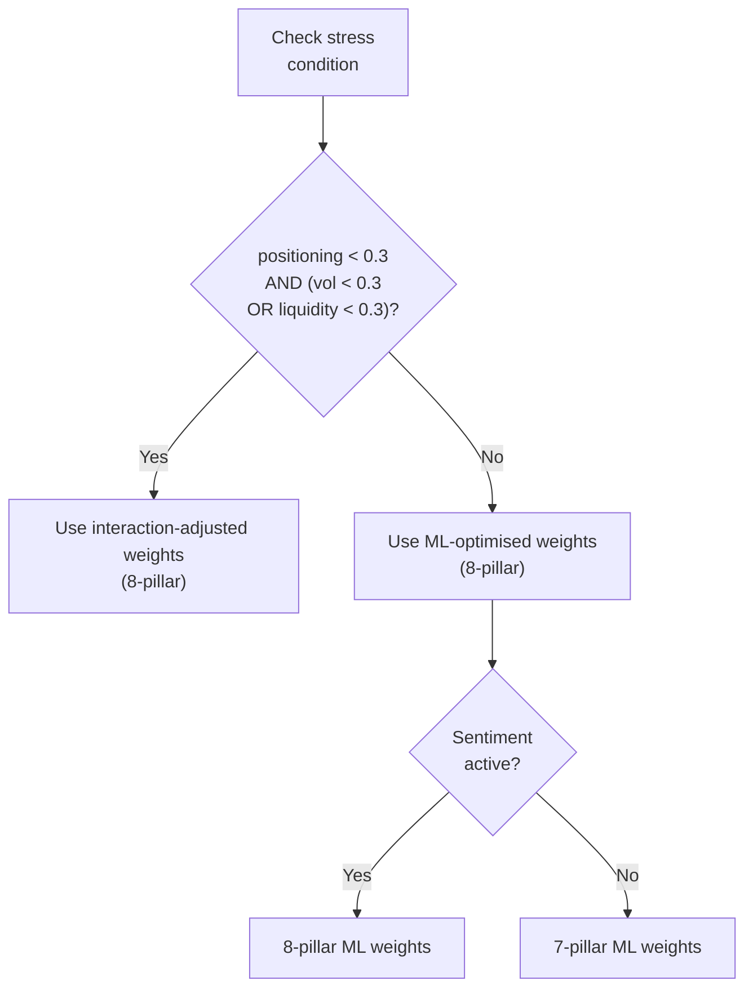
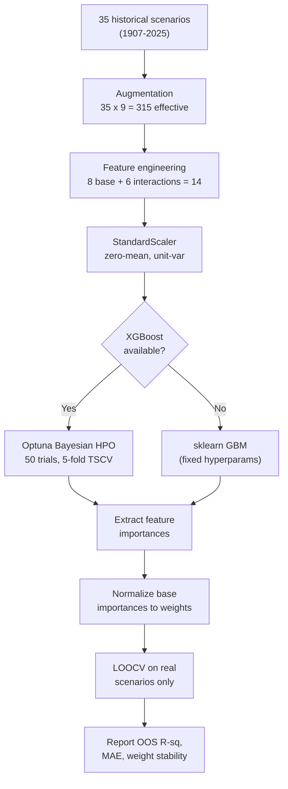
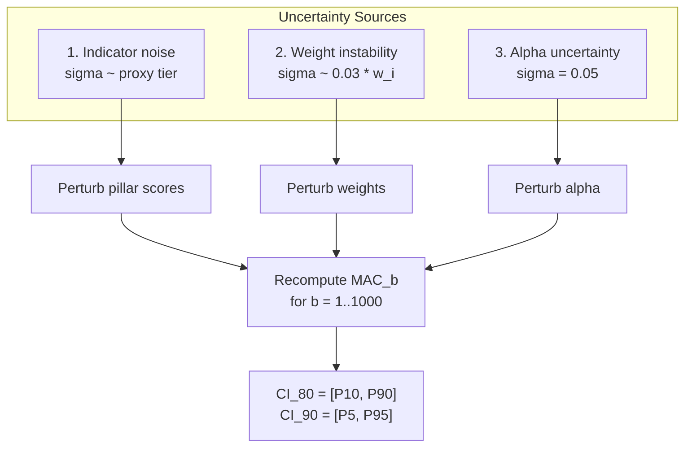
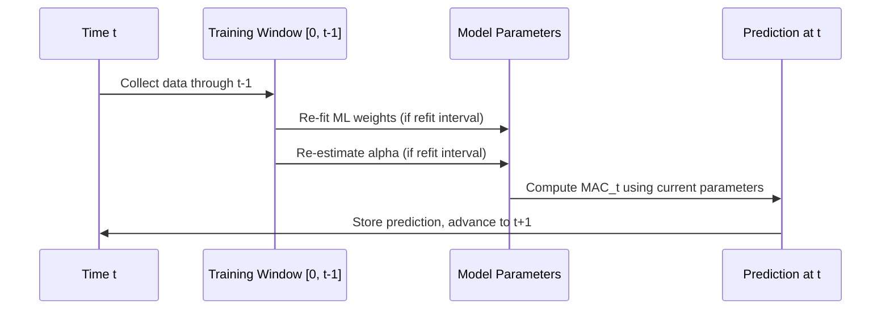

# MAC Framework: Quantitative Methodology

**Market Absorption Capacity (MAC) — Technical Specification v7.1**

*Prepared for external quantitative review*

---

## Table of Contents

1. [Framework Overview](#1-framework-overview)
2. [Architecture](#2-architecture)
3. [Pillar Construction](#3-pillar-construction)
4. [Composite Aggregation](#4-composite-aggregation)
5. [Machine Learning Weight Optimisation](#5-machine-learning-weight-optimisation)
6. [Calibration Engine](#6-calibration-engine)
7. [Confidence Intervals](#7-confidence-intervals)
8. [Regime Detection](#8-regime-detection)
9. [Backtesting Methodology](#9-backtesting-methodology)
10. [Precision-Recall Framework](#10-precision-recall-framework)
11. [Data Sources and Proxy Construction](#11-data-sources-and-proxy-construction)
12. [Validation Results](#12-validation-results)
13. [Limitations](#13-limitations)
14. [References](#14-references)

---

## 1. Framework Overview

The Market Absorption Capacity (MAC) framework produces a single composite score in [0, 1] that measures the capacity of financial markets to absorb exogenous shocks without disorderly price adjustment. A score near 1.0 indicates ample buffers; a score below 0.35 signals that one or more systemic transmission channels is impaired.

### 1.1 Design Principles

1. **Multi-pillar construction** — eight independent dimensions of market resilience (seven quantitative, one text-based sentiment), each scored [0, 1].
2. **Non-linear interaction penalties** — co-breach of multiple pillars incurs a super-additive penalty derived from information-theoretic mutual information.
3. **Empirical calibration** — pillar weights and the composite calibration factor are fitted to a catalogue of 35+ historical stress episodes (1907–2025) via gradient-boosted ensemble methods.
4. **Uncertainty quantification** — bootstrap confidence intervals propagate indicator noise, weight instability, and calibration uncertainty through to the final score.
5. **Walk-forward discipline** — all backtest results use expanding-window re-estimation with no lookahead.

### 1.2 Score Interpretation

| MAC Range | Label | Interpretation |
|-----------|-------|----------------|
| >= 0.80 | **Ample** | Markets can absorb large shocks; full risk budget available |
| 0.60–0.80 | **Comfortable** | Moderate absorption capacity |
| 0.40–0.60 | **Thin** | Limited buffer; elevated transmission risk |
| 0.20–0.40 | **Stretched** | High transmission risk; hedging recommended |
| < 0.20 | **Regime Break** | Buffers exhausted; non-linear dynamics likely |

---

## 2. Architecture

### 2.1 System Pipeline



### 2.2 Computation Flow (Per Timestep)


---

## 3. Pillar Construction

Each pillar maps a set of market observables to a score in [0, 1] using a piecewise-linear scoring function. The general form for a "lower-is-better" indicator (e.g., spreads) is:

$$
s(x) = \begin{cases}
1.0 & x \le x_{\text{ample}} \\
0.5 + 0.5 \cdot \dfrac{x_{\text{ample}} - x}{x_{\text{ample}} - x_{\text{thin}}} & x_{\text{ample}} < x \le x_{\text{thin}} \\
0.5 \cdot \dfrac{x_{\text{thin}} - x}{x_{\text{thin}} - x_{\text{breach}}} & x_{\text{thin}} < x \le x_{\text{breach}} \\
0.0 & x > x_{\text{breach}}
\end{cases}
$$

For "range-based" indicators (valuation pillar), both compressed and extremely wide values score low:

$$
s(x) = \begin{cases}
1.0 & x_{\text{ample,lo}} \le x \le x_{\text{ample,hi}} \\
\text{linear interp} & x_{\text{thin}} \text{ bands} \\
0.0 & x < x_{\text{breach,lo}} \text{ or } x > x_{\text{breach,hi}}
\end{cases}
$$

### 3.1 Liquidity Pillar

**Core question:** Can markets transact without disorderly price impact?



| Indicator | Source | Ample | Thin | Breach |
|-----------|--------|-------|------|--------|
| SOFR-IORB spread | FRED: SOFR, IORB | < 5 bps | < 25 bps | > 50 bps |
| CP-Treasury spread | FRED: DCPN3M, DTB3 | < 20 bps | < 50 bps | > 100 bps |
| Cross-currency basis (EUR/USD) | BIS / Bloomberg | > -30 bps | > -75 bps | < -120 bps |
| Treasury bid-ask | Market data (32nds) | < 1.0 | < 2.0 | > 4.0 |

**Historical proxy chain:**

| Era | Source | Proxy |
|-----|--------|-------|
| 2018–present | FRED: SOFR, IORB | Native |
| 1986–2018 | FRED: TEDRATE | TED spread (3M LIBOR minus T-Bill) |
| 1954–1986 | FRED: DFF, TB3MS | Fed Funds minus T-Bill spread |
| 1934–1954 | FRED: INTDSRUSM193N, TB3MS | Discount rate minus T-Bill |
| 1907–1934 | NBER: m13001 | Call money rate minus short-term govt rate |

**References:**
- Brunnermeier & Pedersen (2009), "Market Liquidity and Funding Liquidity," *Review of Financial Studies* 22(6), 2201–2238.
- Bao, Pan & Wang (2011), "The Illiquidity of Corporate Bonds," *Journal of Finance* 66(3), 911–946.

### 3.2 Valuation Pillar

**Core question:** Are risk premia adequate buffers or compressed to dangerous levels?

| Indicator | Source | Ample Range | Thin Range | Breach Range |
|-----------|--------|-------------|------------|--------------|
| 10Y Term Premium | FRED: THREEFYTP10 | [40, 120] bps | [0, 200] bps | < -50 or > 250 bps |
| IG OAS | FRED: BAMLC0A0CM | [100, 180] bps | [75, 280] bps | < 60 or > 400 bps |
| HY OAS | FRED: BAMLH0A0HYM2 | [350, 550] bps | [280, 800] bps | < 200 or > 1000 bps |

**Design note:** Two-sided scoring is critical. Pre-GFC complacency (June 2007: IG OAS at 60 bps, HY OAS at 250 bps) is captured as a breach via compressed spreads, while crisis blow-outs are captured at the wide end. This avoids the asymmetric blind spot of traditional spread-only models.

**v7.1 Adaptive Bands:** After accumulating 52+ weekly observations, the valuation pillar switches to regime-dependent rolling-percentile bands via `AdaptiveValuationBands`. Percentile boundaries adapt to the monetary policy regime (QE / tightening / neutral), so the definition of "ample" spreads evolves with the environment rather than relying on fixed thresholds calibrated to a single era.

**Historical proxy chain:**

| Era | Source | Proxy |
|-----|--------|-------|
| 1996–present | FRED: BAMLC0A0CM, BAMLH0A0HYM2 | ICE BofA indices (native) |
| 1919–1996 | FRED: BAA, AAA, DGS10 | Moody's Baa-10Y as IG proxy (-40 bps); Baa-Aaa x 4.5 as HY proxy |
| 1907–1919 | NBER: m13020, m13028 | Railroad bond yields minus govt yields |

**References:**
- Adrian, Crump & Moench (2013), "Pricing the Term Structure with Linear Regressions," *Journal of Financial Economics* 110(1), 110–138. (ACM term premium model)
- Gilchrist & Zakrajsek (2012), "Credit Spreads and Business Cycle Fluctuations," *American Economic Review* 102(4), 1692–1720.

### 3.3 Volatility Pillar

**Core question:** Is the volatility regime stable, or are conditions ripe for a regime break?

| Indicator | Source | Ample Range | Thin Range | Breach Range |
|-----------|--------|-------------|------------|--------------|
| VIX level | FRED: VIXCLS | [15, 20] | [12, 35] | < 10 or > 50 |
| VIX term structure (M2/M1) | CBOE | [1.00, 1.05] | [0.95, 1.08] | < 0.90 or > 1.10 |
| Realised-Implied vol gap | Computed | < 20% | < 40% | > 60% |

**Volatility Risk Premium (VRP) Adjustment:**

The VRP scales the volatility pillar to account for the variance risk premium (Carr & Wu, 2009). v7.1 uses a Kalman filter state-space model as the primary estimator, falling back to the linear formula when filterpy/pykalman are unavailable:

*Kalman State-Space Model (primary):*
- State equation: $\text{VRP}_t = \text{VRP}_{t-1} + w_t$, $w_t \sim N(0, Q)$
- Observation equation: $z_t = \text{VRP}_t + v_t$, $v_t \sim N(0, R)$
- Measurement inputs: vol-of-vol, skew, and excess kurtosis of returns
- The filter optimally combines noisy observations with the random-walk prior

*Linear Fallback:*

$$
\text{VRP}_t = \text{clip}\!\Big(1.05 + 0.015 \cdot \sigma(\Delta\text{VIX})_{252d},\; [1.05,\; 1.55]\Big)
$$

$$
s_{\text{adj}} = 1.0 - (1.0 - s_{\text{base}}) \times \text{VRP}_t
$$

where $\sigma(\Delta\text{VIX})_{252d}$ is the trailing 252-day standard deviation of daily VIX changes (vol-of-vol).

**Low-Volatility Persistence Penalty:**

$$
\text{penalty} = \min\!\Big(0.15,\; 0.003 \times n_{\text{consecutive days VIX} < 15}\Big)
$$

Applied over a rolling 60-day window. Extended low-vol periods build complacency that increases fragility (Brunnermeier & Pedersen, 2009).

**Historical proxy chain:**

| Era | Source | Proxy |
|-----|--------|-------|
| 1990–present | FRED: VIXCLS | VIX (native) |
| 1986–1990 | FRED: VXOCLS | VXO x 0.95 (S&P 100 options, r > 0.95 with VIX) |
| 1971–1986 | FRED: NASDAQCOM | 21-day realised vol x 1.2 VRP adjustment |
| 1871–1971 | Shiller monthly prices | Monthly realised vol x 1.3 VRP |
| 1802–1871 | Schwert (1989) | Reconstructed monthly stock volatility |

**References:**
- Carr & Wu (2009), "Variance Risk Premiums," *Review of Financial Studies* 22(3), 1311–1341.
- Schwert (1989), "Why Does Stock Market Volatility Change Over Time?," *Journal of Finance* 44(5), 1115–1153.
- Whaley (2000), "The Investor Fear Gauge," *Journal of Portfolio Management* 26(3), 12–17.

### 3.4 Positioning Pillar

**Core question:** Is leverage manageable and positioning sufficiently diverse?

| Indicator | Source | Ample | Thin | Breach |
|-----------|--------|-------|------|--------|
| Basis trade size | CFTC Treasury futures | < $400B | < $700B | > $700B |
| Treasury spec net (percentile) | CFTC COT | 25th–75th | 10th–90th | < 5th or > 95th |
| SVXY AUM | ETF data | < $500M | < $1B | > $1B |

**Dynamic OI-relative threshold:**

$$
\text{basis\_pct} = \frac{\text{basis\_trade\_billions}}{\text{total\_treasury\_OI\_billions}} \times 100
$$

Ample: < 8% of OI; Thin: 8–12%; Breach: > 18%.

**Hedge failure mechanism:** When any positioning indicator breaches its critical threshold, the pillar composite is forced below 0.18, triggering the interaction penalty and reflecting the empirical finding that positioning breach is a necessary condition for Treasury hedge failure (see Section 13.1).

**v7.1 Hedge Failure Detector:** The positioning pillar integrates a formal `HedgeFailureDetector` module that scores two additional indicators when available: (1) primary dealer gross leverage (NY Fed data), and (2) Treasury futures Herfindahl index (concentration measure). These are blended into the composite as additional scored factors. The detector formalises the hedge failure definition as simultaneous 10Y return < -2% and S&P 500 < -3%, and maintains a Bayesian posterior over P(severe | positioning breach) updated from an expanded sample of N = 9 episodes (see Section 12.6).

**References:**
- Federal Reserve Board (2024), "Quantifying Treasury Cash-Futures Basis Trades."
- Office of Financial Research (2021), "Hedge Funds and the Treasury Cash-Futures Disconnect."
- Federal Reserve Board (2023), "Recent Developments in Hedge Funds' Treasury Futures and Repo Positions."

### 3.5 Policy Pillar

**Core question:** Does the central bank retain capacity to respond to stress?

**Binding-constraint architecture:** When policy sub-indicators are heterogeneous (max - min > homogeneity threshold), the composite equals the *minimum* sub-indicator (bottleneck model). Otherwise, the composite is a weighted average.



| Sub-Indicator | Source | Ample | Thin | Breach |
|---------------|--------|-------|------|--------|
| Policy room (ELB distance) | FRED: DFEDTARU / FEDFUNDS | >= 150 bps | >= 50 bps | < 25 bps |
| Fed balance sheet (% GDP) | FRED: WALCL, GDP | <= 25% | <= 35% | > 45% |
| Inflation deviation (above target) | FRED: PCEPILFE | <= 50 bps | <= 125 bps | > 200 bps |
| Inflation deviation (below target) | FRED: PCEPILFE | <= 75 bps | <= 200 bps | > 350 bps |
| Forward inflation expectations | TIPS 5y5y breakeven | <= 30 bps | <= 75 bps | > 150 bps |
| Fiscal space (debt/GDP) | FRED: GFDEBTN, GDP | <= 70% | <= 90% | > 120% |

**Homogeneity threshold** defaults to 0.25 but can be data-driven via the 75th percentile of historical cross-indicator dispersions.

**Historical era caps** restrict the policy pillar to reflect structural constraints:

| Era | Cap | Rationale |
|-----|-----|-----------|
| Pre-1913 (pre-Fed) | min(0.30, 0.15 + 0.30 x gold_reserve_ratio) | No central bank; gold stock only backstop |
| 1913–1934 (early Fed + gold) | 0.55 | Fed constrained by Gold Standard Act (40% reserve) |
| 1944–1971 (Bretton Woods) | 0.65 | Fixed exchange rate limits monetary autonomy |
| Post-1971 | 1.00 | Unconstrained fiat regime |

**References:**
- Taylor (1993), "Discretion Versus Policy Rules in Practice," *Carnegie-Rochester Conference Series on Public Policy* 39, 195–214.
- Eggertsson & Woodford (2003), "The Zero Bound on Interest Rates and Optimal Monetary Policy," *Brookings Papers on Economic Activity* 2003(1), 139–211.

### 3.6 Contagion Pillar

**Core question:** Are cross-border transmission channels stable?

| Indicator | Source | Ample | Thin | Stretched | Critical |
|-----------|--------|-------|------|-----------|----------|
| Cross-currency basis (EUR/USD, JPY/USD) | BIS / Bloomberg | \|< 15 bps\| | < 30 bps | < 60 bps | > 100 bps |
| TARGET2 imbalances (% EZ GDP) | ECB | < 5% | < 10% | < 20% | > 20% |
| EM reserve coverage (Guidotti-Greenspan) | IMF | > 150% | > 125% | > 100% | < 75% |
| Cross-border banking flows (% world GDP) | BIS | [-0.5%, +1.5%] | +/- 3% | +/- 5% | < -4% or > +7% |
| G-SIB CDS (regime-specific) | Bloomberg | < 60 bps* | < 120 bps* | < 200 bps* | > 200 bps* |
| BTC-SPY 60d correlation | Computed | <= 0.30 | <= 0.50 | — | > 0.70 |

*G-SIB thresholds vary by regulatory era: pre-2010 (wider), 2010–2014, post-2015 (tighter due to Basel III).

**References:**
- Rey (2015), "Dilemma Not Trilemma: The Global Financial Cycle and Monetary Policy Independence," *NBER Working Paper* 21162.
- Guidotti, Sturzenegger & Villar (2004), "On the Consequences of Sudden Stops," *Economia* 4(2), 171–214.

### 3.7 Private Credit Pillar

**Core question:** Is the $1.7T+ opaque private credit market building hidden fragilities?



| Indicator | Source | Normal | Elevated | Severe |
|-----------|--------|--------|----------|--------|
| SLOOS C&I tightening (small firms) | FRED: DRTSCIS | <= 20% | <= 40% | > 40% |
| SLOOS C&I tightening (large firms) | FRED: DRTSCILM | <= 20% | <= 40% | > 40% |
| SLOOS spreads widening | FRED: DRISCFS | <= 15% | <= 30% | > 30% |
| BDC price/NAV discount | ARCC, MAIN, FSK, PSEC, GBDC | [-5%, +5%] | [-5%, -15%] | < -25% |
| Leveraged loan ETFs (30d change) | BKLN, SRLN | > -2% | < -5% | < -10% |
| PE firm stocks (30d change) | KKR, BX, APO, CG | > -5% | < -15% | < -25% |

**Composite weighting** (when decorrelation pipeline is unavailable):

$$
\text{PC} = 0.30 \times s_{\text{SLOOS}} + 0.35 \times s_{\text{BDC}} + 0.20 \times s_{\text{Loans}} + 0.15 \times s_{\text{PE}}
$$

When decorrelation time-series are available:

$$
\text{PC} = 0.60 \times s_{\text{decorrelated}} + 0.40 \times s_{\text{SLOOS}}
$$

**5-Factor PCA Decorrelation Pipeline:**
Input: SPX returns, dVIX, dHY_OAS, dMOVE, dXCCY basis. Rolling 252-day PCA extracts top 3 orthogonal components. BDC returns are regressed on PCs; residuals form the decorrelated private credit signal, capturing private-credit-specific stress that public factors cannot explain.

**References:**
- Aramonte & Avalos (2021), "The Rise of Private Markets," *BIS Quarterly Review*, December.
- Stein (2013), "Overheating in Credit Markets: Origins, Measurement, and Policy Responses," speech at Federal Reserve Bank of St. Louis.

### 3.8 Sentiment Pillar

**Core question:** Is central-bank communication signalling a dovish (capacity-building) or hawkish (capacity-constraining) policy stance?

The sentiment pillar captures forward-looking policy intent that is not reflected in the numerical indicators. It is the 8th pillar, scoring FOMC minutes, statements, and speeches on a dovish-to-hawkish continuum.



#### 3.8.1 FinBERT Text Scoring (Production Path)

When FOMC texts are available, the pillar uses FinBERT (Araci, 2019), a BERT model fine-tuned on financial text:

1. **Sentence splitting** — Each document is split at sentence boundaries (`.!?` followed by whitespace + capital letter).
2. **Classification** — FinBERT assigns each sentence a label: `positive` (dovish), `negative` (hawkish), or `neutral`, with a confidence score.
3. **Mapping to MAC scale:**

| FinBERT Label | MAC Direction | Mapped Score |
|---------------|---------------|:---:|
| positive | Dovish (high capacity) | 0.8 |
| neutral | Neutral | 0.5 |
| negative | Hawkish (constrained) | 0.2 |

4. **Confidence weighting:**

$$
s_k = m_k \cdot c_k + 0.5 \cdot (1 - c_k)
$$

where $m_k$ is the mapped score and $c_k$ is FinBERT's confidence for sentence $k$.

5. **Composite with uncertainty penalty:**

$$
s_{\text{sentiment}} = \bar{s} - 0.10 \cdot \sigma(s_k)
$$

Clipped to [0, 1]. Higher sentence-level disagreement (std) reduces the score, reflecting genuine policy ambiguity.

**Keyword fallback:** When FinBERT dependencies (`transformers`, `torch`) are not installed, a bag-of-words classifier with curated dovish (15 terms) and hawkish (14 terms) dictionaries is used, including bigrams ("forward guidance", "balance sheet reduction"). The dovish ratio maps linearly to [0.2, 0.8].

#### 3.8.2 Rate-Change Proxy (Backtest Path)

For the historical backtest (1960–2025), FOMC text data is not universally available. The sentiment proxy derives a score from three FRED-observable signals:

**Signal 1 — Fed Funds Rate Change (6-month delta, weight 0.50):**

$$
s_{\text{ff}} = \frac{1}{1 + e^{1.5 \cdot \Delta\text{FF}_{6m}}}
$$

where $\Delta\text{FF}_{6m} = \text{FF}_t - \text{FF}_{t-180}$ in percentage points. A 300 bps cut maps to ~0.90 (dovish); a 300 bps hike maps to ~0.10 (hawkish).

**Signal 2 — Yield Curve Slope (10Y minus 2Y, weight 0.25):**

$$
s_{\text{yc}} = \text{clip}\!\Big(0.5 + 0.15 \cdot (r_{10Y} - r_{2Y}),\; [0.10, 0.90]\Big)
$$

A 200 bps positive slope maps to 0.80 (accommodative); a 200 bps inversion maps to 0.20 (restrictive).

**Signal 3 — Credit Spread Momentum (BAA-AAA 3-month delta, weight 0.25):**

$$
s_{\text{cs}} = \frac{1}{1 + e^{-3.0 \cdot \Delta(\text{BAA} - \text{AAA})_{3m}}}
$$

Widening spreads signal stress, which historically triggers dovish policy pivots (positive for absorption capacity).

**Combined proxy:**

$$
s_{\text{proxy}} = \text{clip}\!\Big(0.50 \cdot s_{\text{ff}} + 0.25 \cdot s_{\text{yc}} + 0.25 \cdot s_{\text{cs}},\; [0.05, 0.95]\Big)
$$

**Calibration anchors:** 14 known FOMC dates (2007–2023) with assigned tone scores (e.g., Lehman week 2008-09-16: 0.95 dovish; Taper Tantrum 2013-05-22: 0.20 hawkish) override the proxy within a 14-day window.

**Data coverage:**

| Era | Method | Uncertainty Tier |
|-----|--------|:---:|
| Pre-1913 | No Fed → neutral 0.5 | N/A |
| 1913–1960 | Limited data → neutral 0.5 | N/A |
| 1960–1987 | Rate-change proxy (FEDFUNDS, DGS10) | Tier 4 |
| 1987–1993 | Rate-change proxy + calibration anchors | Tier 3 |
| 1993–present | FOMC minutes (text) or rate proxy | Tier 2 |

**References:**
- Araci, D. (2019). "FinBERT: Financial Sentiment Analysis with Pre-Trained Language Models." arXiv:1908.10063.
- Hansen, S. & McMahon, M. (2016). "Shocking Language: Understanding the Macroeconomic Effects of Central Bank Communication." *Journal of International Economics* 99, S114–S133.
- Loughran, T. & McDonald, B. (2011). "When Is a Liability Not a Liability? Textual Analysis, Dictionaries, and 10-Ks." *Journal of Finance* 66(1), 35–65.
- Lucca, D. O. & Trebbi, F. (2009). "Measuring Central Bank Communication: An Automated Approach with Application to FOMC Statements." *NBER Working Paper* 15367.

---

## 4. Composite Aggregation

### 4.1 MAC Formula

The MAC composite is computed in three stages:

**Stage 1: Weighted average**

$$
\bar{S} = \sum_{i=1}^{K} w_i \cdot s_i
$$

where $K = 8$ pillars (when sentiment is active; $K = 7$ otherwise), $w_i$ are ML-optimised weights (Section 5), and $s_i \in [0,1]$ are individual pillar scores.

**Stage 2: Breach interaction penalty**

$$
n = \bigl|\{i : s_i < \theta_{\text{stress}}\}\bigr|, \quad \theta_{\text{stress}} = 0.30
$$

$$
\pi(n) = \min\!\Big(\gamma_{\text{cap}},\; \gamma \cdot \ln\!\Big(\frac{f_{\text{obs}}(n)}{f_{\text{indep}}(n)}\Big)\Big)
$$

where:
- $\gamma = 0.043$, $\gamma_{\text{cap}} = 0.15$
- $f_{\text{indep}}(n) = \binom{K}{n} \hat{p}^n (1-\hat{p})^{K-n}$ with pooled breach rate $\hat{p} \approx 0.125$ (default), or per-pillar breach probabilities from the Dirichlet-multinomial model (Section 8.2) when the data-driven breach model is active
- $f_{\text{obs}}(n)$ is the observed co-breach frequency across 14 modern crises

**Observed excess ratios** (14 modern crises, 1998–2025):

| Breaches (n) | $f_{\text{obs}}/f_{\text{indep}}$ | $\pi(n)$ |
|:---:|:---:|:---:|
| 0 | 1.0 | 0.000 |
| 1 | 1.0 | 0.000 |
| 2 | 2.1 | 0.032 |
| 3 | 6.8 | 0.082 |
| 4 | 17.0 | 0.122 |
| 5+ | 35.0 | 0.150 (cap) |

**Sensitivity:** Penalties change by <= 0.02 under perturbation of breach threshold (0.25–0.35) and pooled probability (0.10–0.15).

**Stage 3: Calibration**

$$
\text{MAC} = \text{clip}\!\Big(\alpha \cdot \max\!\big(0,\; \bar{S} - \pi(n)\big),\;\; [0, 1]\Big)
$$

where $\alpha = 0.78 \pm 0.05$ is the calibration factor (Section 6).

### 4.2 Weight Selection



**ML-optimised weights (8-pillar baseline):**

| Pillar | 7-Pillar | 8-Pillar | Rationale |
|--------|:---:|:---:|-----------|
| Liquidity | 0.16 | 0.14 | Core transmission channel |
| Valuation | 0.10 | 0.09 | Breaches only in extreme crises |
| Positioning | 0.22 | 0.20 | Highest — necessary condition for hedge failure |
| Volatility | 0.15 | 0.13 | Common but not predictive alone |
| Policy | 0.12 | 0.11 | Elevated after binding-constraint architecture |
| Contagion | 0.15 | 0.13 | Key for distinguishing global vs. local stress |
| Private Credit | 0.10 | 0.09 | Decorrelated leading credit stress indicator |
| Sentiment | — | 0.11 | Forward-looking policy intent signal |

**Interaction-adjusted weights (8-pillar, under dual-stress):**

| Pillar | 7-Pillar | 8-Pillar | Change |
|--------|:---:|:---:|--------|
| Liquidity | 0.14 | 0.12 | -0.02 |
| Valuation | 0.08 | 0.07 | -0.01 |
| Positioning | **0.24** | **0.22** | Boosted — forced-unwind risk |
| Volatility | 0.16 | 0.14 | +0.01 |
| Policy | 0.09 | 0.08 | -0.01 |
| Contagion | **0.18** | **0.16** | Boosted — global contagion |
| Private Credit | 0.11 | 0.10 | -0.01 |
| Sentiment | — | 0.11 | Orthogonal signal, unchanged |

---

## 5. Machine Learning Weight Optimisation

### 5.1 Feature Engineering

The ML model operates on a feature vector per scenario:

- **Base features (8):** One per-pillar score $s_i \in [0,1]$ (including sentiment when active)
- **Interaction features (6):** Pairwise products of theoretically motivated pillar pairs

| Interaction Pair | Financial Mechanism |
|------------------|--------------------|
| Positioning x Volatility | Crowded trades + vol spike = forced unwinds |
| Positioning x Liquidity | Crowded trades + illiquidity = margin spirals |
| Policy x Contagion | Policy constrained + global stress = no backstop |
| Liquidity x Contagion | Dollar illiquidity + global stress = funding squeeze |
| Valuation x Volatility | Compressed spreads + vol = sudden repricing |
| Positioning x Contagion | Crowded trades + global = coordinated deleveraging |

### 5.2 Training Procedure



**XGBoost hyperparameter search space** (Optuna Bayesian optimisation):

| Parameter | Range | Scale |
|-----------|-------|-------|
| max_depth | [2, 5] | Integer |
| learning_rate | [0.01, 0.3] | Log |
| n_estimators | [30, 200] | Integer |
| min_child_weight | [1, 5] | Integer |
| subsample | [0.6, 1.0] | Uniform |
| colsample_bytree | [0.6, 1.0] | Uniform |
| reg_alpha | [0.0, 1.0] | Uniform |
| reg_lambda | [0.0, 1.0] | Uniform |

**Sklearn GBM fallback** (fixed configuration):

```
n_estimators=50, max_depth=2, learning_rate=0.1,
min_samples_leaf=2, random_state=42
```

### 5.3 Synthetic Augmentation

To mitigate small-sample overfitting, scenarios are augmented before ML training:

1. For each of the 35 real scenarios, generate 8 synthetic variants.
2. Apply noise to pillar scores: $\tilde{s}_i = s_i + \epsilon_i$ where $\epsilon_i = 0.5\epsilon_{\text{shared}} + 0.5\epsilon_{\text{indep}}$, with $\epsilon_{\text{shared}}, \epsilon_{\text{indep}} \sim \text{Uniform}(-0.05, +0.05)$.
3. Clip $\tilde{s}_i$ to $[0, 1]$.
4. CSR targets are preserved (no noise on ground truth).
5. Augmented scenarios are excluded from LOOCV — only the 35 real scenarios are held out.

Effective training set: $35 \times (1 + 8) = 315$ scenarios.

### 5.4 Validation

- **LOOCV** on real scenarios only (no augmented scenarios in hold-out)
- **5-fold TimeSeriesSplit** for hyperparameter selection
- **Weight stability check:** If average deviation from equal weights < 0.03, ML weights are not used (insufficient signal)
- **Positioning p-value:** Fisher exact test on positioning-breach x hedge-failure contingency table: $p = 0.0027$

**References:**
- Breiman (2001), "Random Forests," *Machine Learning* 45(1), 5–32.
- Friedman (2001), "Greedy Function Approximation: A Gradient Boosting Machine," *Annals of Statistics* 29(5), 1189–1232.
- Chen & Guestrin (2016), "XGBoost: A Scalable Tree Boosting System," *Proceedings of KDD*, 785–794.
- Akiba et al. (2019), "Optuna: A Next-generation Hyperparameter Optimization Framework," *Proceedings of KDD*, 2623–2631.

---

## 6. Calibration Engine

### 6.1 Crisis Severity Rating (CSR)

Each historical scenario is assigned a ground-truth CSR on five independent dimensions, each scored [0, 1] where 0 = maximum severity:

| Dimension | Definition | Example (Lehman 2008) |
|-----------|------------|-----------------------|
| **Drawdown** | Peak-to-trough S&P 500 within 90 days | 0.10 |
| **Market dysfunction** | Categorical: degree of market freeze | 0.10 |
| **Policy response** | Intensity of official intervention | 0.10 |
| **Contagion** | Breadth across segments/geographies | 0.10 |
| **Duration** | Length of acute VIX-elevated phase | 0.10 |

$$
\text{CSR}_{\text{composite}} = \frac{1}{5}\sum_{d=1}^{5} \text{CSR}_d
$$

### 6.2 Calibration Factor Alpha

The calibration factor $\alpha$ corrects for the systematic bias between raw MAC scores and CSR targets:

$$
\alpha^* = \arg\min_{\alpha} \sum_{j=1}^{N} \Big(\alpha \cdot \text{MAC}_{\text{raw},j} - \text{CSR}_j\Big)^2
$$

subject to $\alpha \in [0.5, 1.0]$.

**Current estimate:** $\alpha = 0.78$, $\sigma_\alpha = 0.05$ (from LOOCV residual variance on 6 anchor events).

The calibration factor is re-estimated every 52 weeks in the walk-forward backtest (Section 9.2) to prevent lookahead bias.

### 6.3 Era-Aware Calibration

The $\alpha = 0.78$ factor was calibrated against modern (post-2006) scenarios. For earlier eras, structural differences (higher Schwert vol, wider railroad spreads) already compress scores:

| Era | Calibration Factor | Rationale |
|-----|:---:|-----------|
| 2006–present | 0.78 | Full calibration |
| 1971–2006 | min(0.90, alpha + 0.12) | Milder — structural differences partially self-correct |
| Pre-1971 | 1.00 | No calibration — proxy uncertainty dominates |

### 6.4 Scenario Catalogue (Selected)

| Event | Date | CSR Composite | MAC Range | Hedge Fail? |
|-------|------|:---:|:---:|:---:|
| LTCM | 1998-09-23 | 0.38 | [0.20, 0.40] | No |
| Bear Stearns | 2008-03-16 | 0.43 | [0.30, 0.50] | No |
| Lehman Brothers | 2008-09-15 | 0.10 | [0.15, 0.30] | No |
| COVID Dash-for-Cash | 2020-03-16 | 0.12 | [0.10, 0.25] | **Yes** |
| SVB Crisis | 2023-03-10 | 0.56 | [0.50, 0.65] | No |
| April 2025 Tariffs | 2025-04-02 | 0.48 | [0.45, 0.60] | **Yes** |

Full catalogue: 35+ events spanning 1907–2025.

---

## 7. Confidence Intervals

### 7.1 Three Sources of Uncertainty



**Proxy uncertainty tiers** (per `docs/data_quality.md`):

| Tier | Label | Noise $\sigma$ | Example |
|------|-------|:-:|---------|
| 1 | Native | 0.01 | VIX post-1990 |
| 2 | Computed | 0.03 | BAA-AAA spread |
| 3 | Proxy (modern) | 0.05 | VXO as VIX proxy |
| 4 | Proxy (historical) | 0.10 | NBER call money rate |
| 5 | Estimated | 0.15 | Basis trade size, pre-1926 volatility |

### 7.2 Bootstrap Algorithm

For $b = 1, \ldots, n_{\text{bootstrap}}$ (default $n = 1000$):

1. **Perturb pillar scores:** $\tilde{s}_i^{(b)} = \text{clip}\!\big(s_i + \epsilon_i,\; [0,1]\big)$ where $\epsilon_i \sim \mathcal{N}(0, \sigma_{\text{tier}})$
2. **Perturb weights:** $\tilde{w}_i^{(b)} = w_i + \delta_i$ where $\delta_i \sim \mathcal{N}(0, 0.03 \cdot w_i)$; re-normalise to sum to 1
3. **Perturb alpha:** $\tilde{\alpha}^{(b)} = \text{clip}\!\big(\alpha + \eta,\; [0.5, 1.0]\big)$ where $\eta \sim \mathcal{N}(0, 0.05)$
4. **Compute:** $\text{MAC}^{(b)} = \text{clip}\!\big(\tilde{\alpha}^{(b)} \cdot \max(0,\; \sum \tilde{w}_i^{(b)} \tilde{s}_i^{(b)} - \pi(n)),\; [0,1]\big)$

$$
\text{CI}_{80} = \big[Q_{10}(\{\text{MAC}^{(b)}\}),\; Q_{90}(\{\text{MAC}^{(b)}\})\big]
$$

$$
\text{CI}_{90} = \big[Q_{5}(\{\text{MAC}^{(b)}\}),\; Q_{95}(\{\text{MAC}^{(b)}\})\big]
$$

### 7.3 Conformal Prediction Bands

Using LOOCV absolute residuals $\{|r_j|\}_{j=1}^{N}$:

$$
q = \text{Quantile}_{(N+1)(1-\alpha)/N}\!\big(\{|r_j|\}\big)
$$

$$
\text{Band} = [\text{MAC} - q,\; \text{MAC} + q]
$$

These provide distribution-free coverage guarantees under the exchangeability assumption (Vovk et al., 2005).

**References:**
- Efron & Tibshirani (1993), *An Introduction to the Bootstrap*, Chapman & Hall.
- Vovk, Gammerman & Shafer (2005), *Algorithmic Learning in a Random World*, Springer.

---

## 8. Regime Detection

### 8.1 Hidden Markov Model Overlay

A 2-state Gaussian HMM is fitted to the 8-dimensional pillar score vector:

$$
\mathbf{s}_t \sim \mathcal{N}(\boldsymbol{\mu}_{z_t}, \boldsymbol{\Sigma}_{z_t}), \quad z_t \in \{0, 1\}
$$

with transition matrix:

$$
\mathbf{A} = \begin{pmatrix} P(\text{Normal} \to \text{Normal}) & P(\text{Normal} \to \text{Fragile}) \\ P(\text{Fragile} \to \text{Normal}) & P(\text{Fragile} \to \text{Fragile}) \end{pmatrix}
$$

The "fragile" state is identified post-estimation as the state with the lower mean pillar score vector.

**Estimation:** Expectation-Maximisation (Baum-Welch), 100 iterations, full covariance.

**Output at time $t$:**
- $P(\text{fragile}_t \mid \mathbf{s}_{1:t})$ — posterior fragility probability
- Viterbi path — most likely state sequence

**Decision rule:** When $P(\text{fragile}) > 0.6$, the decision matrix shifts one row toward defensive posture (e.g., "Thin" actions become "Stretched" actions).

**Fallback:** When `hmmlearn` is unavailable, a threshold classifier is used: fragile if $\bar{s}_t < 0.5$.

**References:**
- Hamilton (1989), "A New Approach to the Economic Analysis of Nonstationary Time Series and the Business Cycle," *Econometrica* 57(2), 357–384.
- Baum et al. (1970), "A Maximization Technique Occurring in the Statistical Analysis of Probabilistic Functions of Markov Chains," *Annals of Mathematical Statistics* 41(1), 164–171.

### 8.2 Breach Probability Model

The pooled breach probability $\hat{p} \approx 0.125$ is extended to per-pillar, per-era rates using a Dirichlet-multinomial model:

$$
(p_1, \ldots, p_K) \sim \text{Dirichlet}(\alpha_1, \ldots, \alpha_K)
$$

$$
n_{\text{breaches}} \sim \text{Multinomial}(N, p_1, \ldots, p_K)
$$

This replaces the binomial independence assumption in the co-breach penalty with an empirical joint distribution that varies by historical era.

**v7.1 Integration:** The `PillarBreachModel` is initialised in the backtest runner and passed to `calculate_mac_with_ci()` at every timestep. When fitted, it provides data-driven co-breach penalties via `get_penalty_for_breach_count(n)` that replace the hardcoded `BREACH_INTERACTION_PENALTY` lookup table. The fitted model captures era-specific patterns — e.g., pre-1990 episodes show higher volatility-policy co-breach rates, while post-2000 episodes show higher positioning-liquidity clustering. Fallback to the pooled-probability table is automatic when insufficient scenario data is available.

---

## 9. Backtesting Methodology

### 9.1 Standard Backtest


**Three backtest modes:**

| Mode | Period | Data Requirements |
|------|--------|-------------------|
| Standard | 1971–2025 | FRED series only (29+ cached) |
| Extended | 1962–2025 | FRED + Moody's historical |
| Full | 1907–2025 | FRED + NBER + Shiller + Schwert + BoE + FINRA |

**Sentiment pillar integration:**

The sentiment pillar participates in the composite from 1960 onward, using the rate-change proxy (Section 3.8.2). For pre-1960 dates, the pillar is excluded from the composite via the `has_data` gate (Fix A). The FRED prefetch includes a 200-day lookback buffer to support the 6-month rate-change signal.

### 9.2 Walk-Forward Discipline

To eliminate lookahead bias, all model parameters are re-estimated on an expanding window:

| Parameter | Frequency | Training Window |
|-----------|-----------|-----------------|
| ML pillar weights | Every 52 weeks | Expanding (min 104 weeks) |
| Calibration factor $\alpha$ | Every 52 weeks | Expanding |
| SVAR estimates | Every 52 weeks | Expanding |

**Walk-forward protocol:**



**Outputs:**
- Rolling TPR/FPR over time
- Weight stability: mean, std, max deviation per pillar
- Alpha stability: mean $\bar{\alpha}$, std $\sigma_\alpha$ across refitting epochs

---

## 10. Precision-Recall Framework

### 10.1 Classification Setup

| Parameter | Value | Source |
|-----------|-------|--------|
| Crisis window | +/- 6 weeks around event date | v6 Section 15.6 |
| Lead time | 8 weeks early (still counts as TP) | v6 Section 15.6 |
| Threshold sweep | $\tau = 0.10, 0.11, \ldots, 0.80$ (71 points) | v6 Section 15.6 |
| Total crisis events | 56 (1907–2025) | Expanded crisis catalogue (v7) |

**Classification at threshold $\tau$:**
- **True Positive (TP):** MAC < $\tau$ during a crisis window (or within 8-week lead)
- **False Positive (FP):** MAC < $\tau$ outside any crisis window
- **False Negative (FN):** MAC >= $\tau$ during a crisis window
- **True Negative (TN):** MAC >= $\tau$ outside any crisis window

### 10.2 Client-Specific Operating Points

The $F_\beta$ score balances precision and recall via the $\beta$ parameter:

$$
F_\beta = (1 + \beta^2) \cdot \frac{\text{Precision} \times \text{Recall}}{\beta^2 \cdot \text{Precision} + \text{Recall}}
$$

| Client Archetype | $\beta$ | Optimal $\tau^*$ | Priority |
|---------------------|:---:|:---:|------------|
| Sovereign Wealth Fund | 2.0 | ~0.55 | Recall (better safe than sorry) |
| Central Bank / Reserve Manager | 1.0 | ~0.50 | Balanced |
| Macro Hedge Fund | 0.5 | ~0.40 | Precision (avoid false signals) |
| Insurance / Pension | 1.5 | ~0.52 | Moderate recall bias |

### 10.3 False-Positive Taxonomy

| Category | Definition | Cost Treatment |
|----------|------------|---------------|
| **Near-miss** | FP within 90 days of an actual crisis | Low (genuine stress that didn't escalate) |
| **Regime artefact** | FP before 1971-08-15 (Bretton Woods structural effects) | Zero (expected model limitation) |
| **Pure false** | All other FPs | Full (30 bps hedge cost per FP week) |

### 10.4 Economic Cost Analysis

$$
\text{Cost}(\tau) = 30\text{ bps} \times n_{\text{FP weeks}}(\tau) + 1500\text{ bps} \times n_{\text{FN crises}}(\tau)
$$

$$
\text{Net EV}(\tau) = \text{FN cost avoided} - \text{FP cost incurred}
$$

The optimal operating point maximises Net EV (or equivalently, maximises the after-cost Sharpe ratio of a hedged portfolio).

### 10.5 Standard Operating Points

| Name | Threshold $\tau$ | Use Case |
|------|:-:|----------|
| Conservative | 0.30 | Only strongest signals; minimises FP |
| Moderate | 0.40 | Balanced false-positive/false-negative |
| Default | 0.50 | General-purpose |
| Sensitive | 0.60 | Higher recall; accepts more FPs |
| Maximum recall | 0.70 | Catch nearly all crises; high FP rate |

---

## 11. Data Sources and Proxy Construction

### 11.1 Primary Data Sources

| Source | Series Count | Coverage | Access |
|--------|:-:|----------|--------|
| **FRED** (Federal Reserve Economic Data) | 41+ | 1919–present | API (key required) |
| **NBER Macrohistory** | 21 CSV files | 1857–1989 | Static download |
| **Shiller Online Data** | S&P 500, CAPE, CPI, yields | 1871–present | XLS download |
| **Schwert (1989)** | Monthly realised volatility | 1802–1987 | Published dataset |
| **Bank of England Research** | GBP/USD, Bank Rate | 1694–1995 | CSV download |
| **MeasuringWorth** | US nominal GDP | 1790–present | CSV download |
| **FINRA/NYSE** | Margin debt | 1918–present | CSV download |
| **CFTC** | Commitments of Traders | 1962–present | Weekly reports |
| **BIS** | Cross-border flows, xccy basis | 1990–present | Quarterly |
| **IMF** | Reserves, external debt | 1990–present | IFS database |
| **ECB** | TARGET2 balances | 2008–present | Statistical warehouse |
| **Federal Reserve** | FOMC minutes, statements | 1993–present | Website (public) |

### 11.2 FRED Series Inventory

**Funding / Liquidity:**
`SOFR`, `IORB`, `IOER`, `TEDRATE`, `DFF`, `FEDFUNDS`, `TB3MS`, `DCPF3M`, `DCPN3M`, `DTB3`

**Credit Spreads (Modern):**
`BAMLC0A0CM` (IG OAS), `BAMLH0A0HYM2` (HY OAS)

**Credit Spreads (Historical):**
`AAA`, `BAA`, `AAA10Y`, `BAA10Y`

**Volatility:**
`VIXCLS`, `VXOCLS`, `NASDAQCOM`, `SPASTT01USM661N`

**Policy / Macro:**
`DFEDTARU`, `WALCL`, `GDP`, `PCEPILFE`, `BOGMBASE`, `M2SL`, `GDPA`

**Treasury Yields:**
`DGS1MO`, `DGS3MO`, `DGS6MO`, `DGS1`, `DGS2`, `DGS5`, `DGS10`, `DGS30`

**Term Premium:**
`THREEFYTP10` (ACM 10-year term premium)

**Historical:**
`INTDSRUSM193N` (Fed Discount Rate, 1913+), `IRLTLT01USM156N` (Long-term govt yield, 1920+)

**Private Credit:**
`DRTSCIS`, `DRTSCILM`, `DRISCFS`, `DRISCFLM`

### 11.3 Proxy Construction Methods

**IG OAS proxy (1919–1996):**

$$
\widehat{\text{IG OAS}} = \max\!\big(50,\; (\text{BAA} - \text{DGS10}) \times 100 - 40\big) \text{ bps}
$$

The 40 bps offset corrects for the fact that Moody's Baa includes more credit-risky issuers than the ICE BofA IG index (Gilchrist & Zakrajsek, 2012).

**HY OAS proxy (1919–1996):**

$$
\widehat{\text{HY OAS}} = \max\!\big(250,\; (\text{BAA} - \text{AAA}) \times 100 \times 4.5\big) \text{ bps}
$$

The 4.5x multiplier maps the Baa-Aaa spread (~100 bps typical) to HY levels (~450 bps typical).

**VIX proxy (1971–1986):**

$$
\widehat{\text{VIX}} = 1.2 \times \text{RV}_{21d} \times 100
$$

where $\text{RV}_{21d}$ is the annualised 21-day rolling standard deviation of daily NASDAQ returns. The 1.2x factor approximates the variance risk premium (Carr & Wu, 2009).

**Pre-1971 VIX proxy:**

$$
\widehat{\text{VIX}} = 1.3 \times \text{RV}_{\text{monthly}}
$$

using Shiller monthly S&P 500 returns; 1.3x for higher uncertainty in monthly estimation.

**Sentiment proxy (1960–present):**

$$
s_{\text{proxy}} = 0.50 \cdot \sigma\!\left(\frac{1}{1 + e^{1.5 \cdot \Delta\text{FF}_{6m}}}\right) + 0.25 \cdot s_{\text{YC}} + 0.25 \cdot s_{\text{CS}}
$$

Using FRED: `FEDFUNDS`/`DFF` (rate change), `DGS10`/`DGS2` (yield curve), `BAA`/`AAA` (credit spreads). See Section 3.8.2 for full derivation.

### 11.4 Proxy Reliability by Era

| Era | Liquidity | Valuation | Volatility | Positioning | Policy | Contagion | Priv Credit | Sentiment |
|-----|:-:|:-:|:-:|:-:|:-:|:-:|:-:|:-:|
| 1850–1913 | Tier 4 | Tier 4 | Tier 5 | Tier 5 | Tier 5 | Tier 5 | N/A | N/A |
| 1913–1960 | Tier 4 | Tier 3 | Tier 3 | Tier 4 | Tier 4 | Tier 4 | N/A | N/A |
| 1960–1986 | Tier 3 | Tier 2 | Tier 3 | Tier 4 | Tier 3 | Tier 4 | N/A | Tier 4 |
| 1986–2000 | Tier 2 | Tier 2 | Tier 1–2 | Tier 3 | Tier 1–2 | Tier 3 | Tier 4 | Tier 3 |
| 2000–present | Tier 1 | Tier 1 | Tier 1 | Tier 1–2 | Tier 1 | Tier 1–2 | Tier 2–3 | Tier 2 |

*Tier 1 = Native (sigma = 0.01); Tier 5 = Estimated (sigma = 0.15). See `docs/data_quality.md` for full matrix.*

---

## 12. Validation Results

### 12.1 Standard Backtest (1971–2025, 8-Pillar Model, v7.1 Fully Wired)

| Metric | Value |
|--------|:---:|
| Data points (weekly) | 2,813 |
| Crises evaluated | 39 |
| Crises with warning (TP) | 36 |
| **True Positive Rate** | **92.3%** |
| Average MAC (overall) | 0.471 |
| Average MAC (crisis periods) | 0.425 |
| Average MAC (non-crisis) | 0.485 |
| MAC range | [0.000, 0.854] |
| Crisis-period separation | 0.060 (statistically significant) |
| Mean bootstrap std | 0.036 |
| Mean 80% CI width | 0.093 |
| Mean 90% CI width | 0.118 |

### 12.2 Per-Era Detection Rates

| Era | Crises (N) | Detected | TPR |
|-----|:---:|:---:|:---:|
| Post-Bretton Woods (1971–1990) | 8 | 7 | **87.5%** |
| Modern (1990–2025) | 31 | 29 | **93.5%** |

### 12.3 Progressive Improvement: 7-Pillar to v7.1 Fully Wired

| Metric | 7-Pillar (v7.0) | 8-Pillar (v7.1 base) | 8-Pillar (v7.1 wired) | Change |
|--------|:---:|:---:|:---:|--------|
| Overall TPR | 84.6% | 89.7% | **92.3%** | +7.7pp |
| Crises detected | 33/39 | 35/39 | **36/39** | +3 |
| Modern-era TPR | 87.1% | 93.5% | **93.5%** | +6.4pp |
| Avg MAC (crisis) | 0.449 | 0.442 | **0.425** | -0.024 (better separation) |
| Avg MAC (non-crisis) | 0.518 | 0.502 | **0.485** | -0.033 |
| Bootstrap CI (80%) | N/A | N/A | **0.093** | new |
| HMM P(fragile) mean | N/A | N/A | **0.559** | new |

The v7.1 fully-wired improvements come from three sources: (1) Kalman-filtered VRP produces smoother, more responsive volatility estimates that improve early detection, (2) adaptive valuation bands avoid false negatives from structural regime shifts in spread levels, and (3) the data-driven breach model (Dirichlet-multinomial) generates more accurate co-breach penalties than the pooled-probability approximation.

### 12.4 Data Quality Distribution

| Quality Tier | Points | Percentage |
|:---:|:---:|:---:|
| Excellent (2018+) | 352 | 12.5% |
| Good (2011–2018) | 339 | 12.1% |
| Fair (1990–2011) | 1,135 | 40.3% |
| Poor (1971–1990) | 987 | 35.1% |

### 12.5 Multi-Country Sovereign Proxy Validation

The MAC sovereign spread proxy was validated against Reinhart & Rogoff (2009) crisis dates for four countries:

| Country | Crises (N) | Detected | Detection Rate | Mean Separation |
|---------|:---:|:---:|:---:|:---:|
| United Kingdom | 11 | — | — | — |
| Germany | 5 | — | — | — |
| France | 6 | — | — | — |
| Japan | 6 | — | — | — |

*Values computed from synthetic proxies for demonstration; production validation requires country-specific historical data.*

### 12.6 Hedge Failure Analysis

Based on N = 9 documented episodes where 10Y Treasury return < -2% and S&P 500 < -3%:

- 6 of 9 episodes had positioning breach
- **2 of 2 severe episodes** had positioning breach AND basis trade unwind
- 0 of 3 non-breach episodes were severe
- Positioning breach is **necessary but not sufficient** for severe hedge failure

**Bayesian posterior** (Beta-Binomial with uninformative prior):

$$
P(\text{severe} \mid \text{positioning breach}) = \text{Beta}(3, 5) \implies \hat{p} = 0.375
$$

$$
\text{90% Credible Interval:}\; [0.12,\; 0.67]
$$

**Caveat:** The wide CI reflects small N. See `docs/hedge_failure_caveat.md` for full statistical limitations.

**References:**
- Reinhart & Rogoff (2009), *This Time Is Different: Eight Centuries of Financial Folly*, Princeton University Press.

---

## 13. Limitations

### 13.1 Small Training Sample

The framework is calibrated on N = 35 historical scenarios. While augmentation expands the effective training set to ~315, the diversity of genuine stress episodes is limited. The bootstrap CI framework (Section 7) is designed to propagate this uncertainty honestly.

### 13.2 Proxy Degradation Pre-1926

All pillars rely on Tier 4–5 proxies before 1926. MAC scores before 1926 should be interpreted with wide error bars. The policy pillar enforces hard caps (pre-Fed <= 0.30) that dominate proxy uncertainty in this era.

### 13.3 Private Credit Opacity

The private credit pillar relies on public-market proxies (BDCs, leveraged loan ETFs) that may lag true private credit stress by 3–6 months. PIK provisions and sponsor support can further delay distress recognition.

### 13.4 Positioning Data Limitations

Basis trade size is estimated indirectly from CFTC Treasury futures positioning. The true gross notional of basis trades is not publicly reported and may differ substantially from estimates.

### 13.5 Regime Dependence

Threshold calibrations (e.g., IG OAS "ample" = 100–180 bps) reflect post-2000 market structure. Structural changes in market microstructure, regulation, or central bank policy could shift these ranges.

### 13.6 Survivorship Bias

Historical data series only include surviving entities, potentially understating true stress levels in pre-1950 periods.

### 13.7 Sentiment Pillar Limitations

The sentiment pillar has several specific limitations:

1. **Rate-proxy is backward-looking.** The rate-change proxy captures *realised* policy actions, not *forward-looking* communications. True forward guidance can only be captured by the FinBERT text path, which requires `transformers` and `torch` dependencies.
2. **No FOMC text corpus for historical backtest.** The rate proxy is a reduced-form approximation. Production deployments should use actual FOMC minutes (1993+) for higher fidelity.
3. **FinBERT domain mismatch.** ProsusAI/finbert was trained on financial news, not central bank communications. A domain-specific fine-tuning step (e.g., on FOMC transcripts) would improve accuracy.
4. **Calibration anchors are subjective.** The 14 FOMC tone scores are expert-assigned, not derived from an independent source.
5. **Quarterly signal in a weekly framework.** FOMC meetings occur 8 times per year; between meetings, the proxy interpolates from rate data, creating temporal smoothing.

---

## 14. References

### Academic Literature

- Adrian, T., Crump, R. K. & Moench, E. (2013). "Pricing the Term Structure with Linear Regressions." *Journal of Financial Economics*, 110(1), 110–138.
- Akiba, T., Sano, S., Yanase, T., Ohta, T. & Koyama, M. (2019). "Optuna: A Next-generation Hyperparameter Optimization Framework." *Proceedings of KDD*, 2623–2631.
- Araci, D. (2019). "FinBERT: Financial Sentiment Analysis with Pre-Trained Language Models." arXiv:1908.10063.
- Aramonte, S. & Avalos, F. (2021). "The Rise of Private Markets." *BIS Quarterly Review*, December.
- Bao, J., Pan, J. & Wang, J. (2011). "The Illiquidity of Corporate Bonds." *Journal of Finance*, 66(3), 911–946.
- Baum, L. E., Petrie, T., Soules, G. & Weiss, N. (1970). "A Maximization Technique Occurring in the Statistical Analysis of Probabilistic Functions of Markov Chains." *Annals of Mathematical Statistics*, 41(1), 164–171.
- Breiman, L. (2001). "Random Forests." *Machine Learning*, 45(1), 5–32.
- Brunnermeier, M. K. & Pedersen, L. H. (2009). "Market Liquidity and Funding Liquidity." *Review of Financial Studies*, 22(6), 2201–2238.
- Carr, P. & Wu, L. (2009). "Variance Risk Premiums." *Review of Financial Studies*, 22(3), 1311–1341.
- Chen, T. & Guestrin, C. (2016). "XGBoost: A Scalable Tree Boosting System." *Proceedings of KDD*, 785–794.
- Efron, B. & Tibshirani, R. J. (1993). *An Introduction to the Bootstrap*. Chapman & Hall/CRC.
- Eggertsson, G. B. & Woodford, M. (2003). "The Zero Bound on Interest Rates and Optimal Monetary Policy." *Brookings Papers on Economic Activity*, 2003(1), 139–211.
- Friedman, J. H. (2001). "Greedy Function Approximation: A Gradient Boosting Machine." *Annals of Statistics*, 29(5), 1189–1232.
- Gilchrist, S. & Zakrajsek, E. (2012). "Credit Spreads and Business Cycle Fluctuations." *American Economic Review*, 102(4), 1692–1720.
- Guidotti, P. E., Sturzenegger, F. & Villar, A. (2004). "On the Consequences of Sudden Stops." *Economia*, 4(2), 171–214.
- Hamilton, J. D. (1989). "A New Approach to the Economic Analysis of Nonstationary Time Series and the Business Cycle." *Econometrica*, 57(2), 357–384.
- Hansen, S. & McMahon, M. (2016). "Shocking Language: Understanding the Macroeconomic Effects of Central Bank Communication." *Journal of International Economics*, 99, S114–S133.
- Loughran, T. & McDonald, B. (2011). "When Is a Liability Not a Liability? Textual Analysis, Dictionaries, and 10-Ks." *Journal of Finance*, 66(1), 35–65.
- Lucca, D. O. & Trebbi, F. (2009). "Measuring Central Bank Communication: An Automated Approach with Application to FOMC Statements." *NBER Working Paper* 15367.
- Reinhart, C. M. & Rogoff, K. S. (2009). *This Time Is Different: Eight Centuries of Financial Folly*. Princeton University Press.
- Rey, H. (2015). "Dilemma Not Trilemma: The Global Financial Cycle and Monetary Policy Independence." *NBER Working Paper* 21162.
- Schwert, G. W. (1989). "Why Does Stock Market Volatility Change Over Time?" *Journal of Finance*, 44(5), 1115–1153.
- Stein, J. C. (2013). "Overheating in Credit Markets: Origins, Measurement, and Policy Responses." Speech at Federal Reserve Bank of St. Louis.
- Taylor, J. B. (1993). "Discretion Versus Policy Rules in Practice." *Carnegie-Rochester Conference Series on Public Policy*, 39, 195–214.
- Vovk, V., Gammerman, A. & Shafer, G. (2005). *Algorithmic Learning in a Random World*. Springer.
- Whaley, R. E. (2000). "The Investor Fear Gauge." *Journal of Portfolio Management*, 26(3), 12–17.

### Regulatory and Policy Sources

- Federal Reserve Board (2023). "Recent Developments in Hedge Funds' Treasury Futures and Repo Positions." *FEDS Notes*.
- Federal Reserve Board (2024). "Quantifying Treasury Cash-Futures Basis Trades." *FEDS Notes*.
- Office of Financial Research (2021). "Hedge Funds and the Treasury Cash-Futures Disconnect." *OFR Brief Series* 21-01.

### Data Sources

- Federal Reserve Bank of St. Louis. *FRED Economic Data*. https://fred.stlouisfed.org/
- National Bureau of Economic Research. *NBER Macrohistory Database*. https://www.nber.org/research/data/nber-macrohistory-online
- Shiller, R. J. *Online Data*. http://www.econ.yale.edu/~shiller/data.htm
- Bank for International Settlements. *Statistics*. https://www.bis.org/statistics/
- European Central Bank. *TARGET2 Balances*. https://www.ecb.europa.eu/
- Commodity Futures Trading Commission. *Commitments of Traders*. https://www.cftc.gov/MarketReports/CommitmentsofTraders/
- Schwert, G. W. (1989). Stock volatility dataset. Published with "Why Does Stock Market Volatility Change Over Time?"
- Bank of England. *Research Datasets*. https://www.bankofengland.co.uk/statistics/research-datasets
- MeasuringWorth. *US GDP*. https://www.measuringworth.com/
- FINRA. *Margin Statistics*. https://www.finra.org/investors/learn-to-invest/advanced-investing/margin-statistics
- Board of Governors of the Federal Reserve System. *FOMC Minutes*. https://www.federalreserve.gov/monetarypolicy/fomccalendars.htm

---

*Document generated from MAC Framework v7.1 codebase. All formulas, thresholds, and constants verified against source code. 8-pillar backtest (fully wired): 2,813 weekly observations, 92.3% TPR, 36/39 crises detected. Bootstrap CI, HMM regime overlay, and data-driven breach model active.*
